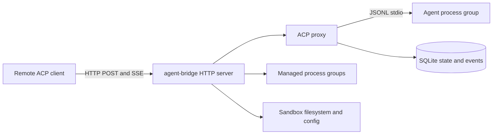

# Specification: agent-bridge

**Date:** 2026-08-15
**Revised:** 2026-08-23
**Status:** DRAFT
**Risk Level:** High

---

## Overview

Reimplement the Rust `sandbox-agent` server core as one static Linux Go binary. It bridges raw ACP JSON-RPC between remote HTTP/SSE clients and pre-provisioned coding-agent subprocesses over stdio, and exposes process, filesystem, and per-project config APIs. Agents are pinned in the runtime image and are never installed by the server.

## Goal

Deliver `agent-bridge` with client-compatible ACP behavior for Claude Code, Codex, and OpenCode; durable per-sandbox ACP event/session state; and the required process, filesystem, and config APIs. Preserve semantic ACP passthrough: the bridge may compact JSON for JSONL framing and inspect routing/session metadata, but does not normalize or interpret conversation content.

## Requirements

### Platform and dependencies

- Linux only; Go 1.26; `net/http` method/path ServeMux patterns.
- Go stdlib plus one external module: pure-Go `modernc.org/sqlite` through `database/sql`. No other production or test modules.
- Build with `CGO_ENABLED=0` as one static binary. SQLite DB/WAL files are runtime state, not embedded assets.
- No runtime agent download/install/update code.
- PTY, terminal WebSocket, desktop APIs, agent install/list APIs, `/opencode` compatibility, Inspector UI, telemetry, daemon mode, and public CLI subcommands are out of scope.

### Authentication and errors

- `AGENT_BRIDGE_TOKEN` unset: no auth only on loopback. Set: every `/v1/*` route, including health, requires `Authorization: Bearer <token>` using constant-time comparison. `GET /` remains public.
- Startup fails when `AGENT_BRIDGE_HOST` is non-loopback and no token is configured unless `AGENT_BRIDGE_ALLOW_INSECURE_REMOTE=1`. The runtime image binds `0.0.0.0`, so normal image startup requires a token.
- Every non-2xx response for a request that reaches routing/handlers, including router 404/405, malformed body, and body-limit failures, is `application/problem+json` using RFC 9457 fields `{type,title,status,detail}` and top-level extension members. Transport errors produced before routing, such as malformed request lines or oversized headers, are exceptions.
- ACP JSON-RPC error envelopes are HTTP 200 responses, not HTTP problem responses.
- Agent stderr included in a 502 is capped at 8KiB under `agentStderr`. In lines containing case-insensitive `token|key|secret|password` followed by `:` or `=`, replace the remainder with `[REDACTED]`.

### ACP HTTP contract

- Server IDs are client-defined, 1-128 bytes, using only ASCII letters, digits, `.`, `_`, and `-`.
- `POST /v1/acp/{serverId}` requires `Content-Type: application/json`; media-type parameters are allowed. Missing `Accept`, `application/json`, `application/*`, or `*/*` is accepted; otherwise 406.
- Body is one JSON-RPC 2.0 object, maximum 10MiB. Batch arrays and `id:null` are invalid. IDs may be strings or bounded JSON numbers. String IDs match exactly. Numeric ID tokens are at most 128 bytes with exponent magnitude at most 1,000,000 and match by an O(token-length) canonical tuple of sign, normalized significant digits, and base-10 exponent without expanding powers of ten; `1`, `1.0`, and `1e0` correlate. Invalid/over-limit numeric IDs are 400. `Runtime.Post` alone compacts the validated object to one line before stdio forwarding. Compaction is whitespace-only stdlib `json.Compact` on the validated raw bytes; decode-and-re-marshal is forbidden because `json.Marshal` HTML-escapes (`<`, `>`, `&`) and normalizes number lexemes (`1e0` → `1`), which would break byte-exact transcript replay.
- Client request (`method` plus non-null `id`) waits for the matching response and returns 200. Duplicate active or grace-retained IDs on one server return 409. Each runtime permits at most 256 pending plus retained correlations; excess returns 429. Default timeout is 120s via `AGENT_BRIDGE_ACP_REQUEST_TIMEOUT_MS`; timeout returns 504. Non-lifecycle correlation is released immediately. Lifecycle metadata/ID remain reserved for a fixed 30s late-response grace; a late response is persisted and may update the session, while grace expiry kills/exits the runtime and releases all correlations.
- Client notification (`method`, no `id`) and client response (`id` plus exactly one of `result`/`error`, no `method`) are forwarded and return 202 empty. Client responses complete agent reverse-calls.
- First POST creates the server and requires `?agent=claude|codex|opencode|mock`; omission is 400. A conflicting agent later is 409. `mock` is test-only and omitted from public docs.
- Unknown server is 404 for GET, DELETE, status, and events. First POST with an agent creates it.
- `GET /v1/acp/{serverId}` accepts missing Accept or one allowing `text/event-stream`; otherwise 406. It emits `event: message`, monotonic per-server `id`, raw JSON `data`, and `: heartbeat` every 15s.
- `Last-Event-ID` is a nonnegative decimal integer in `0..math.MaxInt64`. Replay emits larger sequences, then live events without gaps or duplicates. SSE data preserves the exact stored one-line agent-output JSON bytes.
- `DELETE /v1/acp/{serverId}` marks deleting, closes SSE, blocks new activity, immediately kills the process group to unblock active requests, waits activity leases/pumps, removes the live instance, and prunes DB rows before returning 204. Concurrent POSTs return 409; late output cannot restore rows. If pruning fails after termination, mark the server exited, clear deleting, return 500, and allow a later DELETE to retry pruning.
- Synthetic notifications are `_adapter/agent_exited` and `_adapter/invalid_stdout`.

### ACP lifecycle and persistence

- One subprocess exists per live server ID and multiplexes ACP sessions itself. It survives HTTP/SSE disconnects until DELETE, exit, bridge shutdown, or idle reap.
- Status is `creating|idle|busy|exited`; busy means at least one reserved request correlation in waiting, lifecycle-grace, or committing state. Notifications and client responses reserve no correlation. Status writes are serialized and derive the current correlation count at execution time so stale completion cannot persist idle after a concurrent request. Idle TTL starts on transition to idle, defaults to 900000ms via `AGENT_BRIDGE_IDLE_TTL_MS`; 0 disables it.
- POST acquires an activity lease under the same per-server lifecycle lock used by reaping and deletion, increments activity before releasing the lock, and releases after `Runtime.Post`. Reaping/deletion first block new leases and recheck activity; they never kill a runtime between selection and request registration.
- After exit/reap, events and sessions remain. An exited server is recreated only by `initialize`; any other request returns 409 instructing reinitialization. The client then sends `session/load` or `session/resume`; the bridge never synthesizes or replays ACP requests.
- Subprocesses inherit bridge cwd. ACP session cwd comes from `session/new`, `session/load`, or `session/resume` params and is persisted.
- At bridge startup, persisted `creating|idle|busy` rows become `exited` and stale PIDs are cleared. Persisted PIDs are never signaled.
- Only agent stdout envelopes are persisted. `kind=request` means agent reverse-call; inbound client prompts are not stored.
- Pending metadata stores only id, method, optional sessionId, and optional lifecycle cwd. The bridge inspects JSON-RPC routing fields and `cwd`/`sessionId` on session lifecycle/scoped messages only. A successful `session/new` response supplies the new sessionId and commits it with request cwd in the same event transaction; load/resume correlate request sessionId/cwd. Errors/timeouts do not create session rows, while a late successful response may.
- Agent output commits before synchronous delivery or SSE broadcast. SQLite failure kills and marks the server exited, logs the failure, and fails pending requests with 507.
- Runtime event notification is a capacity-one non-blocking/coalesced wakeup, never an event queue. SQLite is authoritative. SSE subscribes before reading a DB watermark, replays through it, then queries after wakeups or a bounded fallback ticker; dropped wakeups and lag cannot create gaps or duplicates. Consumers must two-value-receive the wakeup channel (`v, ok := <-wake`): `!ok` means the runtime terminated, so they perform one final replay query past the current watermark and stop; an ignored closed-channel `select` case is permanently ready and would busy-loop SQLite.
- Event retention is intentionally unbounded and prune-on-DELETE only. Operators provision and monitor disk.

### ACP state endpoints and schema

- `GET /v1/acp` → `{"servers":[{"serverId","agent","status","createdAtMs","updatedAtMs"}]}`, sorted by serverId and including exited servers.
- `GET /v1/acp/{serverId}/status` → `{serverId,agent,status,createdAtMs,lastEventSeq,sessionIds,pid?,updatedAtMs}`; session IDs sorted, PID omitted unless live.
- `GET /v1/acp/{serverId}/events?sessionId=&after=&limit=&order=` → `{events:[{seq,kind,method?,payload,sessionId?,createdAtMs}]}`. Path selects server; sessionId optionally filters. `after` is an exclusive integer in `0..math.MaxInt64`, default 0; limit default 100/max 1000; order `asc` default or `desc`; unknown session filter is 404.
- Tables:
  - `servers(server_id PK, agent, status, created_at_ms, updated_at_ms, idle_since_ms, last_event_seq, pid, exited_at_ms)`
  - `server_sessions(server_id, session_id, cwd, created_at_ms, updated_at_ms, PRIMARY KEY(server_id,session_id))`
  - `events(server_id, seq, kind, method, payload, session_id, created_at_ms, PRIMARY KEY(server_id,seq))`
- Sequence columns use SQLite signed `INTEGER` and must never exceed `math.MaxInt64`; allocation rejects exhaustion. Foreign keys cascade; events index `(server_id,session_id,seq)`. One bridge owns one DB; use one SQL connection, WAL, foreign keys, 5s busy timeout, transactional sequence allocation, and checkpoint on shutdown. All connection-state pragmas are set through the modernc DSN `_pragma=` parameters (`journal_mode(WAL)`, `foreign_keys(1)`, `busy_timeout(5000)`, `synchronous(FULL)`) plus `_txlock=immediate`, never by `Exec` on one connection: `database/sql` recycles connections and would silently lose per-connection pragmas, disabling cascade pruning. `synchronous(FULL)` matches the commit-before-delivery durability contract; NORMAL is a documented future optimization only with accepted power-loss analysis. The mattn-style `_journal_mode=WAL&_busy_timeout=5000` DSN syntax is silently ignored by modernc and must not be used.

### Agent resolution

| Agent | Default binary | Default args | Overrides |
|---|---|---|---|
| claude | `claude-agent-acp` | `[]` | `AGENT_BRIDGE_CLAUDE_BIN`, `AGENT_BRIDGE_CLAUDE_ARGS` |
| codex | `codex-acp` | `[]` | `AGENT_BRIDGE_CODEX_BIN`, `AGENT_BRIDGE_CODEX_ARGS` |
| opencode | `opencode` | `["acp"]` | `AGENT_BRIDGE_OPENCODE_BIN`, `AGENT_BRIDGE_OPENCODE_ARGS` |

- Binary override wins, then `exec.LookPath`; errors name agent and binary.
- `*_ARGS` are JSON arrays of strings; invalid values fail startup.
- Children inherit bridge env except `AGENT_BRIDGE_TOKEN`, `AGENT_BRIDGE_PID_FILE`, `AGENT_BRIDGE_INTERNAL_MOCK_AGENT`, and `AGENT_BRIDGE_ALLOW_INSECURE_REMOTE`; agent credentials remain available.
- `mock` launches the current binary with private `AGENT_BRIDGE_INTERNAL_MOCK_AGENT=1`, entering its JSONL loop before HTTP. No public mock subcommand.

### Non-ACP endpoints

| Endpoint | Behavior |
|---|---|
| `GET /v1/health` | 200 `{"status":"ok"}` |
| `GET /` | 200 `{"name":"agent-bridge","docs":"..."}` |
| `POST /v1/processes` | `{command,args[],cwd?,env{}}` → 200 running snapshot |
| `GET /v1/processes` | 200 `{"processes":[snapshot]}` sorted by ID |
| `GET /v1/processes/{id}` | 200 snapshot / 404 |
| `POST /v1/processes/{id}/stop` | SIGTERM process group, wait ≤2s, return snapshot |
| `POST /v1/processes/{id}/kill` | SIGKILL process group, wait ≤1s, return snapshot |
| `DELETE /v1/processes/{id}` | 204; running is 409 |
| `GET /v1/processes/{id}/logs?stream=stdout|stderr|combined&tail=&since=` | 200 `{"entries":[{sequence,stream,timestampMs,data,encoding:"base64"}]}`; since exclusive, then tail by entry count |
| `POST /v1/processes/{id}/input` | `{data,encoding:base64|utf8}` → `{bytesWritten}`; exited is 409 |
| `POST /v1/processes/run` | `{command,args,cwd?,env{},timeoutMs?,maxOutputBytes?}` → `{exitCode?,timedOut,stdout,stderr,stdoutTruncated,stderrTruncated,durationMs}` |
| `GET/POST /v1/processes/config` | full object `{maxConcurrentProcesses,defaultRunTimeoutMs,maxRunTimeoutMs,maxOutputBytes,maxLogBytesPerProcess,maxInputBytesPerRequest}` |
| `GET /v1/fs/entries?directory=&type=all|file|dir` | 200 `{"entries":[{name,path,type,size,modifiedMs}]}` sorted by path; type defaults to all |
| `GET /v1/fs/file?path=` | 200 raw bytes / 404 |
| `PUT /v1/fs/file?path=` | raw body → 200 `{path,size}`; creates parents and overwrites |
| `DELETE /v1/fs/entry?path=` | 204; recursive for directories; missing is 404 |
| `POST /v1/fs/mkdir` | `{directory,name}` → 200 `{path}`; name is one component |
| `POST /v1/fs/move` | `{source,destination}` → 200 `{path}`; same-filesystem rename, overwrite destination |
| `GET /v1/fs/stat?path=` | `{path,type,size,modifiedMs,mode}`; mode is uint32 |
| `POST /v1/fs/upload-batch?directory=` | staged safe tar.gz extraction → `{files:[{path,size}]}` |
| `GET/PUT/DELETE /v1/config/{mcp,skills}?directory=` | JSON object at `{resolved directory}/.agent-bridge/config/{mcp,skills}.json` |

- Processes use pipes/no TTY and independent process groups. Stop, kill, timeout, reaper, and shutdown signal the group. Logs are base64 8KiB chunks in bridge-observed order; there is no stdin-close endpoint.
- Process config defaults are 64 concurrent, 30s default/300s max run timeout, 1MiB output, 10MiB logs, and 64KiB decoded input. POST is full replacement. Maxima are 1024 concurrent, 24h timeout fields, 16MiB output, 256MiB logs, and 7MiB decoded input; conversions are checked, all values are positive, and default timeout ≤ max timeout. Lowering concurrency does not kill running processes.
- Managed logs retain raw chunks and base64-encode only response DTOs. The manager enforces conservative aggregate retained-memory accounting of `cap(rawChunk)+256` bytes per entry, capped at 256MiB and 1,048,576 entries across all processes, evicting globally oldest whole entries when either cap is exceeded. It also enforces a fixed 512MiB aggregate active one-shot peak reservation; each run reserves 20 times its effective per-stream output cap for two raw captures, worst-case UTF-8 result strings, and JSON escaping/encoder buffering, then releases on every exit path. These are conservative budgets, not exact Go heap guarantees; unavailable capacity returns 409.
- One-shot output caps apply independently. Invalid UTF-8 is replaced. Timeout defaults to `defaultRunTimeoutMs` and cannot exceed `maxRunTimeoutMs`; output cap defaults to and cannot exceed active `maxOutputBytes`.
- Snapshots are `{id,command,args,cwd,status,pid?,exitCode?,createdAtMs,exitedAtMs?}` sorted by ID. Request env merges over sanitized inherited env; cwd defaults to bridge cwd.
- Process input uses separate wire and decoded limits: bound JSON to `min(10MiB, 4*ceil(maxInputBytesPerRequest/3)+1KiB)` and always enforce the decoded limit after base64/UTF-8 decoding.
- Public JSON routes require their documented Content-Type, reject malformed/trailing JSON and unknown fields, and reject repeated scalar query values. Required path/directory/command fields must be non-empty.
- The sandbox is the filesystem boundary. Absolute paths are direct; safe non-empty relative paths resolve under `$HOME`. Inspect raw lexical components before cleaning; relative `..`, NUL, empty public paths, and missing HOME are 400.
- Directory listings follow symlinks with `os.Stat`; dangling links and non-file/non-directory entries are skipped. Entry type is `file|dir`; `mode` is permission bits only: `uint32(info.Mode().Perm())`.
- Upload rejects absolute/escaping names, links/devices, existing symlink components, trailing bytes, and non-EOF archives; compressed and extracted limits are 512MiB; validate/extract in staging before merge.
- All bridge filesystem/config mutations share one process-local mutation lock. This prevents races among bridge endpoints, but not concurrent external OS actors; because authenticated clients can execute arbitrary commands, the sandbox remains the security boundary and pathname checks are not confinement against such actors.
- PUT/upload overwrite regular files; existing mkdir succeeds. Move uses `os.Rename` atomic replacement only for compatible types and never pre-deletes the destination; type conflict, non-empty directory replacement, or EXDEV fails without deleting destination. Config PUT and DELETE return 204 empty; writes are atomic mode 0600. Missing GET/DELETE is 404.
- MCP config values are `{command:string,args?:string[],env?:map[string]string}`; skills accepts any JSON object; non-object PUT is 400.
- Body limits: ACP/JSON 10MiB, process input active limit, FS PUT 512MiB, upload 512MiB compressed/extracted; excess is 413.

### Environment, shutdown, and image

- Defaults: `AGENT_BRIDGE_HOST=127.0.0.1`, `AGENT_BRIDGE_PORT=2468`, `AGENT_BRIDGE_LOG_LEVEL=info`, `AGENT_BRIDGE_DB=./agent-bridge.db`, `AGENT_BRIDGE_ALLOW_INSECURE_REMOTE=0`; runtime image sets host `0.0.0.0` and therefore requires a token.
- `AGENT_BRIDGE_ACP_REQUEST_TIMEOUT_MS` defaults to 120000 and is capped at 1h. `AGENT_BRIDGE_IDLE_TTL_MS` defaults to 900000, allows 0, and is capped at 30d. Parse all numeric values with checked conversion.
- Optional `AGENT_BRIDGE_PID_FILE` is created after startup and removed on clean shutdown.
- SIGINT/SIGTERM uses one 10s staged budget: stop listener acceptance; run pre-drain hooks that block new activity, stop reapers, close SSE, and kill/wait process groups and pumps; call `http.Server.Shutdown` to drain now-unblocked handlers; post-drain idempotently confirms pumps/commits are complete, checkpoints/closes SQLite, and removes the PID file; exit 0. Cleanup stages receive only the remaining budget and SSE closure never waits behind HTTP drain.
- Request logs include method, URI, status, latency, and never Authorization.
- Runtime pins: Claude adapter 0.68.0, Codex adapter 1.3.0, OpenCode 1.18.18, Node 24 slim pinned by digest at implementation.
- Preserve npm optional dependencies/lifecycle scripts; use committed package/lockfile with `npm ci`; run non-root behind a digest/version-pinned init/subreaper (`tini`) with `DISABLE_AUTOUPDATER=1`, `NO_BROWSER=1`. Expected image ≥1GB.
- Keyless e2e: all initialize; Claude/Codex session creation may return auth-required; OpenCode session creation succeeds and auth may fail at prompt. OpenCode 1.18.18 may omit sessionId from `session/load`.

## Reference Implementation

Rust source of truth: `/home/viethoangcr/Workspace/github/rivet/sandbox-agent`.

- `server/packages/acp-http-adapter/src/process.rs`: stdio matching, synthetic events, SSE, stderr tail.
- `server/packages/sandbox-agent/src/acp_proxy_runtime.rs`: lifecycle, resolution, deletion, shutdown.
- `server/packages/sandbox-agent/src/router.rs` and `router/support.rs`: handlers, negotiation, errors, path behavior.
- `server/packages/sandbox-agent/src/process_runtime.rs`: process limits and behavior.

The Go port replaces Rust in-memory state with SQLite and adds status/events endpoints. It is a compatible superset, not internal parity.

## Target Architecture

## Implementation Plans

Execute in numeric order except phases 04 and 05 may implement their isolated packages after phase 01 in parallel with phases 02-03. Phase 06 begins with an explicit integration task that owns the final `httpapi.Dependencies`, `internal/app` construction, route composition, and staged cleanup order before image work.

1. [Phase 01: Scaffolding and server foundation](20260823-01-scaffolding.md)
2. [Phase 02: ACP persistence and stdio runtime](20260823-02-acp-persistence-runtime.md)
3. [Phase 03: ACP proxy and HTTP lifecycle](20260823-03-acp-http-lifecycle.md)
4. [Phase 04: Processes API](20260823-04-process-api.md)
5. [Phase 05: Filesystem and config APIs](20260823-05-filesystem-config.md)
6. [Phase 06: Runtime image, E2E, hardening, and docs](20260823-06-runtime-image-e2e.md)

## Open Questions

- Confirm sandbox storage persists agent home directories and `AGENT_BRIDGE_DB` for the required resume lifetime.
- Live authenticated real-agent prompt/resume E2E remains deferred until CI provides isolated test credentials. Real-agent ACP transcripts recorded once per pinned agent version (Phase 06 Task 6.12) are replayed byte-exactly through the bridge (Task 6.13) and structurally against the mock (Task 6.14) in CI without credentials; recording on a credentialed machine is the only credential-gated step.

## Testing Conventions

- TDD RED evidence should be a failing behavioral assertion against a minimal seam/fake whenever feasible. Missing files or symbols are setup evidence, not sufficient behavioral RED evidence.
- Inject clocks, tickers, and size limits for focused tests. Keep one bounded real 15s heartbeat check and at most one streamed production-limit boundary check per large body class.
- Process tests inspect `/proc/<pid>/stat` to distinguish zombies from running processes. Unit tests require no non-zombie descendant after group termination and explicitly clean possible orphan zombies; image tests require `tini` to reap them while the container remains alive.
- Phase 06 adds CI ownership for unit, race, static-build, Docker E2E, and multiarchitecture verification; authenticated real-agent tests remain separately gated by credentials.
- Real-agent compatibility is validated by dual-side ACP transcripts committed once per pinned agent version and replayed in CI: byte-exact through the bridge, structural against the mock (Phase 06 Tasks 6.12-6.14). Recording is manual and credentialed; replay is not.
- CI uses read-only `gofmt -l` drift detection. Third-party actions are pinned to full 40-character commit SHAs. `pull_request` and pushes to `main` run unit/vet/race/static and authenticated host-architecture Docker E2E; non-publishing multiarchitecture verification runs on pushes to `main`, a weekly schedule, and `workflow_dispatch`.
