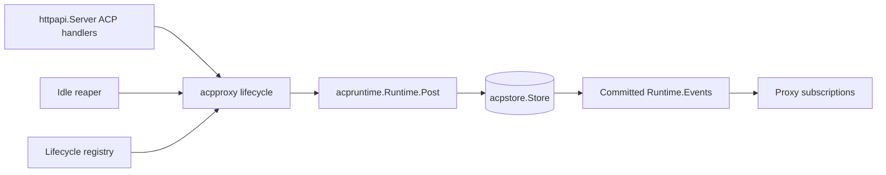

# Plan: Phase 03 - ACP Proxy and HTTP Lifecycle

**Date:** 2026-08-23
**Status:** DRAFT
**Risk Level:** High

---

## Phase Goal

Build lifecycle ownership and HTTP transport over the Phase 02 ACP store/runtime: one live runtime per server ID, durable status reporting, initialize-only recreation, idle reaping, gap-free subscriptions, atomic deletion, coordinated shutdown, and the complete ACP POST/SSE/list/status/events/DELETE API.

## References and Assumptions

- `docs/plans/20260815-agent-bridge.md` is authoritative, especially the sections "Authentication and errors", "ACP HTTP contract", "ACP lifecycle and persistence", "ACP state endpoints and schema", and "Environment, shutdown, and image".
- Phase 01 plan: `docs/plans/20260823-01-scaffolding.md`. Extend `httpapi.Server` in `internal/httpapi/server.go`; reuse `Problem`, `WriteProblem`, `DecodeJSON`, authentication/logging, `config.Config`, and the lifecycle registry.
- Phase 02 plan: `docs/plans/20260823-02-acp-persistence-runtime.md`. Consume `internal/acpstore`, `internal/acpruntime`, and `internal/mockagent` directly. Do not create an `internal/acp` package or duplicate their models.
- Phase 01 already parses agent commands, ACP request timeout, and idle TTL. Phase 02 owns `acpruntime.Resolver`, launch resolution, sanitized agent environment through shared `internal/childenv`, and private mock execution.
- Phase 02 owns `acpruntime.Runtime.Post`: JSON-RPC shape/routing, exact raw ID correlation, duplicate in-flight rejection, request timeout, client notification/response forwarding, reverse-call completion, session attribution, and response delivery. It also owns stdout classification, synthetic events, `acpstore.AppendOutput`, commit-before-delivery, stderr redaction/capping, and process-group termination.
- Phase 03 treats `Runtime.Post`, `Runtime.Events`, `Runtime.PID`, `Runtime.Stderr`, `Runtime.Wait`, and `Runtime.Kill` as the subprocess boundary. It must not parse output, match IDs, persist events/sessions, re-redact stderr, or write stdin itself.
- Phase 03 uses Phase 02 store operations and models unchanged. Initial `CreateServer` and recreation via existing `Store.SetStatus(StatusCreating)` own entry into `creating`; `Runtime.Start` owns creating-to-idle, `Runtime.Post` owns busy/idle, and `Runtime.Kill`/exit own exited. Phase 03 never writes busy/idle/exited itself.
- `mock` remains private/test-only and is never advertised by public docs or a CLI subcommand.
- Tests inject clocks/tickers and runtime factories. Process/SSE integration tests alone may use bounded real deadlines.

## Scope Boundaries

**Included:** `internal/acpproxy` instance ownership, per-server lifecycle locks, durable-status observation, exited recreation, event subscription wakeups/replay, idle reaping, deletion, shutdown, ACP HTTP validation/error mapping/handlers, and integration tests.

**Excluded:** agent config parsing/resolution, child environment sanitization, JSONL pumps, JSON-RPC matching/timeouts/duplicate handling, reverse-call correlation, session extraction, event persistence, stderr processing, process-group primitives, and mock-agent implementation; all are Phase 02 responsibilities.

## Consumed Interfaces

Use the completed Phase 02 declarations rather than introducing aliases or proxy-local copies:

- `acpstore.Store`: `CreateServer`, `Server`, `Servers`, `SetStatus`, `DeleteServer`, `Session`, `Sessions`, and `Events`. Phase 03 uses `SetStatus` only for exited-to-creating recreation. Runtime-owned paths use `SetLive`, `SetStatus` for busy/idle, `MarkExited`, and `AppendOutput`.
- `acpstore.Server`, `acpstore.Session`, `acpstore.Event`, `acpstore.EventQuery`, `acpstore.StatusCreating`, `StatusIdle`, `StatusBusy`, `StatusExited`, `ErrNotFound`, `ErrConflict`, and `ErrDeleted`.
- `acpruntime.Resolver.Resolve`, `acpruntime.Start`, `acpruntime.Runtime.Post`, `PID`, `Events`, `Stderr`, `Wait`, and `Kill`.
- `httpapi.Server` and Phase 01's problem/body/router/lifecycle facilities.

`internal/acpproxy` introduces only lifecycle-facing declarations:

```go
type Proxy struct { /* store, resolver, runtime factory, live instances, keyed locks */ }

var (
	ErrMissingAgent   = errors.New("agent is required for a new server")
	ErrAgentConflict  = errors.New("server uses a different agent")
	ErrReinitialize   = errors.New("exited server requires initialize")
	ErrDeleting       = errors.New("server is deleting")
	ErrClosed         = errors.New("proxy is shutting down")
)

type Subscription interface {
	Next(context.Context) (acpstore.Event, error)
	Close()
}

func New(store *acpstore.Store, resolver acpruntime.Resolver, requestTimeout, idleTTL time.Duration, log *slog.Logger) *Proxy
func (p *Proxy) Post(ctx context.Context, serverID string, agent *string, method string, payload json.RawMessage) (acpruntime.PostResult, error)
func (p *Proxy) Subscribe(ctx context.Context, serverID string, after uint64) (Subscription, error)
func (p *Proxy) LivePID(serverID string) (int, bool)
func (p *Proxy) Delete(ctx context.Context, serverID string) error
func (p *Proxy) Shutdown(ctx context.Context) error
```

If Phase 02's concrete `Runtime.Post` result/error names differ, use them directly and map them in `acpproxy`; do not add compatibility wrappers in `acpruntime`.

## Target Flow



## Ordered Atomic Tasks

### Task 3.1: Implement Per-Server Runtime Ownership and Recreation

**Description:** Create `internal/acpproxy` and serialize creation/recreation for each server ID while keeping unrelated IDs concurrent, delegating post/status mechanics to Phase 02.

**Files:** `internal/acpproxy/proxy.go`, `internal/acpproxy/proxy_test.go`

**Symbols:** `acpproxy.Proxy`, `New`, `Proxy.Post`, private `instance`, `runtime`, `runtimeFactory`, `newWithFactory`, `getOrCreate`, `lifecycleLock`.

**References:** Master sections "ACP HTTP contract" and "ACP lifecycle and persistence"; consumed interfaces above.

**Dependencies:** Completed Phases 01-02.

**Risk:** High

**Reversibility:** Needs careful rollback because memory/SQLite lifecycle state must agree.

**Strict test-first steps:**

- [ ] Write fake-runtime/factory tests proving concurrent first POSTs for one server create exactly one row/runtime, while different server IDs create concurrently. Cover missing first agent, matching/omitted later agent, conflicting later agent, resolution failure creating no row, spawn failure retaining the Phase 02 exited row, and keyed-lock cleanup.
- [ ] Test creation uses Phase 02 `Resolver.Resolve` and `acpruntime.Start`, never parses config or constructs a `LaunchSpec` locally.
- [ ] Test `Proxy.Post` calls the selected runtime's `Post` exactly once and returns its exact `acpruntime.PostResult`. Assert the proxy performs no store busy/idle write; Phase 02 tests and Phase 03 integration tests own those transition assertions.
- [ ] Test Phase 02 duplicate-ID, timeout, accepted, raw response, JSON-RPC error response, client-response, persistence, write, and process-exit outcomes are propagated without proxy-level ID tracking, timeout, session attribution, or persistence.
- [ ] Test an exited durable server recreates only when the HTTP-validated method is `initialize`; preserve the stored agent, reject a conflicting agent, transition exited-to-creating with existing `Store.SetStatus`, let `Runtime.Start` transition to idle, and reject every other method with a reinitialization conflict. Never synthesize session requests.
- [ ] **RED evidence:** Run `go test ./internal/acpproxy -run 'Test(ProxyOwnership|ProxyPostDelegation|ProxyRecreate)'`; retain missing-package/symbol failure.
- [ ] Define a narrow private `runtime` interface matching only the consumed `acpruntime.Runtime` methods and an injected `runtimeFactory` for tests; production `New` binds them to `acpruntime.Start` without wrapping Phase 02 result/error/model types.
- [ ] Implement a mutex-protected live map plus one keyed lifecycle mutex per server ID. Resolve before initial `CreateServer`; never hold the global map mutex during resolution, spawn, `Runtime.Post`, store I/O, wait, or kill.
- [ ] Pass the Phase 01 configured timeout only to `acpruntime.Start`; do not add a proxy timer. Use the already HTTP-validated `method` argument only for initialize-only recreation policy, then pass raw payload unchanged to `Runtime.Post`.
- [ ] **GREEN evidence:** Run the focused tests under `-race -count=10` and record one-runtime/status/recreation assertions passing.

**Verification:** `go test -race ./internal/acpproxy -run 'Test(ProxyOwnership|ProxyPostDelegation|ProxyRecreate)' -count=10`

**Deliverable:** One concurrency-safe lifecycle owner per live server, with exact `Runtime.Post` delegation and no duplicated runtime/store responsibilities.

### Task 3.2: Build Durable Gap-Free Subscriptions

**Description:** Turn Phase 02 committed-event notifications into bounded wakeups over authoritative SQLite replay.

**Files:** `internal/acpproxy/subscription.go`, `internal/acpproxy/subscription_test.go`, `internal/acpproxy/proxy.go`

**Symbols:** `Proxy.Subscribe`, `Subscription`, private `subscription`, `watchEvents`, `notifySubscribers`.

**References:** Master "ACP lifecycle and persistence" SSE ordering requirements; `acpruntime.Runtime.Events`; `acpstore.Store.Events`.

**Dependencies:** Task 3.1.

**Risk:** High

**Reversibility:** Needs careful rollback because gaps/duplicates are externally observable.

**Strict test-first steps:**

- [ ] Test unknown server fails before subscription creation and exited servers can replay persisted events without a live runtime.
- [ ] Race a committed event between subscriber registration and watermark observation; assert every sequence greater than `after` appears once in ascending order.
- [ ] Overflow a bounded notification channel and prove `Next` catches up from `acpstore.Events` without gaps. Treat `Runtime.Events` values as commit wakeups, not a second persistence path.
- [ ] Test multiple subscribers advance independently; request cancellation closes only that subscription; runtime exit preserves replay; DELETE/shutdown closes all affected subscriptions.
- [ ] **RED evidence:** Run `go test ./internal/acpproxy -run 'TestSubscription'`; retain missing-symbol failures.
- [ ] Register the subscriber before reading the durable server watermark; replay through that watermark; then query after the last emitted sequence whenever awakened or a sequence gap is observed.
- [ ] Keep at most one/coalesced wakeup per subscriber and no unbounded event queue. Return copied `acpstore.Event` values directly.
- [ ] **GREEN evidence:** Run `go test -race ./internal/acpproxy -run 'TestSubscription' -count=20`.

**Verification:** `go test -race ./internal/acpproxy -run 'TestSubscription' -count=20`

**Deliverable:** Replay/live subscriptions whose source of truth remains Phase 02 SQLite state.

### Task 3.3: Implement Idle Reaping, Delete, and Shutdown

**Description:** Add all proxy-owned termination paths with current-generation checks and lifecycle-registry ordering.

**Files:** `internal/acpproxy/reaper.go`, `internal/acpproxy/reaper_test.go`, `internal/acpproxy/proxy.go`, `internal/acpproxy/proxy_test.go`, `internal/app/app.go`, `internal/app/app_test.go`

**Symbols:** `Proxy.StartReaper`, private `reapOnce`; `Proxy.Delete`, `Proxy.Shutdown`, `instance.close`; existing `app.Run`, `lifecycle.Registry.Add`.

**References:** Master "ACP HTTP contract", "ACP lifecycle and persistence", and "Environment, shutdown, and image" sections.

**Dependencies:** Tasks 3.1-3.2.

**Risk:** High

**Reversibility:** Needs careful rollback because incorrect signaling can kill a replacement process.

**Strict test-first steps:**

- [ ] With fake clock/ticker, test idle TTL zero disables reaping; only current idle instances at/after their deadline are reaped; creating/busy/exited instances and refreshed idle transitions are skipped.
- [ ] Test reaping takes the same keyed lock as create/delete, rechecks current `acpstore.Server` status/generation, calls current `Runtime.Kill`, removes the live instance, observes the runtime-owned exited transition, closes subscriptions, preserves events/sessions, and permits only initialize recreation.
- [ ] Test DELETE unknown is not found; it marks deleting before termination so concurrent POST is conflict; closes subscriptions; calls `Runtime.Kill`/`Wait`; removes the current generation; then calls `acpstore.DeleteServer`. Late committed wakeups cannot recreate rows.
- [ ] Test successful DELETE prunes server/session/event rows and allows a later first POST with a newly supplied agent. A store delete failure remains visible and cannot silently publish a half-deleted live instance.
- [ ] Test shutdown is idempotent, blocks create/recreate, stops the reaper, closes subscriptions, kills/waits all current runtimes, preserves durable rows, and never signals PIDs obtained only from `acpstore.Server`.
- [ ] Add an app registry-order test proving proxy cleanup runs before the Phase 02 store checkpoint/close and before the Phase 01 ten-second deadline expires.
- [ ] **RED evidence:** Run `go test ./internal/acpproxy ./internal/app -run 'Test(Reaper|ProxyDelete|ProxyShutdown|ACPRegistryOrder)'`; retain failing lifecycle assertions.
- [ ] Give each instance a generation and deleting/closed state. Perform kill/wait/store operations outside global locks but under the server's lifecycle lock.
- [ ] Register proxy cleanup after store cleanup registration so Phase 01's reverse-order registry kills runtimes first.
- [ ] **GREEN evidence:** Run focused tests under `-race -count=10` and retain descendant/subscription/order assertions.

**Verification:** `go test -race ./internal/acpproxy ./internal/app -run 'Test(Reaper|ProxyDelete|ProxyShutdown|ACPRegistryOrder)' -count=10`

**Deliverable:** Safe reaping, deletion, and shutdown that target only currently owned runtimes.

### Task 3.4: Add Strict ACP POST HTTP Handling

**Description:** Extend `httpapi.Server` with POST negotiation, bounded raw-envelope validation, agent selection, proxy dispatch, and exact problem mapping.

**Files:** `internal/httpapi/server.go`, `internal/httpapi/acp.go`, `internal/httpapi/acp_test.go`, `internal/httpapi/problem.go`

**Symbols:** `httpapi.Dependencies.ACP`, `Dependencies.ACPStore`, `Server.registerACPRoutes`, `Server.handleACPPost`, private `validateServerID`, `decodeACPEnvelope`, `parseAgentQuery`, `mapACPError`.

**References:** Master "Authentication and errors" and "ACP HTTP contract" sections.

**Dependencies:** Tasks 3.1 and 3.3; Phase 01 `httpapi.Server`; Phase 02 typed runtime errors.

**Risk:** Medium

**Reversibility:** Easy to revert.

**Strict test-first steps:**

- [ ] Add server-ID tables for 1-128 bytes and `[A-Za-z0-9._-]`; reject empty, decoded slash, non-ASCII, spaces, and 129 bytes with 400.
- [ ] Test `Content-Type` requires `application/json` while allowing parameters/case; missing/wrong is 415. Test missing `Accept`, `application/json`, `application/*`, `*/*`, comma lists, and parameters; incompatible values are 406.
- [ ] Test exact 10 MiB acceptance and over-limit 413; malformed/trailing JSON, batch/non-object, wrong/missing `jsonrpc`, `id:null`, invalid ID type, and invalid request/notification/response shape are 400. Preserve the raw object for `Runtime.Post`.
- [ ] Test valid request, notification, and client-response shapes. Validation may classify only enough to reject invalid HTTP input and identify initialize for lifecycle policy; it must not correlate IDs, sessions, or agent output.
- [ ] Test first agent omission 400; unknown agent 400; later conflict 409; deleting/reinitialize conflict 409; duplicate ID from Phase 02 maps 409; Phase 02 timeout maps 504; process/spawn/write/exit maps 502 with `Runtime.Stderr()` as already capped/redacted `agentStderr`; store failure maps 507.
- [ ] Test `acpruntime.PostResult.Response` carries raw normal and JSON-RPC error responses as HTTP 200; `PostResult.Accepted` produces 202 with no body.
- [ ] **RED evidence:** Run `go test ./internal/httpapi -run TestACPPost`; retain missing-handler failures.
- [ ] Extend `httpapi.Dependencies` with `ACP *acpproxy.Proxy` and `ACPStore *acpstore.Store`, retaining the Phase 01 `NewServer(deps) *Server` and `Server.Handler() http.Handler` assembly path. Register `POST /v1/acp/{serverId}` through that server and existing auth/logging/problem behavior.
- [ ] Reuse `DecodeJSON` where it can preserve `json.RawMessage`; otherwise add one ACP-specific bounded raw decoder in `acp.go`, not generic duplicate middleware.
- [ ] Map Phase 02/acpproxy typed errors only; do not reimplement timeout, duplicate detection, stderr redaction, or response matching.
- [ ] **GREEN evidence:** Re-run the focused handler table and record exact status/content-type/body results.

**Verification:** `go test ./internal/httpapi -run TestACPPost -count=1 && go vet ./internal/httpapi`

**Deliverable:** Exact ACP POST transport semantics over `acpproxy.Proxy.Post` and Phase 02 runtime behavior.

### Task 3.5: Add List, Status, and Events Handlers

**Description:** Expose durable state through `httpapi.Server`, consulting the proxy only for current live PID ownership.

**Files:** `internal/httpapi/server.go`, `internal/httpapi/acp.go`, `internal/httpapi/acp_test.go`

**Symbols:** `Server.handleACPList`, `Server.handleACPStatus`, `Server.handleACPEvents`, private `parseEventQuery`.

**References:** Master "ACP state endpoints and schema" section; `acpstore.Store` query methods.

**Dependencies:** Task 3.4.

**Risk:** Medium

**Reversibility:** Easy to revert.

**Strict test-first steps:**

- [ ] Test `GET /v1/acp` returns all durable live/exited servers sorted by `serverId`, with exactly `serverId`, `agent`, `status`, `createdAtMs`, and `updatedAtMs`.
- [ ] Test unknown status is 404; session IDs are sorted; `lastEventSeq` is durable; PID appears only when `Proxy.LivePID` confirms the current generation and is otherwise omitted.
- [ ] Test events defaults `after=0`, `limit=100`, `order=asc`; exclusive after; limit 1-1000; asc/desc; strict decimal parsing; repeated/empty/unknown values; and raw payload embedding rather than JSON string quoting.
- [ ] Test session filtering and unknown-session 404, with unknown server checked first.
- [ ] **RED evidence:** Run `go test ./internal/httpapi -run 'TestACP(List|Status|Events)'`; retain missing-handler failures.
- [ ] Register exact method/path patterns on `httpapi.Server`; call `acpstore.Servers`, `Server`, `Sessions`, and `Events` directly for durable data.
- [ ] Parse scalar query keys strictly and reject repeated values instead of choosing one.
- [ ] **GREEN evidence:** Re-run the focused tests and retain exact JSON/sorting/query assertions.

**Verification:** `go test ./internal/httpapi -run 'TestACP(List|Status|Events)' -count=1`

**Deliverable:** Durable list/status/event views with no stale-PID exposure.

### Task 3.6: Add SSE and DELETE Handlers

**Description:** Frame proxy subscriptions as SSE and expose lifecycle deletion with exact negotiation.

**Files:** `internal/httpapi/server.go`, `internal/httpapi/acp.go`, `internal/httpapi/acp_sse_test.go`

**Symbols:** `Server.handleACPSSE`, `Server.handleACPDelete`, private `parseLastEventID`, `writeSSEEvent`.

**References:** Master "ACP HTTP contract" SSE/DELETE requirements; `acpproxy.Proxy.Subscribe` and `Delete`.

**Dependencies:** Tasks 3.2-3.5.

**Risk:** High

**Reversibility:** Needs careful rollback because streaming behavior is externally observable.

**Strict test-first steps:**

- [ ] Test missing `Accept` or values allowing `text/event-stream` pass; incompatible values return 406. Test absent `Last-Event-ID`, `0`, and max `uint64`; reject signs, blank, overflow, non-decimal, and repeated headers with 400.
- [ ] Test framing exactly `event: message`, decimal `id`, raw compact JSON `data`, blank terminator, and `: heartbeat` every 15 seconds. Assert `text/event-stream`, `Cache-Control: no-cache`, and flush after each frame.
- [ ] Through the handler, race replay/live commits and assert no gaps/duplicates; subscriber lag catches up from SQLite; disconnect closes only the subscription and not the runtime.
- [ ] Test unknown SSE/DELETE server is 404; DELETE returns empty 204, closes SSE, prunes durable rows, and makes a concurrent POST receive 409.
- [ ] **RED evidence:** Run `go test ./internal/httpapi -run 'TestACP(SSE|Delete)'`; retain missing-handler failures.
- [ ] Stream `Subscription.Next` until request cancellation, delete/shutdown closure, or write failure. Keep heartbeat timing in HTTP, not `acpproxy`.
- [ ] Call `Proxy.Delete` from DELETE and reuse shared server-ID/problem mapping.
- [ ] **GREEN evidence:** Run focused tests under `-race -count=10`.

**Verification:** `go test -race ./internal/httpapi -run 'TestACP(SSE|Delete)' -count=10`

**Deliverable:** Standards-compliant gap-free ACP SSE and atomic HTTP deletion.

### Task 3.7: Add End-to-End ACP Lifecycle Tests

**Description:** Verify Phase 03 composition against the real Phase 02 store, runtime, resolver, and private mock agent.

**Files:** `internal/integration/acp_test.go`, `internal/app/app.go`, `internal/app/app_test.go`

**Symbols:** `TestACPLifecycle`, `TestACPReplayAfterRestart`, `TestACPDeleteRace`, `TestACPShutdown`; existing `app.Run`.

**References:** All master ACP sections and completed Phase 02 mock behaviors.

**Dependencies:** Tasks 3.1-3.6.

**Risk:** High

**Reversibility:** Easy to revert tests; fixes may span proxy/HTTP composition.

**Strict test-first steps:**

- [ ] Use `internal/mockagent` as delivered by Phase 02; extend only its existing private test protocol when an assertion cannot be expressed, with its tests changed in the same RED/GREEN cycle. Do not create another mock package.
- [ ] Test first initialize, session cwd persistence, synchronous raw response, notification 202, reverse-call/client-response flow, duplicate ID, timeout plus late SSE/event visibility, invalid stdout, stderr-safe 502, exit/reinitialize, and sorted list/status/events.
- [ ] Attribute protocol matching/session/persistence/busy-idle assertions to `acpruntime.Runtime.Post`/`acpstore`; assert `acpproxy` only owns instance lifecycle and routes committed events.
- [ ] Test SSE reconnect from an exact sequence and replay after bridge restart. Startup reconciliation marks stale live rows exited and never signals persisted PIDs.
- [ ] Race DELETE with output and assert no rows return; test shutdown closes SSE, kills current process groups, checkpoints after runtimes stop, removes PID file, and finishes inside ten seconds.
- [ ] **RED evidence:** Run `go test ./internal/integration ./internal/app -run 'TestACP'`; retain the first missing composition/lifecycle failure.
- [ ] Wire `acpstore.Store`, `acpruntime.Resolver`, `acpproxy.Proxy`, and `httpapi.Server` in `app.Run`; register cleanup in the required reverse order. Make only fixes demanded by integration failures.
- [ ] **GREEN evidence:** Run the focused integration suite under `-race` and retain process cleanup/replay assertions.

**Verification:** `go test -race ./internal/integration ./internal/app -run 'TestACP' -count=1 && CGO_ENABLED=0 go test ./...`

**Deliverable:** End-to-end evidence that Phase 03 composes, rather than duplicates, Phase 02 protocol/runtime behavior.

## Dependencies

| Task | Depends On |
|---|---|
| 3.1 | Completed Phases 01-02 |
| 3.2 | 3.1 |
| 3.3 | 3.1, 3.2 |
| 3.4 | 3.1, 3.3 |
| 3.5 | 3.4 |
| 3.6 | 3.2, 3.3, 3.4, 3.5 |
| 3.7 | 3.1-3.6 |

## Phase Deliverables

- `internal/acpproxy` as the sole owner of live instance lifecycle, recreation, subscriptions, reaping, deletion, and shutdown; Phase 02 remains the owner of busy/idle runtime transitions.
- ACP handlers implemented as methods on Phase 01 `httpapi.Server`.
- Direct reuse of Phase 02 `acpstore`, `acpruntime.Runtime.Post`, resolver, committed events, stderr, and `internal/mockagent`.
- Race-focused unit tests and real HTTP/SQLite/subprocess integration coverage.

## Completion Criteria

- [ ] Every task retains intentional RED evidence before implementation and focused GREEN evidence afterward.
- [ ] Every required ACP route is registered through `httpapi.Server`; router 404/405/auth/body errors still use Phase 01 RFC 9457 behavior.
- [ ] `go test -race ./internal/acpproxy ./internal/httpapi ./internal/integration ./internal/app -run 'TestACP|TestProxy|TestReaper|TestSubscription'` passes.
- [ ] `go test ./...`, `go vet ./...`, and `CGO_ENABLED=0 go build -trimpath ./cmd/agent-bridge` pass.
- [ ] No `internal/acp` package, resolver/config parser, JSONL parser, ID waiter map, session extractor, output persistence path, stderr redactor, or mock-agent duplicate exists in Phase 03.
- [ ] Manual inspection confirms subscriptions read committed `acpstore.Event` data, lifecycle termination targets only current `acpruntime.Runtime` objects, and persisted PIDs are never signaled.

## Open Questions

- None for implementation. Use the concrete Phase 02 `Runtime.Post` result/error declarations produced by that phase and map them without wrappers.
