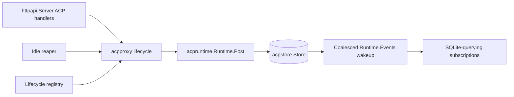

# Plan: Phase 03 - ACP Proxy and HTTP Lifecycle

**Date:** 2026-08-23
**Revised:** 2026-09-12
**Status:** DRAFT
**Risk Level:** High

---

## Phase Goal

Build lifecycle ownership and HTTP transport over the Phase 02 ACP store/runtime: one live runtime per server ID, durable status reporting, initialize-only recreation, idle reaping, gap-free subscriptions, atomic deletion, coordinated shutdown, and the complete ACP POST/SSE/list/status/events/DELETE API.

## References and Assumptions

- `docs/plans/20260815-agent-bridge.md` is authoritative, especially the sections "Authentication and errors", "ACP HTTP contract", "ACP lifecycle and persistence", "ACP state endpoints and schema", and "Environment, shutdown, and image".
- `docs/references/acp-v1-protocol.md`: normative ACP v1 field map and keyless/auth implications (§5, §9); all ACP claims must be checked against it.
- Phase 01 plan: `docs/plans/20260823-01-scaffolding.md`. Extend `httpapi.Server` in `internal/httpapi/server.go`; reuse `Problem`, `WriteProblem`, `DecodeJSON`, authentication/logging, `config.Config`, and the lifecycle registry.
- Phase 02 plan: `docs/plans/20260823-02-acp-persistence-runtime.md`. Consume `internal/acpstore`, `internal/acpruntime`, and `internal/mockagent` directly. Do not create an `internal/acp` package or duplicate their models.
- Phase 01 already parses agent commands, ACP request timeout, and idle TTL. Phase 02 owns `acpruntime.Resolver`, launch resolution, sanitized agent environment through shared `internal/childenv`, and private mock execution.
- Phase 02 owns `acpruntime.Runtime.Post`: JSON-RPC shape/routing, sole input compaction/JSONL framing, one bounded writer path for every envelope, 128-byte ID tokens, the 256 correlation cap, bounded lifecycle metadata, 30-second lifecycle grace/expiry kill, duplicate rejection, serialized busy/idle reconciliation, request timeout, client notification/response forwarding, reverse-call completion, session attribution, and response delivery. It also owns exact agent-output byte persistence after JSONL framing removal, synthetic events, `acpstore.AppendOutput`, commit-before-delivery, stderr redaction/capping, and process-group termination on every direct-child exit.
- Phase 03 treats `Runtime.Post`, `Runtime.Events`, `Runtime.PID`, `Runtime.Stderr`, `Runtime.Wait`, and `Runtime.Kill` as the subprocess boundary. `Runtime.Events` is only a capacity-1 non-blocking/coalesced commit wakeup; SQLite queries are authoritative. Phase 03 must not parse output, match IDs, persist events/sessions, re-redact stderr, compact stored output, or write stdin itself.
- Phase 03 uses Phase 02 store operations and models unchanged. Initial `CreateServer` and recreation via existing `Store.SetStatus(StatusCreating)` own entry into `creating`; `Runtime.Start` owns creating-to-idle, `Runtime.Post` owns busy/idle, and `Runtime.Kill`/exit own exited. Phase 03 never writes busy/idle/exited itself.
- `mock` remains private/test-only and is never advertised by public docs or a CLI subcommand.
- SQLite sequence and every `after`/`Last-Event-ID` API are limited to `0..math.MaxInt64`. Store/proxy models use `int64`; HTTP accepts/emits nonnegative decimal and converts DTOs directly from `int64` without `uint64`, `float64`, or architecture-sized `int` intermediates.
- Tests inject clocks/tickers and runtime factories. Unit SSE heartbeat tests use an injected ticker. Exactly one bounded real-time integration test waits for the production 15-second heartbeat; no repeated/race-counted test sleeps 15 seconds.

## Scope Boundaries

**Included:** `internal/acpproxy` instance ownership, per-server lifecycle locks, durable-status observation, exited recreation, event subscription wakeups/replay, idle reaping, deletion, shutdown, ACP HTTP validation/error mapping/handlers, and integration tests.

**Excluded:** agent config parsing/resolution, child environment sanitization, JSONL pumps, JSON-RPC matching/timeouts/duplicate handling, reverse-call correlation, session extraction, event persistence, stderr processing, process-group primitives, and mock-agent implementation; all are Phase 02 responsibilities.

## Consumed Interfaces

Use the completed Phase 02 declarations rather than introducing aliases or proxy-local copies:

- `acpstore.Store`: `CreateServer`, `Server`, `Servers`, `SetStatus`, `DeleteServer`, `Session`, `Sessions`, and `Events`. Phase 03 uses `SetStatus` only for exited-to-creating recreation. Runtime-owned paths use `SetLive`, `SetStatus` for busy/idle, `MarkExited`, and `AppendOutput`.
- `acpstore.Server`, `acpstore.Session`, `acpstore.Event`, `acpstore.EventQuery`, `acpstore.StatusCreating`, `StatusIdle`, `StatusBusy`, `StatusExited`, `ErrNotFound`, `ErrConflict`, and `ErrDeleted`.
- `acpruntime.Resolver.Resolve`, `acpruntime.Start`, `acpruntime.Runtime.Post`, `PID`, `Events`, `Stderr`, `Wait`, and `Kill`.
- `httpapi.Server` and Phase 01's problem/body/router/lifecycle facilities.

`internal/acpproxy` introduces only lifecycle-facing declarations:

```go
type Proxy struct { /* store, resolver, runtime factory, live instances, keyed locks */ }

var (
	ErrMissingAgent   = errors.New("agent is required for a new server")
	ErrAgentConflict  = errors.New("server uses a different agent")
	ErrReinitialize   = errors.New("exited server requires initialize")
	ErrDeleting       = errors.New("server is deleting")
	ErrClosed          = errors.New("proxy is shutting down")
	ErrRuntimeCapacity = errors.New("ACP runtime capacity reached")
)

type Subscription interface {
	Next(context.Context) (acpstore.Event, error)
	Close()
}

func New(store *acpstore.Store, resolver acpruntime.Resolver, requestTimeout, idleTTL time.Duration, log *slog.Logger) *Proxy
func (p *Proxy) Post(ctx context.Context, serverID string, agent *string, method string, payload json.RawMessage) (acpruntime.PostResult, error)
func (p *Proxy) Subscribe(ctx context.Context, serverID string, after int64) (Subscription, error)
func (p *Proxy) LivePID(serverID string) (int, bool)
func (p *Proxy) Delete(ctx context.Context, serverID string) error
func (p *Proxy) Shutdown(ctx context.Context) error
```

If Phase 02's concrete `Runtime.Post` result/error names differ, use them directly and map them in `acpproxy`; do not add compatibility wrappers in `acpruntime`.

Each live instance has an activity lease count and a `terminating` gate protected by its per-server lifecycle lock. `Proxy.Post` acquires that lock, resolves/rechecks the current generation and deleting/closed/terminating state, increments active activity before releasing the lock, then calls `Runtime.Post` without holding any lifecycle/global lock. Lease release reacquires the lifecycle lock, decrements exactly once in a `defer`, and wakes termination waiters when active reaches zero. The reaper is policy cleanup: it gates/rechecks and may wait for zero activity before `Runtime.Kill`. DELETE and shutdown are explicit cancellation: under the same lock they gate new leases and detach the current generation, close subscriptions, then call `Runtime.Kill` immediately without holding lifecycle/global locks. `Kill` signals and waits process/pumps, unblocking active `Runtime.Post`; only then do DELETE/shutdown wait for lease count zero and perform idempotent `Wait` confirmation. Public `busy` remains exclusively runtime-owned and means any reserved correlation in waiting, lifecycle grace, or committing state. Notifications/client responses and proxy activity leases do not reserve correlations or write busy/idle. Phase 02 serializes status reconciliation, so durable busy prevents the reaper from treating grace/commit work as idle.

The proxy permits a fixed maximum of 64 live ACP runtimes. Creation/recreation reserves one slot under the live-map lock before `CreateServer`/`SetStatus(StatusCreating)` or spawn; full capacity returns `ErrRuntimeCapacity` for HTTP 429 without creating/changing a row or spawning. Spawn failure and every runtime exit release exactly one slot. This is fixed production policy, not configuration.

## Target Flow



## Ordered Atomic Tasks

### Task 3.1: Implement Per-Server Runtime Ownership and Recreation

**Description:** Create `internal/acpproxy` and serialize creation/recreation for each server ID while keeping unrelated IDs concurrent, delegating post/status mechanics to Phase 02.

**Files:** `internal/acpproxy/proxy.go`, `internal/acpproxy/proxy_test.go`

**Symbols:** `acpproxy.Proxy`, `New`, `Proxy.Post`, private `instance`, `runtime`, `runtimeFactory`, `newWithFactory`, `getOrCreate`, `lifecycleLock`, `acquireActivity`, `releaseActivity`.

**References:** Master sections "ACP HTTP contract" and "ACP lifecycle and persistence"; consumed interfaces above.

**Dependencies:** Completed Phases 01-02.

**Risk:** High

**Reversibility:** Needs careful rollback because memory/SQLite lifecycle state must agree.

**Strict test-first steps:**

- [ ] Write fake-runtime/factory tests proving concurrent first POSTs for one server create exactly one row/runtime, while different server IDs create concurrently. Cover missing first agent, matching/omitted later agent, conflicting later agent, resolution failure creating no row, spawn failure retaining the Phase 02 exited row, and keyed-lock cleanup.
- [ ] Race 65 distinct creations and prove exactly 64 reserve live capacity before row creation/spawn; the remainder returns `ErrRuntimeCapacity`, creates no row, and never spawns. Prove spawn failure and natural/controlled direct-child exit each release once so a later creation succeeds.
- [ ] Test creation uses Phase 02 `Resolver.Resolve` and `acpruntime.Start`, never parses config or constructs a `LaunchSpec` locally.
- [ ] Test `Proxy.Post` calls the selected runtime's `Post` exactly once and returns its exact `acpruntime.PostResult`. Assert the proxy performs no store busy/idle write; Phase 02 tests and Phase 03 integration tests own those transition assertions.
- [ ] Race Post with reaper, DELETE, and shutdown. Under the keyed lifecycle lock, Post must recheck the current generation/gates and increment active before release. Reaper may wait for lease release before kill; DELETE/shutdown gate/detach then kill immediately so active posts return/release before their wait and HTTP drain. Assert `Runtime.Post` runs without the lifecycle/global lock and every success/error/cancellation path releases exactly once.
- [ ] Test Phase 02 duplicate-ID, correlation capacity, writer admission/timeout, timeout/grace, committing, serialized busy/idle, accepted, raw response, JSON-RPC error response, client-response, persistence, write, and process-exit outcomes are propagated without proxy-level ID/status tracking, timers, session attribution, compaction, or persistence.
- [ ] Test an exited durable server recreates only when the HTTP-validated method is `initialize`; preserve the stored agent, reject a conflicting agent, transition exited-to-creating with existing `Store.SetStatus`, let `Runtime.Start` transition to idle, and reject every other method with a reinitialization conflict. Never synthesize session requests.
- [ ] **RED evidence:** Create the minimal compiling package/API, then run `go test ./internal/acpproxy -run 'Test(ProxyOwnership|ProxyPostDelegation|ProxyRecreate|ActivityLease)'`; retain behavioral failures for duplicate creation, termination/Post overlap, and leaked leases rather than only a missing-package failure.
- [ ] Define a narrow private `runtime` interface matching only the consumed `acpruntime.Runtime` methods and an injected `runtimeFactory` for tests; production `New` binds them to `acpruntime.Start` without wrapping Phase 02 result/error/model types.
- [ ] Implement a mutex-protected live map with a fixed 64-slot count plus one keyed lifecycle mutex per server ID. Resolve before reservation; atomically reserve under the map lock before row creation/spawn and release exactly once on spawn failure or runtime completion. Never hold the global map mutex during resolution, spawn, `Runtime.Post`, store I/O, wait, or kill. Acquire/release activity as defined above; use a condition/channel under the lifecycle lock so termination waits are cancellation-aware and do not spin.
- [ ] Pass the Phase 01 configured timeout only to `acpruntime.Start`; do not add a proxy timer. Use the already HTTP-validated `method` argument only for initialize-only recreation policy, then pass the handler's original validated raw object unchanged to `Runtime.Post`; only the runtime compacts it.
- [ ] **GREEN evidence:** Run the focused tests under `-race -count=10` and record one-runtime/status/recreation assertions passing.

**Verification:** `go test -race ./internal/acpproxy -run 'Test(ProxyOwnership|ProxyPostDelegation|ProxyRecreate|ActivityLease)' -count=10`

**Deliverable:** One concurrency-safe lifecycle owner per live server, with exact `Runtime.Post` delegation and no duplicated runtime/store responsibilities.

### Task 3.2: Build Durable Gap-Free Subscriptions

**Description:** Turn Phase 02 committed-event notifications into bounded wakeups over authoritative SQLite replay.

**Files:** `internal/acpproxy/subscription.go`, `internal/acpproxy/subscription_test.go`, `internal/acpproxy/proxy.go`

**Symbols:** `Proxy.Subscribe`, `Subscription`, private `subscription`, `watchEvents`, `notifySubscribers`, `newSubscriptionTicker`.

**References:** Master "ACP lifecycle and persistence" SSE ordering requirements; `acpruntime.Runtime.Events`; `acpstore.Store.Events`.

**Dependencies:** Task 3.1.

**Risk:** High

**Reversibility:** Needs careful rollback because gaps/duplicates are externally observable.

**Strict test-first steps:**

- [ ] Test unknown server fails before subscription creation and exited servers can replay persisted events without a live runtime.
- [ ] Race a committed event between subscriber registration and watermark observation; assert every sequence greater than `after` appears once in ascending order.
- [ ] Fill/coalesce both the runtime and subscriber capacity-1 notification channels and prove producers never block and `Next` catches up from `acpstore.Events` without gaps. Treat `Runtime.Events` values as wakeups only, not event payloads or a second persistence path. Consumers must two-value-receive (`v, ok := <-wake`): `!ok` means the runtime terminated, so they perform one final replay query past the current watermark and stop; an ignored closed-channel `select` case is permanently ready and would busy-loop SQLite. Add a test that after a natural agent exit each subscription emits its final events and terminates instead of spinning.
- [ ] Drop all wakeups after commits and use an injected bounded fallback ticker to prove `Next` queries after its current sequence and catches up. Production uses one documented bounded interval (one second); tests advance a fake ticker without sleeping.
- [ ] Test multiple subscribers advance independently; request cancellation closes only that subscription; runtime exit preserves replay; DELETE/shutdown closes all affected subscriptions.
- [ ] **RED evidence:** With a compiling subscription skeleton, run `go test ./internal/acpproxy -run 'TestSubscription'`; retain behavioral gap/blocking failures from registration races, dropped wakeups, and fallback polling.
- [ ] Register the subscriber before reading the durable server watermark; replay through that watermark; then query after the last emitted `int64` sequence whenever awakened and on every fallback tick. Querying after a wakeup/tick, rather than trusting a notified sequence, closes all races.
- [ ] Keep at most one/coalesced wakeup per runtime/subscriber and no unbounded event queue. Return copied `acpstore.Event` values directly from SQLite.
- [ ] **GREEN evidence:** Run `go test -race ./internal/acpproxy -run 'TestSubscription' -count=20`.

**Verification:** `go test -race ./internal/acpproxy -run 'TestSubscription' -count=20`

**Deliverable:** Replay/live subscriptions whose source of truth remains Phase 02 SQLite state.

### Task 3.3: Implement Idle Reaping, Delete, and Shutdown

**Description:** Add all proxy-owned termination paths with current-generation checks and lifecycle-registry ordering.

**Files:** `internal/acpproxy/reaper.go`, `internal/acpproxy/reaper_test.go`, `internal/acpproxy/proxy.go`, `internal/acpproxy/proxy_test.go`, `internal/app/app.go`, `internal/app/app_test.go`

**Symbols:** `Proxy.StartReaper`, private `reapOnce`; `Proxy.Delete`, `Proxy.Shutdown`, `instance.close`; existing `app.Run`, Phase 01 pre-drain hook, `lifecycle.Registry.Add`.

**References:** Master "ACP HTTP contract", "ACP lifecycle and persistence", and "Environment, shutdown, and image" sections.

**Dependencies:** Tasks 3.1-3.2.

**Risk:** High

**Reversibility:** Needs careful rollback because incorrect signaling can kill a replacement process.

**Strict test-first steps:**

- [ ] With fake clock/ticker, test idle TTL zero disables reaping; only current idle instances at/after their deadline are reaped; creating/busy/exited instances and refreshed idle transitions are skipped. A durable busy row remains unreapable while the runtime has only a grace-retained or committing correlation, even after its HTTP waiter/lease has returned.
- [ ] Test reaping takes the same keyed lock as create/delete, sets the terminating gate, rechecks current `acpstore.Server` status/generation after activity drains, calls current `Runtime.Kill`, removes the live instance, observes the runtime-owned exited transition, closes subscriptions, preserves events/sessions, and permits only initialize recreation. A refreshed/non-idle state clears the reaper gate without killing.
- [ ] Test DELETE unknown is not found; under the lifecycle lock it marks deleting/terminating, detaches the current generation, and blocks new leases so concurrent POST returns conflict. It closes subscriptions, immediately calls `Runtime.Kill` outside locks to signal/wait process and pumps and unblock active Posts, waits for all activity leases to release, performs idempotent `Wait` confirmation, then calls `acpstore.DeleteServer`. It never waits for the configured request timeout before kill, and late committed wakeups cannot recreate rows.
- [ ] Test successful DELETE prunes server/session/event rows and allows a later first POST with a newly supplied agent. If DB prune fails after close/kill/wait, the durable server remains `exited`, the in-memory runtime is removed, the deleting gate clears, HTTP returns 500, and subscriptions closed by the attempt are not reopened. A subsequent DELETE finds the exited row and retries prune without another process. No process restarts except the normal initialize-only rule.
- [ ] Test shutdown is idempotent, blocks create/recreate and new leases, stops/joins the reaper, closes subscriptions, and immediately calls each current runtime's signal-and-wait `Kill` to unblock active posts; it then waits lease release and idempotent `Wait`, preserves durable rows, and never signals PIDs obtained only from `acpstore.Server`.
- [ ] Add an app shutdown-order test for the Phase 01 pre-drain hook: before `http.Server.Shutdown` begins waiting, stop the reaper, close subscriptions, block new leases, and call signal-and-wait `Kill` on runtimes so long-lived POST/SSE handlers cannot make HTTP drain wait forever. Post-drain performs only idempotent runtime/pump completion confirmation before DB checkpoint/close. Assert all stages share the Phase 01 ten-second deadline.
- [ ] **RED evidence:** With compiling lifecycle methods, run `go test ./internal/acpproxy ./internal/app -run 'Test(Reaper|ProxyDelete|ProxyShutdown|ACPRegistryOrder|ACPPreDrain)'`; retain behavioral failures for lease races, retryable prune failure, and HTTP-drain deadlock prevention.
- [ ] Give each instance a generation and deleting/terminating/closed state. Use the keyed lifecycle lock to gate/detach generations, but call `Runtime.Post`, `Kill`, `Wait`, and store operations without holding lifecycle/global locks. Reaper waits for zero activity before kill; DELETE/shutdown kill before waiting for zero.
- [ ] Integrate staged shutdown with Phase 01: pre-drain proxy shutdown performs signal-and-wait `Kill`; post-drain invokes idempotent `Wait` confirmation and then closes/checkpoints the store. Do not describe post-drain as the first pump wait or rely only on reverse callback registration.
- [ ] **GREEN evidence:** Run focused tests under `-race -count=10` and retain descendant/subscription/order assertions.

**Verification:** `go test -race ./internal/acpproxy ./internal/app -run 'Test(Reaper|ProxyDelete|ProxyShutdown|ACPRegistryOrder|ACPPreDrain)' -count=10`

**Deliverable:** Reaper-safe policy cleanup plus immediate-cancellation DELETE/pre-drain shutdown, with idempotent completion confirmation and retryable durable prune failures.

### Task 3.4: Add Strict ACP POST HTTP Handling

**Description:** Extend `httpapi.Server` with POST negotiation, bounded raw-envelope validation, agent selection, proxy dispatch, and exact problem mapping.

**Files:** `internal/httpapi/server.go`, `internal/httpapi/acp.go`, `internal/httpapi/acp_test.go`, `internal/httpapi/problem.go`

**Symbols:** `httpapi.Dependencies.ACP`, `Dependencies.ACPStore`, `Server.registerACPRoutes`, `Server.handleACPPost`, private `validateServerID`, `decodeACPEnvelope`, `parseAgentQuery`, `mapACPError`.

**References:** Master "Authentication and errors" and "ACP HTTP contract" sections.

**Dependencies:** Tasks 3.1 and 3.3; Phase 01 `httpapi.Server`; Phase 02 typed runtime errors.

**Risk:** Medium

**Reversibility:** Easy to revert.

**Strict test-first steps:**

- [ ] Add server-ID tables for 1-128 bytes and `[A-Za-z0-9._-]`; reject empty, decoded slash, non-ASCII, spaces, and 129 bytes with 400.
- [ ] Test `Content-Type` requires `application/json` while allowing parameters/case; missing/wrong is 415. Test missing `Accept`, `application/json`, `application/*`, `*/*`, comma lists, and parameters; incompatible values are 406.
- [ ] Test exact 10 MiB acceptance and over-limit 413; malformed/trailing JSON, batch/non-object, wrong/missing `jsonrpc`, `id:null`, invalid ID type, and invalid request/notification/response shape are 400. Raw string/numeric ID tokens over 128 bytes, numeric exponent magnitude over 1,000,000, session IDs over 1024 UTF-8 bytes, and lifecycle cwd over 4096 UTF-8 bytes are 400 before runtime creation/admission. Preserve and pass the original validated raw object to `Runtime.Post`; semantic/raw passthrough preserves envelope fields, exact decoded string IDs, numeric lexemes, and payload values, while the runtime alone owns later compaction.
- [ ] Test valid request, notification, and client-response shapes. Validation may classify only enough to reject invalid HTTP input and identify initialize for lifecycle policy; it must not correlate IDs, sessions, or agent output.
- [ ] Test first agent omission 400; unknown agent 400; invalid/over-limit ID or session metadata 400; later conflict 409; deleting/reinitialize/deleted conflict 409; proxy `ErrClosed` maps 503 while the bridge is shutting down; duplicate ID, including a lifecycle ID retained during grace, maps 409; proxy live-runtime capacity and Phase 02 correlation capacity map 429; Phase 02 writer/request timeout maps 504; process/spawn/write/exit maps 502 with `Runtime.Stderr()` as already capped/redacted `agentStderr` when a process was started (spawn/resolution failures omit it); store failure maps 507.
- [ ] Test `acpruntime.PostResult.Response` carries exact agent-emitted normal and JSON-RPC error object bytes after JSONL framing removal as HTTP 200; the handler does not decode/re-marshal them. `PostResult.Accepted` produces 202 with no body.
- [ ] **RED evidence:** With a compiling route stub, run `go test ./internal/httpapi -run TestACPPost`; retain behavioral failures for raw-object delegation, numeric bounds, 409/429/504 mapping, and exact response bytes rather than only missing-handler failure.
- [ ] Extend `httpapi.Dependencies` with `ACP *acpproxy.Proxy` and `ACPStore *acpstore.Store`, retaining the Phase 01 `NewServer(deps) *Server` and `Server.Handler() http.Handler` assembly path. Register `POST /v1/acp/{serverId}` through that server and existing auth/logging/problem behavior.
- [ ] Reuse `DecodeJSON` where it can preserve the original object `json.RawMessage`; otherwise add one ACP-specific bounded raw decoder in `acp.go`, not generic duplicate middleware. For envelope shape/limit validation call the exported `acpruntime.ClassifyClientEnvelope` from Phase 02 (single source of truth) before proxy creation; do not restate its rules in `httpapi`. Pass the original raw object through proxy; `Runtime.Post` is the sole compaction owner.
- [ ] Map Phase 02/acpproxy typed errors only, including `ErrCapacity` to 429; do not reimplement correlation, timeout/grace timers, duplicate detection, stderr redaction, compaction, or response matching.
- [ ] **GREEN evidence:** Re-run the focused handler table and record exact status/content-type/body results.

**Verification:** `go test ./internal/httpapi -run TestACPPost -count=1 && go vet ./internal/httpapi`

**Deliverable:** Exact ACP POST transport semantics over `acpproxy.Proxy.Post` and Phase 02 runtime behavior.

### Task 3.5: Add List, Status, and Events Handlers

**Description:** Expose durable state through `httpapi.Server`, consulting the proxy only for current live PID ownership.

**Files:** `internal/httpapi/server.go`, `internal/httpapi/acp.go`, `internal/httpapi/acp_test.go`

**Symbols:** `Server.handleACPList`, `Server.handleACPStatus`, `Server.handleACPEvents`, private `parseEventQuery`.

**References:** Master "ACP state endpoints and schema" section; `acpstore.Store` query methods.

**Dependencies:** Task 3.4.

**Risk:** Medium

**Reversibility:** Easy to revert.

**Strict test-first steps:**

- [ ] Test `GET /v1/acp` returns all durable live/exited servers sorted by `serverId`, with exactly `serverId`, `agent`, `status`, `createdAtMs`, and `updatedAtMs`.
- [ ] Test unknown status is 404; session IDs are sorted; `lastEventSeq` is the durable nonnegative `int64` value; PID appears only when `Proxy.LivePID` confirms the current generation and is otherwise omitted. DTO conversion writes `int64` directly to JSON numbers and never casts through `uint64`, `int`, or `float64`.
- [ ] Test events defaults `after=0`, `limit=100`, `order=asc`; exclusive after; limit `1..1000` with `0` rejected as 400; asc/desc; strict nonnegative decimal `int64` parsing through `math.MaxInt64`; reject signs, overflow, repeated/empty/unknown values; and raw payload embedding rather than JSON string quoting.
- [ ] Test session filtering, reject filter values over 1024 UTF-8 bytes with 400, and return unknown-session 404 with unknown server checked first.
- [ ] **RED evidence:** With compiling handler stubs, run `go test ./internal/httpapi -run 'TestACP(List|Status|Events)'`; retain behavioral failures for `math.MaxInt64` boundaries, DTO precision, raw payload embedding, sorting, and filtering.
- [ ] Register exact method/path patterns on `httpapi.Server`; call `acpstore.Servers`, `Server`, `Sessions`, and `Events` directly for durable data.
- [ ] Parse scalar query keys strictly and reject repeated values instead of choosing one.
- [ ] **GREEN evidence:** Re-run the focused tests and retain exact JSON/sorting/query assertions.

**Verification:** `go test ./internal/httpapi -run 'TestACP(List|Status|Events)' -count=1`

**Deliverable:** Durable list/status/event views with no stale-PID exposure.

### Task 3.6: Add SSE and DELETE Handlers

**Description:** Frame proxy subscriptions as SSE and expose lifecycle deletion with exact negotiation.

**Files:** `internal/httpapi/server.go`, `internal/httpapi/acp.go`, `internal/httpapi/acp_sse_test.go`

**Symbols:** `Server.handleACPSSE`, `Server.handleACPDelete`, private `parseLastEventID`, `writeSSEEvent`, `newHeartbeatTicker`.

**References:** Master "ACP HTTP contract" SSE/DELETE requirements; `acpproxy.Proxy.Subscribe` and `Delete`.

**Dependencies:** Tasks 3.2-3.5.

**Risk:** High

**Reversibility:** Needs careful rollback because streaming behavior is externally observable.

**Strict test-first steps:**

- [ ] Test missing `Accept` or values allowing `text/event-stream` pass; incompatible values return 406. Test absent `Last-Event-ID`, `0`, and `math.MaxInt64`; reject signs, blank, `math.MaxInt64+1`, other overflow, non-decimal, and repeated headers with 400. Parse and retain `int64` end-to-end.
- [ ] With an injected fake heartbeat ticker, test framing exactly `event: message`, nonnegative decimal `int64 id`, `data: ` followed by exactly the stored agent-output JSON bytes, a blank terminator, and `: heartbeat` on each production-equivalent 15-second tick. Deliberately persist valid non-compact JSON and assert SSE does not re-marshal or compact it. Assert `text/event-stream`, `Cache-Control: no-cache`, and flush after each event/heartbeat frame.
- [ ] Keep this handler suite entirely fake-ticker based. Task 3.7 owns the sole bounded real-time integration test for the actual 15-second production ticker.
- [ ] Through the handler, race replay/live commits and assert no gaps/duplicates; subscriber lag catches up from SQLite; disconnect closes only the subscription and not the runtime.
- [ ] Test unknown SSE/DELETE server is 404; successful DELETE returns empty 204, closes SSE, prunes durable rows, and makes a concurrent POST receive 409. If kill/wait succeeds but DB prune fails, SSE stays closed, the row reports exited, DELETE returns RFC 9457 500, and a subsequent DELETE retries prune and can return 204 without restarting a process.
- [ ] **RED evidence:** With compiling SSE/DELETE handlers, run `go test ./internal/httpapi -run 'TestACP(SSE|Delete)'`; retain behavioral failures for `int64` boundaries, exact stored bytes, fake heartbeat timing, lease races, and retryable prune errors.
- [ ] Stream `Subscription.Next` until request cancellation, delete/shutdown closure, or write failure. Keep heartbeat timing in HTTP, not `acpproxy`, and inject ticker construction through a private test seam.
- [ ] Call `Proxy.Delete` from DELETE and reuse shared server-ID/problem mapping.
- [ ] **GREEN evidence:** Run fake-ticker SSE and DELETE tests under `-race -count=10`; no unit test waits in real time.

**Verification:** `go test -race ./internal/httpapi -run 'TestACP(SSE|Delete)' -count=10`

**Deliverable:** Standards-compliant gap-free ACP SSE and atomic HTTP deletion.

### Task 3.7: Add End-to-End ACP Lifecycle Tests

**Description:** Verify Phase 03 composition against the real Phase 02 store, runtime, resolver, and private mock agent.

**Files:** `internal/integration/acp_test.go`, `internal/app/app.go`, `internal/app/app_test.go`

**Symbols:** `TestACPLifecycle`, `TestACPReplayAfterRestart`, `TestACPDeleteRace`, `TestACPShutdown`; existing `app.Run`.

**References:** All master ACP sections and completed Phase 02 mock behaviors.

**Dependencies:** Tasks 3.1-3.6.

**Risk:** High

**Reversibility:** Easy to revert tests; fixes may span proxy/HTTP composition.

**Strict test-first steps:**

- [ ] Use `internal/mockagent` as delivered by Phase 02; extend only its existing private test protocol when an assertion cannot be expressed, with its tests changed in the same RED/GREEN cycle. Do not create another mock package.
- [ ] Post `session/prompt` and assert its response event carries the retained request `sessionId` and that `/events?sessionId=` returns it like the sibling `session/update` notifications; assert an over-limit `sessionId` on a session-scoped request is 400 before admission.
- [ ] Test first initialize, successful bounded session roster/cwd persistence in the same output transaction, synchronous exact agent response bytes, runtime-compacted agent input from an unchanged HTTP raw object, notification/client-response bounded writer behavior, lexical equivalent numeric duplicate IDs, invalid/over-limit IDs/metadata, 64-live-runtime and 256-correlation capacity 429, timeout 504 with durable busy throughout grace/commit plus late session/SSE/event visibility, grace-expiry exit, invalid stdout, stderr-safe 502, exit/reinitialize, and sorted list/status/events.
- [ ] Attribute protocol matching/session/persistence/busy-idle assertions to `acpruntime.Runtime.Post`/`acpstore`; assert `acpproxy` only owns instance lifecycle and routes coalesced commit wakeups into authoritative store queries.
- [ ] Test SSE reconnect from an exact `int64` sequence and replay after bridge restart, including dropped/coalesced wakeups recovered by polling. Startup reconciliation marks stale live rows exited and never signals persisted PIDs.
- [ ] Add the sole real-time heartbeat integration, `TestRealHeartbeat15Seconds`: use the production ticker, require exactly one heartbeat with a 20-second outer deadline, and run it once without `-race` or repeated count. Every other heartbeat test uses the injected ticker.
- [ ] Race DELETE/reaper/shutdown with active Post leases and late output. Reaper waits for release, but DELETE/shutdown gate and signal-and-wait kill immediately, causing active Posts to release without waiting for request timeout; then they confirm `Wait`. Assert no rows return after successful DELETE. Inject DB prune failure and prove exited/closed 500 state followed by retry success. Test pre-drain completes runtime process/pump waits before HTTP drain; post-drain idempotently confirms completion, checkpoints/closes DB, and removes the PID file inside ten seconds. If the budget expires during HTTP drain, the Phase 01 `http.Server.Close` fallback force-closes remaining connections before post-drain.
- [ ] **RED evidence:** With compiling application composition, run `go test ./internal/integration ./internal/app -run 'TestACP'`; retain the first behavioral failure in sole-owner compaction, numeric/capacity mapping, grace cleanup, explicit-cancellation lease ordering, partial DELETE, or staged shutdown rather than stopping at a compile failure.
- [ ] Wire `acpstore.Store`, `acpruntime.Resolver`, `acpproxy.Proxy`, and `httpapi.Server` in `app.Run`; register explicit pre-drain termination and post-drain confirmation/DB cleanup stages. Make only fixes demanded by integration failures.
- [ ] **GREEN evidence:** Run the focused integration suite under `-race` and retain process cleanup/replay assertions.

**Verification:** `go test -race ./internal/integration ./internal/app -run 'TestACP' -count=1 && CGO_ENABLED=0 go test ./... -count=1`

**Deliverable:** End-to-end evidence that Phase 03 composes, rather than duplicates, Phase 02 protocol/runtime behavior, including lease-safe termination and pre-drain shutdown.

## Dependencies

| Task | Depends On |
|---|---|
| 3.1 | Completed Phases 01-02 |
| 3.2 | 3.1 |
| 3.3 | 3.1, 3.2 |
| 3.4 | 3.1, 3.3 |
| 3.5 | 3.4 |
| 3.6 | 3.2, 3.3, 3.4, 3.5 |
| 3.7 | 3.1-3.6 |

## Phase Deliverables

- `internal/acpproxy` as the sole owner of live instance lifecycle, recreation, subscriptions, reaping, deletion, and shutdown; Phase 02 remains the owner of busy/idle runtime transitions.
- Fixed atomic admission for at most 64 live ACP runtimes, returning 429 without row creation/spawn when full.
- ACP handlers implemented as methods on Phase 01 `httpapi.Server`.
- Direct reuse of Phase 02 `acpstore`, `acpruntime.Runtime.Post`, resolver, coalesced commit wakeups, stderr, and `internal/mockagent`.
- Race-focused unit tests and real HTTP/SQLite/subprocess integration coverage.

## Completion Criteria

- [ ] Every task retains a failing behavioral RED assertion against the smallest compiling seam where feasible; missing symbols alone are setup evidence. Focused GREEN evidence follows implementation.
- [ ] Every required ACP route is registered through `httpapi.Server`; router 404/405/auth/body errors still use Phase 01 RFC 9457 behavior.
- [ ] `go test -race ./internal/acpproxy ./internal/httpapi ./internal/integration ./internal/app -run 'TestACP|TestProxy|TestReaper|TestSubscription'` passes.
- [ ] `go test ./...`, `go vet ./...`, and `CGO_ENABLED=0 go build -trimpath ./cmd/agent-bridge` pass.
- [ ] No `internal/acp` package, resolver/config parser, JSONL parser, ID waiter map, session extractor, output persistence path, stderr redactor, or mock-agent duplicate exists in Phase 03.
- [ ] Phase 03 passes the original validated raw object unchanged; only `Runtime.Post` compacts input. ID/session/cwd limits map to 400, retained duplicates to 409, live-runtime/correlation capacity to 429, writer/request timeout to 504, and shutdown-window posts to 503.
- [ ] All sequence DTOs and parsers use nonnegative `int64` through `math.MaxInt64`; no `uint64`, `float64`, or architecture-sized conversion can overflow or lose precision.
- [ ] Manual inspection confirms subscriptions query committed `acpstore.Event` data after coalesced wakeups and fallback ticks, lifecycle termination targets only leased/current `acpruntime.Runtime` objects, and persisted PIDs are never signaled.
- [ ] Public busy means any waiting, grace-retained, or committing correlation; notification/client-response forwarding and proxy leases do not affect status. Idle reaping cannot target grace/commit work.
- [ ] SSE emits stored agent-output bytes unchanged, heartbeat unit tests use injected tickers, and only one bounded integration test waits for the real 15-second interval.
- [ ] Reaper may wait for activity, but DELETE/shutdown gate and signal-and-wait kill immediately before waiting leases. Partial DELETE prune failure leaves an exited durable row and closed SSE, returns 500, and retries without process restart.
- [ ] Pre-drain `Kill` has already waited process/pumps before HTTP drain; post-drain `Wait` is idempotent confirmation before DB checkpoint/close.

## Open Questions

- None for implementation. Use the concrete Phase 02 `Runtime.Post` result/error declarations produced by that phase and map them without wrappers.
