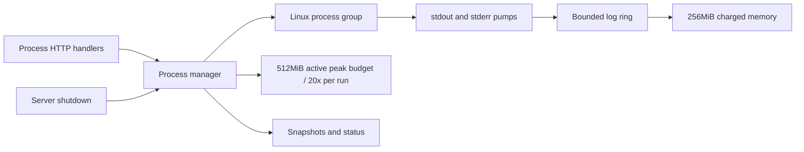

# Plan: Phase 04 - Managed Processes API

**Date:** 2026-08-23
**Revised:** 2026-09-12
**Status:** DRAFT
**Risk Level:** High

---

## Phase Goal

Implement Linux pipe-based managed process groups and one-shot execution, including immutable snapshots, bounded ordered logs, stdin, runtime configuration, termination, deletion, shutdown, and all `/v1/processes` HTTP handlers. Phase 04's isolated package tasks (4.1-4.6) are independent of ACP and may execute after phase 01 in parallel with phases 02-03. Tasks 4.7-4.9 extend shared `httpapi`/`internal/app` files and require Phase 03 completion.

## References

- Authoritative contract: `docs/plans/20260815-agent-bridge.md`, especially "Non-ACP endpoints", process requirements beneath that table, body limits, and shutdown requirements.
- Project ground rules: `docs/references/go-project-layout.md` (structure, ownership, hygiene) and `docs/references/go-coding-standards.md` (coding rules) are binding for all tasks; the specification and phase plans remain authoritative for behavior.
- Phase 01 plan: `docs/plans/20260823-01-scaffolding.md`. Extend `httpapi.Server` in `internal/httpapi/server.go`; reuse `NewServer`, `Server.Handler`, `Problem`, `WriteProblem`, `DecodeJSON`, authentication/logging, the lifecycle registry, and `childenv.Sanitized` from `internal/childenv/env.go`.
- Behavioral reference only: `/home/viethoangcr/Workspace/github/rivet/sandbox-agent/server/packages/sandbox-agent/src/process_runtime.rs` and the process handlers in `server/packages/sandbox-agent/src/router.rs`. The Go specification overrides Rust behavior: no PTY, WebSocket, owner, restart, follow-log, or caller-controlled signal wait APIs.

## Assumptions and Boundaries

- Phase 01 provides Go 1.26 Linux setup, `httpapi.Server` backed by `http.ServeMux`, `NewServer`, `Server.Handler`, auth/logging, RFC 9457 problem writing, strict JSON/body helpers, and coordinated shutdown hooks.
- Phase 01 provides `childenv.Sanitized(environ []string) []string`. Call it once during application composition; process request `env` overlays that fresh sanitized base and does not replace it. `cwd` defaults to the bridge startup cwd captured once.
- Tasks 4.1-4.6 have no dependency on Phase 02 or Phase 03; Tasks 4.7-4.9 require Phase 03's final `httpapi.Server` and `Dependencies` state so their shared-file edits do not race the ACP HTTP work. `internal/app` constructs one `process.Manager`, injects it through `httpapi.Dependencies`, and registers its staged shutdown hooks with the Phase 01 lifecycle registry. Phase 06 owns final cross-phase shutdown ordering and runtime-image integration.
- Use only the standard library. Linux process groups use `exec.Cmd.SysProcAttr = &syscall.SysProcAttr{Setpgid: true}` and are signaled with `syscall.Kill(-pid, signal)`. Never signal a bare child PID for stop, kill, timeout, reaper, or shutdown.
- Processes are in-memory only. Restarting the bridge does not restore snapshots or logs and must not inspect or signal old PIDs.
- The API is pipe-only: stdin/stdout/stderr are pipes; no TTY, PTY, terminal resize, WebSocket, restart policy, process owner, log follow/SSE, or stdin-close endpoint.
- Exact public snapshots are `{id,command,args,cwd,status,pid?,exitCode?,createdAtMs,exitedAtMs?}`. `cwd` is always the effective cwd. PID is omitted after exit; exit code is omitted when unavailable (including signal termination).
- Process runtime methods return process-package sentinel/typed errors; methods on `httpapi.Server` map them through Phase 01 `httpapi.Problem`/`WriteProblem`: validation 400, decoded/body limits 413, not found 404, state/capacity conflict 409, and spawn/I/O failure 502. Do not add duplicate problem writers or middleware.

The process package introduces `NewManager(baseEnv []string, cwd string) *Manager`, with production constants `MaxOutputBytes = 16 << 20`, `MaxRetainedLogMemoryBytes = 256 << 20`, and `MaxActiveRunPeakBytes = 512 << 20`. `internal/app/app.go` must pass `childenv.Sanitized(os.Environ())` and the bridge startup cwd. `NewManager` defensively copies both values; no process method reads the bridge environment later. A private `managerBudgets`/test constructor injects smaller log-memory and run-peak budgets without changing the public config schema.

The master plan is authoritative for public HTTP strictness. For every process JSON endpoint, `Content-Type` must parse as `application/json` (case-insensitive type/subtype; parameters allowed); missing, malformed, or another media type is 415. DTOs reject unknown fields and trailing JSON. Every scalar query key is allowlisted and may occur at most once; unknown, repeated, malformed, or empty supplied values are 400. Required string fields reject empty and whitespace-only values. These are public contract requirements, not handler implementation choices.

For every RED section, first make the test compile when the symbol already exists, run it before implementation, and retain the failing behavioral assertion. A compile failure is acceptable evidence only when introducing a genuinely new symbol; replace it with behavioral RED evidence as soon as the test can compile.

## Required Behavior

- `GET` and `POST /v1/processes/config` use exactly the same full-replacement object: `{maxConcurrentProcesses,defaultRunTimeoutMs,maxRunTimeoutMs,maxOutputBytes,maxLogBytesPerProcess,maxInputBytesPerRequest}`. POST requires all six fields; there are no partial updates or additional fields.
- Defaults are max concurrent managed processes 64, default run timeout 30000ms, max run timeout 300000ms, max one-shot output 1048576 bytes per stream, log ring 10485760 raw bytes per process, and decoded input 65536 bytes per request.
- Every config field is a positive integer. Operational maxima are 1024 concurrent processes, 86400000ms (24h) for each timeout field, 16777216 bytes (16MiB) output, 268435456 bytes (256MiB) logs per process, and 7340032 decoded bytes (7MiB) input per request. Also require `defaultRunTimeoutMs <= maxRunTimeoutMs`. Parse into fixed-width integers and use checked conversions before `int`, `int64`, `time.Duration`, buffer sizes, or arithmetic; overflow is 400. Invalid updates are rejected atomically. Lowering concurrency below the current running count does not kill anything; it blocks starts until below the limit.
- The manager has one fixed conservative retained-log memory budget of 268435456 bytes (256MiB). An internal entry retains a copied raw chunk, never a base64 string, and is charged `cap(rawChunk)+256` bytes using checked addition; the fixed 256-byte charge conservatively covers entry/list/index metadata. Per-process rings still enforce their configured creation-time `maxLogBytesPerProcess` using `len(rawChunk)` only. The manager evicts globally oldest whole entries while aggregate retained-memory charge exceeds its budget. Exited records continue competing until DELETE, which removes their remaining charge.
- Each accepted log entry receives both its public per-process `sequence` and a private manager-wide monotonic `globalSequence` under the manager log lock. `globalSequence` starts at 1, never repeats, is not serialized, and is the sole global eviction order; concurrent stdout/stderr appends are ordered by lock acquisition, so ties are impossible. Per-process eviction removes the same entry from the global FIFO, and aggregate eviction removes the global FIFO head from its owning ring.
- Managed starts reserve capacity atomically, spawn in an independent process group, return a running snapshot, asynchronously pump stdout/stderr in bridge-observed 8KiB chunks, and retain exited snapshots until DELETE.
- Public query log entries are `{sequence,stream,timestampMs,data,encoding}` with `encoding:"base64"`; sequence is monotonic per process. Rings retain raw chunks internally and base64-encode copies only when constructing query DTOs. Per-process ring capacity counts raw `len`, evicts oldest whole entries, and may retain one chunk larger than a newly lowered limit only for already-running processes because each process captures its creation-time log limit.
- Logs apply `since` exclusively, then stream filter, then `tail` by entry count. `stream` is `stdout|stderr|combined`, defaults to combined; `tail=0` is valid and returns no entries.
- Input accepts exactly `base64` or `utf8`; decoded bytes are limited by the active config. `Manager.WriteInput` accepts the request context, permits one active write per process through context-aware admission, and applies one fixed server-owned five-second deadline. Timeout/cancellation before any bytes rejects safely; write failure or timeout after a partial write immediately SIGKILLs the captured negative PGID. Unknown/exited process states map exactly as specified.
- Process input has two independent limits. Bound the encoded JSON body before decoding with `min(the master global JSON hard ceiling, 4*ceil(activeDecodedLimit/3)+a fixed JSON-envelope allowance)` using checked arithmetic; the allowance must cover the exact compact `{data,encoding}` envelope. Regardless of encoded size, decode and enforce the active decoded-byte limit, including UTF-8 requests. Tests use compact boundary bodies and prove base64 expansion is admitted up to the decoded limit without weakening the global JSON ceiling.
- One-shot runs share the managed process-count budget and separately share a fixed 536870912-byte (512MiB) active peak-reservation budget. Before spawn, each run atomically reserves `20*effectiveMaxOutputBytes`; checked multiplication is mandatory. This conservative worst-case model allocates 2x for two raw captures, up to 6x for UTF-8 replacement/result strings, and up to 12x for JSON escaping plus encoder buffers. The configured 16MiB maximum therefore reserves 320MiB and leaves 192MiB aggregate headroom. If either process-count or peak capacity is unavailable, release nothing partially reserved and return the typed capacity conflict mapped to 409. Release both reservations on every success, spawn error, wait error, timeout, cancellation, and shutdown path. Captures use independent stdout/stderr caps while draining beyond caps to avoid deadlock, replace invalid UTF-8, kill the whole group on timeout, and report duration. Requested timeout/output caps above active maxima are 400, not silently clamped.
- The aggregate retained-log and active one-shot budgets are fixed admission/accounting controls, not configurable fields and not exact Go heap guarantees. Conservative log charges and run-peak reservations prevent straightforward multiplication of valid per-field maxima without claiming to account for allocator/runtime overhead or all transient HTTP allocations.
- Stop sends SIGTERM to the group and waits at most two seconds; kill sends SIGKILL and waits at most one second. Calling either on an exited process is idempotent and returns its snapshot. DELETE rejects running processes.
- On every managed or one-shot direct-child exit, including natural exit, the sole waiter immediately sends SIGKILL to the captured negative PGID before awaiting stdout/stderr pumps, marking exited, or releasing process/run capacity. `ESRCH` is harmless. This prevents a surviving descendant from retaining pipes or capacity.
- Shutdown blocks new starts/runs, kills all managed and one-shot groups, waits for watchers/pumps, and completes under the phase 01 global 10-second deadline.
- Shutdown is staged: a pre-drain hook atomically blocks new starts/runs before HTTP draining, then the manager shutdown hook kills groups and waits for watchers/pumps. Phase 04 supplies and unit-tests both hooks; Phase 06 owns their final ordering with ACP, HTTP, DB, PID-file, and image shutdown.

## Target Flow

## Tasks

### Task 4.1: Define Configuration and Public Runtime Types

**Description:** Establish process-only types and atomic runtime configuration before process execution code.

**Files:** `internal/process/types.go`, `internal/process/config.go`, `internal/process/config_test.go`

**Symbols:** `Config`, `DefaultConfig`, `Config.Validate`, `Status`, `Snapshot`, `LogEntry`, `LogQuery`, `StartRequest`, `RunRequest`, `RunResult`

**References:** Master "Non-ACP endpoints" process table and process configuration requirements.

**Dependencies:** Phase 01 only.

**Risk:** Low

**Reversibility:** Easy to revert

**RED:**

- [x] Add tests for all exact defaults and JSON field names/omission rules in snapshots, logs, config, and run results.
- [x] Assert config JSON contains exactly all six fields named in Required Behavior and that POST is a full replacement. Add table tests accepting `maxOutputBytes=16777216` and rejecting 16777217, plus missing/unknown fields, zero/negative/fractional values, every other operational maximum plus one, default timeout above max, and values that overflow checked integer or `time.Duration` conversion; prove a failed update leaves the prior config unchanged.
- [x] Test returned config values are copies and concurrent readers observe either the old or complete new config, never a partial update.
- [x] Use injected validation bounds for small behavioral tests and one production-boundary test that checks the real maxima without allocating maximum-sized buffers. Run `go test ./internal/process -run 'Test(Config|JSON)'` and retain an assertion failure caused by missing behavior where feasible, rather than only compile-failure evidence.

**GREEN:**

- [x] Define the minimum API types without PTY/owner/restart fields.
- [x] Store config as one immutable value behind `sync.RWMutex` or `atomic.Pointer`; validate before replacement.
- [x] Run `go test ./internal/process -run 'Test(Config|JSON)'`.

**Verify:** `go test -race ./internal/process -run 'Test(Config|JSON)'`

### Task 4.2: Implement the Bounded Ordered Log Ring

**Description:** Capture bridge-observed stdout/stderr chunks in byte-bounded per-process FIFOs that can participate in deterministic manager-wide eviction.

**Files:** `internal/process/logring.go`, `internal/process/logring_test.go`

**Symbols:** `logRing`, `logEntry`, `newLogRing`, `logRing.append`, `logRing.remove`, `logRing.query`

**References:** Master process log chunking, retention, ordering, and query semantics.

**Dependencies:** Task 4.1.

**Risk:** Medium

**Reversibility:** Easy to revert

**RED:**

- [x] Test monotonic sequence starting at 1 and stream/timestamp assignment. Assert rings retain copied raw chunks with no base64 string, per-process accounting uses `len(rawChunk)`, and query DTO construction emits standard padded base64 without mutating retained data.
- [x] Test oldest whole-entry eviction at the byte limit, including a single 8KiB chunk and limits not divisible by chunk size.
- [x] Test entries retain a private manager-assigned global sequence without serializing it, expose a checked conservative charge of `cap(rawChunk)+256`, and removal of a specific globally evicted entry updates raw-length and charged-memory accounting exactly once without disturbing remaining order.
- [x] Test query order: exclusive `since`, stream filter, then tail; cover `stdout`, `stderr`, `combined`, no matches, `tail=0`, tail larger than available, and snapshots that cannot mutate the ring.
- [x] Run `go test ./internal/process -run 'TestLogRing'` and confirm failure.

**GREEN:**

- [x] Implement the minimum deque/list operations needed for per-process head eviction, manager-directed removal, and copied query DTOs; retain raw bytes only and update raw-length plus conservative aggregate charges exactly once for every removal.
- [x] Keep stream merge order at the lock acquisition order of stdout/stderr pumps; do not infer ordering from child timestamps.
- [x] Run `go test ./internal/process -run 'TestLogRing'`.

**Verify:** `go test -race ./internal/process -run 'TestLogRing'`

### Task 4.3: Start, Watch, Snapshot, List, and Delete Managed Groups

**Description:** Add capacity-safe process creation and durable-in-memory lifecycle records.

**Files:** `internal/process/manager.go`, `internal/process/managed.go`, `internal/process/manager_test.go`, `internal/process/helper_test.go`

**Symbols:** `Manager`, `NewManager(baseEnv []string, cwd string)`, private `managerBudgets`, private `newManagerWithBudgets`, `Manager.Start`, `Manager.List`, `Manager.Get`, `Manager.Delete`, `managedProcess`, `managedProcess.snapshot`, `Manager.reserveProcess`, `Manager.releaseProcess`

**References:** Master process start/snapshot/delete requirements; Phase 01 `childenv.Sanitized`.

**Dependencies:** Tasks 4.1-4.2 and Phase 01 `childenv.Sanitized`.

**Risk:** High

**Reversibility:** Needs careful rollback because process leaks are possible

**RED:**

- [x] Add a test-binary helper mode (`TestProcessHelper` re-exec of `os.Args[0]` selected by a control environment variable, routed by `TestMain`) exposing modes for output, blocking, environment/cwd reporting, chosen exit code, signal handling, child spawning, stdin echo, and invalid UTF-8.
- [x] Test empty/whitespace command validation; omitted args/env; effective cwd default and override; request environment overlays the base supplied to `NewManager`; bridge controls removed by `childenv.Sanitized` remain absent while credentials remain; spawn failure does not consume capacity or create a snapshot.
- [x] Race more starts than the configured limit and prove exactly the limit succeeds. Include one-shot reservations once Task 6 exists; initially expose the shared reservation primitive to tests in-package.
- [x] Test IDs are unique, snapshots are sorted lexicographically by ID, caller mutation cannot alter stored command/args, running snapshots include group leader PID, natural exit records exit code/time and omits PID, and unknown get/delete is not found.
- [x] Use a helper whose group leader exits while its child remains blocked with inherited pipes. Assert the waiter immediately SIGKILLs the captured negative PGID, then joins pumps, marks exited, and releases process capacity; no descendant remains non-zombie and completion does not hang.
- [x] Test DELETE running is conflict, DELETE exited removes snapshot/logs, and a failed/removed ID is never reused.
- [x] Construct managers with small injected log-memory and run-peak budgets; reject non-positive values. Verify production construction selects exactly 256MiB retained-log charge and 512MiB active run peak without allocating those amounts.
- [x] Run `go test ./internal/process -run 'TestManager_(Start|Capacity|Snapshot|Delete)'` and confirm failure.

**GREEN:**

- [x] Reserve process-count capacity under the manager reservation lock before spawn and release it on spawn failure or watcher-observed exit; keep counters for process count and one-shot peak reservations independent. Generate opaque `proc_<monotonic>` IDs without reuse.
- [x] Defensively copy constructor environment/cwd, merge request overrides without mutating either input, and build `exec.Cmd` with explicit effective cwd/env, three pipes, and `Setpgid`; capture PID only after successful `Start`.
- [x] Keep every helper mode inside the package test binary (no `testdata` program), so `go test`, `go vet`, and `-race` exercise it without a `go run` toolchain dependency.
- [x] Insert the fully initialized managed record before exposing its snapshot, start two 8KiB pumps and one sole waiter, and ensure direct-child `Wait` is followed immediately by SIGKILL of the captured negative PGID before pump joins, exit publication, or capacity release.
- [x] Sort copied snapshots by ID and retain exited records until DELETE.
- [x] Run `go test ./internal/process -run 'TestManager_(Start|Capacity|Snapshot|Delete)'`.

**Verify:** `go test -race ./internal/process -run 'TestManager_(Start|Capacity|Snapshot|Delete)'`

### Task 4.4: Pump and Query Managed Logs

**Description:** Connect stdout/stderr pipes to raw per-process rings, enforce the manager-wide charged-memory budget, and expose base64 query DTOs after output and exit.

**Files:** `internal/process/managed.go`, `internal/process/logring.go`, `internal/process/manager.go`, `internal/process/manager_test.go`

**Symbols:** `pump`, `Manager.appendLog`, `Manager.evictLogs`, `Manager.Logs`, `managedProcess.wait`

**References:** Master public 8KiB base64 log chunks, per-process raw-byte ring behavior, and this plan's aggregate charged-memory budget.

**Dependencies:** Tasks 4.2-4.3.

**Risk:** Medium

**Reversibility:** Easy to revert

**RED:**

- [x] Test output larger than 8KiB is split into bridge read chunks, stdout/stderr entries decode to the original bytes per stream, and all entries have increasing per-process sequence numbers.
- [x] Test a small configured creation-time ring evicts oldest chunks; a later config change affects only newly created process rings.
- [x] With an injected small charged-memory budget, interleave raw appends across at least two processes and both streams; prove private global sequence follows manager-lock acceptance order and byte pressure evicts globally oldest whole entries regardless of process, while each public per-process sequence remains monotonic and may contain eviction gaps.
- [x] Use chunks where `cap(rawChunk) != len(rawChunk)` to prove per-process caps count `len` and aggregate memory counts checked `cap+256`. Test per-process eviction removes the same entry from global accounting/FIFO, aggregate eviction removes it from the owning ring, and charge never double-decrements under concurrent append/query/delete.
- [x] Test exited records continue consuming and competing for aggregate charged memory, logs remain queryable after exit, and DELETE immediately releases their charge; unknown process is not found.
- [x] Query repeatedly and prove base64 is generated only in copied DTOs, is not retained or charged as ring state, and decodes to the original raw stream bytes.
- [x] Test waiter/pumps terminate on normal exit and stream read errors do not deadlock process completion.
- [x] Run `go test ./internal/process -run 'TestManager_Logs'` and confirm failure.

**GREEN:**

- [x] Read each stream with an 8KiB buffer until EOF and append non-empty reads immediately.
- [x] Route every raw append through one manager log lock that assigns both sequences, applies the owning ring's raw-length cap, checked-adds `cap(rawChunk)+256`, and evicts global FIFO heads while the injected byte budget is exceeded. Never base64-encode under append or retain encoded data, and never hold this lock during pipe reads, process waits, encoding, or HTTP writes.
- [x] Make process completion coordinate `Wait` and both pumps so tests/shutdown can wait for all observed output without holding manager locks.
- [x] Implement `Manager.Logs` as a lookup plus copied query DTO construction that base64-encodes selected raw chunks after filtering/tail selection.
- [x] Run `go test ./internal/process -run 'TestManager_Logs'`.

**Verify:** `go test -race ./internal/process -run 'TestManager_Logs'`

### Task 4.5: Implement Input, Stop, Kill, and Group Semantics

**Description:** Add bounded stdin writes and idempotent whole-group signaling.

**Files:** `internal/process/managed.go`, `internal/process/manager.go`, `internal/process/manager_test.go`

**Symbols:** `Manager.WriteInput`, `Manager.Stop`, `Manager.Kill`, `managedProcess.signalGroup`, `managedProcess.waitUntil`

**References:** Master process input, fixed stop/kill waits, process-group, and shutdown requirements.

**Dependencies:** Tasks 4.3-4.4.

**Risk:** High

**Reversibility:** Needs careful rollback because wrong PID signs can kill unrelated processes

**RED:**

- [x] Test utf8 and base64 bytes round-trip through stdin, invalid base64/encoding is validation failure, decoded length at limit succeeds, one byte over is payload-too-large, and exited process input is conflict.
- [x] Test `WriteInput` accepts context, permits only one active write per process, and uses a fixed five-second server deadline. With a child that does not read stdin, prove queued admission observes cancellation/deadline; timeout before any bytes leaves the process usable, while write failure/timeout after a partial write SIGKILLs the captured negative PGID and maps to gateway failure.
- [x] Test stop sends SIGTERM to the negative group ID, waits no longer than two seconds, and returns the current snapshot; kill uses SIGKILL/one second; both are idempotent for exited processes.
- [x] Use the helper's spawned grandchild to prove stop/kill terminate descendants in the same group while the bridge test process remains alive. Inspect `/proc/<pid>/stat`: missing or state `Z` proves the process is no longer running, while any other state fails. Do not require immediate PID disappearance in phase-local tests; the runtime image init owns orphan reaping. Assert tests never signal PID 0, 1, a negative-unvalidated PID, or a PID after the record has exited.
- [x] Run `go test ./internal/process -run 'TestManager_(Input|Stop|Kill|ProcessGroup)'` and confirm failure.

**GREEN:**

- [x] Use a capacity-one per-process admission channel so waiting for the sole writer is context-aware; check running state and active decoded input limit, then derive a deadline no later than five seconds from the request context. Track bytes written: pre-write cancellation releases admission only, while partial failure/timeout kills the group before returning.
- [x] Read the current live group leader PID under the process lock, validate `pid > 1`, then call `syscall.Kill(-pid, signal)`; treat `ESRCH` as already exited and map other errors.
- [x] Wait on an exit channel with fixed server-owned deadlines, not polling and not request-controlled durations.
- [x] Run `go test ./internal/process -run 'TestManager_(Input|Stop|Kill|ProcessGroup)'`.

**Verify:** `go test -race ./internal/process -run 'TestManager_(Input|Stop|Kill|ProcessGroup)'`

### Task 4.6: Implement One-Shot Run with Independent Output Caps

**Description:** Execute bounded commands using the same capacity/environment/group rules without retaining snapshots or logs.

**Files:** `internal/process/run.go`, `internal/process/run_test.go`, `internal/process/manager.go`

**Symbols:** `Manager.Run`, `Manager.reserveRun`, `Manager.releaseRun`, `capture`, `RunRequest.Validate`

**References:** Master one-shot timeout, output cap, truncation, UTF-8, and duration requirements.

**Dependencies:** Tasks 4.1 and 4.3-4.5.

**Risk:** High

**Reversibility:** Needs careful rollback because timeout leaks can leave groups alive

**RED:**

- [x] Test success/non-zero exit, effective cwd/environment, separate stdout/stderr, duration, and invalid UTF-8 replacement using `strings.ToValidUTF8` semantics.
- [x] Test default timeout, exact requested timeout, zero/non-positive timeout rejection, timeout above active max rejection, timeout killing a spawned descendant group, `timedOut:true`, and omitted exit code when killed.
- [x] Add a one-shot helper whose direct child exits while a descendant remains blocked with inherited pipes. Assert the waiter immediately SIGKILLs the captured negative PGID before joining captures and releasing process/run-peak reservations; no descendant remains non-zombie and `Run` completes.
- [x] Test default output cap, requested cap at max, cap above active max rejection, independent stdout/stderr truncation flags, exact-boundary non-truncation, and continued draining after truncation with no pipe deadlock.
- [x] Test one-shot and managed starts share one atomic concurrency budget; reservation is released after every success, spawn error, wait error, timeout, and cancellation.
- [x] With an injected small run-peak budget, prove each run reserves exactly 20 times its effective per-stream cap before spawn, concurrent runs cannot exceed aggregate reservations, and insufficient peak capacity returns the typed capacity conflict/409 without spawning or consuming process-count capacity. Prove checked multiplication and exact-boundary acceptance. Without large allocations, verify the conservative components are 2x raw captures, 6x UTF-8 replacement/result strings, and 12x JSON escaping/encoder buffers, and that the 16MiB configured maximum requires 320MiB and fits the production 512MiB budget with 192MiB headroom.
- [x] Assert capture and process-count reservations are independent and both are released exactly once after success, spawn/wait error, timeout, cancellation, and shutdown; race all paths under `-race`.
- [x] Run `go test ./internal/process -run 'TestManager_Run'` and confirm failure.

**GREEN:**

- [x] Snapshot active config once, validate requested values without clamping, checked-calculate `20*effectiveMaxOutputBytes`, and atomically reserve process-count plus run-peak capacity before spawning with null stdin, two pipes, effective cwd/env, and `Setpgid`.
- [x] Capture each stream concurrently up to its own cap while reading/discarding the remainder; mark truncation upon the first discarded byte.
- [x] Race `cmd.Wait` against a timer/context; on timeout kill the group and always reap it. On every direct-child return, immediately SIGKILL the captured negative PGID before joining captures and releasing reservations. Convert invalid UTF-8 deterministically.
- [x] Run `go test ./internal/process -run 'TestManager_Run'`.

**Verify:** `go test -race ./internal/process -run 'TestManager_Run'`

### Task 4.7: Add Process HTTP Types, Validation, and Config Handlers

**Description:** Register process routes and implement strict JSON/query validation plus atomic config GET/POST.

**Files:** `internal/httpapi/process.go`, `internal/httpapi/process_test.go`, `internal/httpapi/server.go`

**Symbols:** `Server.registerProcessRoutes`, `Server.handleProcessConfig`, `decodeProcessJSON`, `parseLogsQuery`, `mapProcessError`

**References:** Master "Authentication and errors", process config endpoint, and body-limit requirements; Phase 01 `httpapi.Server`.

**Dependencies:** Tasks 4.1-4.6 and Phase 01 HTTP foundation.

**Risk:** Medium

**Reversibility:** Easy to revert

**RED:**

- [x] Test `GET /v1/processes/config` returns exactly `{maxConcurrentProcesses,defaultRunTimeoutMs,maxRunTimeoutMs,maxOutputBytes,maxLogBytesPerProcess,maxInputBytesPerRequest}` with defaults, and POST requires that complete replacement object. Prove `maxOutputBytes` accepts 16777216 and rejects 16777217; reject missing/unknown fields, malformed/trailing JSON, wrong types, every non-positive value, every other operational maximum plus one, invalid timeout ordering, and conversion overflow with 400; prove no partial update.
- [x] Test all JSON process endpoints enforce the public Content-Type/unknown-field/trailing-value contract above. Apply the phase 01/master global JSON hard ceiling to all JSON, including input; input additionally uses an encoded-body ceiling that accounts for `4*ceil(n/3)` base64 expansion plus the fixed envelope allowance and always enforces the decoded active limit.
- [x] Test required empty/whitespace fields and unknown, repeated, or empty scalar query values produce the master RFC 9457 contract response. Retain behavioral RED evidence for strictness and replacement semantics before implementation.
- [x] Test process route method mismatches and unknown paths still return RFC 9457 JSON through phase 01; no endpoint accepts PTY/owner/restart/follow/signal-wait fields because unknown JSON fields are rejected.
- [x] Run `go test ./internal/httpapi -run 'TestProcess(Config|Validation)'` and confirm failure.

**GREEN:**

- [x] Extend Phase 01 `httpapi.Dependencies` with `Processes *process.Manager`, retain `NewServer(deps) *Server` and `Server.Handler() http.Handler`, store the manager on `Server`, register exact Go 1.26 method/path patterns, and reuse Phase 01 body/problem helpers.
- [x] Define private handler DTOs only where runtime types cannot directly provide exact JSON; use `DisallowUnknownFields` and require EOF.
- [x] Wire config GET/POST to atomic manager operations.
- [x] Run `go test ./internal/httpapi -run 'TestProcess(Config|Validation)'`.

**Verify:** `go test ./internal/httpapi -run 'TestProcess(Config|Validation)' && go vet ./internal/httpapi`

### Task 4.8: Add Managed Process and Logs HTTP Handlers

**Description:** Expose start/list/get/stop/kill/delete/log/input behavior with exact statuses and response bodies.

**Files:** `internal/httpapi/process.go`, `internal/httpapi/process_test.go`, `internal/httpapi/server.go`

**Symbols:** `Server.handleProcessStart`, `Server.handleProcessList`, `Server.handleProcessGet`, `Server.handleProcessStop`, `Server.handleProcessKill`, `Server.handleProcessDelete`, `Server.handleProcessLogs`, `Server.handleProcessInput`

**References:** Master `/v1/processes` start/list/get/stop/kill/delete/log/input endpoint contracts.

**Dependencies:** Task 4.7.

**Risk:** Medium

**Reversibility:** Easy to revert

**RED:**

- [x] Test `POST /v1/processes` returns 200 with the running snapshot itself, exactly `{id,command,args,cwd,status,pid,createdAtMs}` while omitting `exitCode`/`exitedAtMs`; no response wrapper is allowed.
- [x] Test `GET /v1/processes` returns 200 with exactly `{"processes":[snapshot...]}` sorted by ID, and `GET /v1/processes/{id}` returns 200 with the snapshot itself. For exited snapshots assert `pid` is omitted, `exitCode` appears only when available, and `exitedAtMs` appears; unknown IDs are 404.
- [x] Test stop and kill return snapshots after their fixed waits, DELETE exited is 204 empty, DELETE running is 409, and process capacity conflict is 409.
- [x] Test logs return 200 with exactly `{"entries":[{sequence,stream,timestampMs,data,encoding}]}` and no additional top-level fields. Test default combined, each stream option, strict decimal `since`, non-negative decimal `tail` including zero, repeated/empty/unknown values as 400, and filtering as exclusive since followed by tail.
- [x] Test input defaults only if the authoritative request explicitly chooses one; otherwise require exact `encoding:base64|utf8`, decode before enforcing active limit, return `{"bytesWritten":N}`, map oversized decoded data to 413, invalid data to 400, and exited process to 409.
- [x] Exercise input limits mostly with an injected small active limit; include one bounded production-boundary test of limit selection/arithmetic without constructing a 7MiB allocation.
- [x] Test spawn and pipe I/O failures map to 502 without exposing environment values.
- [x] Run `go test ./internal/httpapi -run 'TestProcess(Start|List|Get|Stop|Kill|Delete|Logs|Input)'` and confirm failure.

**GREEN:**

- [x] Implement thin handlers that validate, call `process.Manager`, and serialize exact master DTOs; define the logs response only as `struct { Entries []process.LogEntry }` with field tag `json:"entries"`. Keep lifecycle logic out of HTTP code.
- [x] Parse logs with `url.Values`, reject repeated scalar keys, and preserve `tail=0` distinctly from omission.
- [x] Require `encoding` because the authoritative request schema names it without an optional/default marker; do not retain Rust's `text` alias or default base64 behavior.
- [x] Run `go test ./internal/httpapi -run 'TestProcess(Start|List|Get|Stop|Kill|Delete|Logs|Input)'`.

**Verify:** `go test -race ./internal/httpapi -run 'TestProcess(Start|List|Get|Stop|Kill|Delete|Logs|Input)'`

### Task 4.9: Add Run Handler and Staged Process Shutdown

**Description:** Complete one-shot HTTP execution and terminate every current process group during bridge shutdown.

**Files:** `internal/httpapi/process.go`, `internal/httpapi/process_test.go`, `internal/process/manager.go`, `internal/process/shutdown_test.go`, `internal/integration/process_test.go`, `internal/app/app.go`, `internal/app/app_test.go`

**Symbols:** `Server.handleProcessRun`, `Manager.Shutdown`, `TestProcessHTTP`, `TestProcessShutdown`

**References:** Master `/v1/processes/run` and "Environment, shutdown, and image" sections; Phase 01 lifecycle registry.

**Dependencies:** Tasks 4.6-4.8.

**Risk:** High

**Reversibility:** Needs careful rollback because shutdown ordering affects process leaks

**RED:**

- [ ] Test `POST /v1/processes/run` returns 200 with exactly `{exitCode?,timedOut,stdout,stderr,stdoutTruncated,stderrTruncated,durationMs}` and no wrapper. Cover success/non-zero exit, omission of unavailable `exitCode` on timeout, independent truncation flags, duration, validation, capacity conflict, and 502 spawn/wait failures through a real HTTP server.
- [ ] Test the pre-drain hook atomically rejects new managed starts and runs before HTTP drain; test shutdown closes managed stdin, sends SIGKILL to all current managed and one-shot groups, waits for watchers/pumps, and is idempotent.
- [ ] Inspect descendants through `/proc/<pid>/stat` and accept only missing records or state `Z` as no longer running; do not require immediate PID disappearance in phase-local shutdown tests. Verify group termination while the bridge parent remains alive. Exited records need no signal, no stale PID is signaled, and the manager finishes inside the phase 01 10-second global deadline.
- [ ] Add a phase-local integration lifecycle covering start, input echo, logs, stop, get, delete, run timeout, config update, auth/problem middleware, pre-drain, and manager shutdown. The runtime image's init process owns reaping orphaned descendants; Phase 06 proves that behavior in-container and owns final all-service shutdown integration.
- [ ] Run `go test ./internal/process ./internal/httpapi ./internal/integration -run 'Test(ProcessRun|ProcessShutdown|ProcessHTTP)'` and confirm failure before final wiring.

**GREEN:**

- [ ] Implement the run handler as strict decode plus `Manager.Run` and exact result serialization.
- [ ] Track active one-shot groups and their peak reservations separately from retained managed records; mark manager closing under the reservation lock, snapshot current groups, kill outside global locks, then await one shared `WaitGroup`. Shutdown releases every peak reservation exactly once.
- [ ] In `internal/app/app.go`, call `process.NewManager(childenv.Sanitized(os.Environ()), startupCWD)`, pass it through `httpapi.Dependencies` to `httpapi.NewServer(...).Handler()`, and register process pre-drain and shutdown hooks. `httpapi` only consumes the injected manager. Bound shutdown with the existing context; do not claim final cross-phase ordering here because Phase 06 owns that integration.
- [ ] Run `go test ./internal/process ./internal/httpapi ./internal/integration -run 'Test(ProcessRun|ProcessShutdown|ProcessHTTP)'`.

- [x] Review addenda (2026-09-12, oracle-driven): managed stdout/stderr use explicit `os.Pipe` ownership (never `cmd.Wait`-closed pipes); a per-group `signalGate` plus Linux `waitid(P_PID, …, WEXITED|WNOWAIT)` observation closes the PID-reuse window before the mandatory negative-PGID SIGKILL on managed and one-shot paths (non-Linux fallback); parameterless process endpoints reject any query string; `config`/`run` reserved literals return exact 405 with a correct `Allow`; input encoded-ceiling and log-charge arithmetic are checked; omitted `args` serialize as `[]`.

**Verify:** `go test -race ./internal/process ./internal/httpapi ./internal/integration -run 'TestProcess' && CGO_ENABLED=0 go test ./...`

## Dependencies

| Task | Depends On |
|---|---|
| 4.1 | Phase 01 |
| 4.2 | 4.1 |
| 4.3 | 4.1-4.2, Phase 01 `internal/childenv` |
| 4.4 | 4.2-4.3 |
| 4.5 | 4.3-4.4 |
| 4.6 | 4.1, 4.3-4.5 |
| 4.7 | 4.1-4.6, Phase 01 HTTP foundation |
| 4.8 | 4.7 |
| 4.9 | 4.6-4.8 |

## Deliverables

- Linux process-group manager with atomic process-count and conservative one-shot peak reservations, snapshots, fixed signal waits, and coordinated shutdown.
- Per-process raw 8KiB chunk rings with query-time base64, deterministic manager-global eviction, one 256MiB conservative retained-memory budget, and exact query semantics.
- Bounded stdin and one-shot execution with a 16MiB configured output ceiling and a 512MiB conservative active peak budget reserving 20x per run, plus timeout, independent stream caps, UTF-8 replacement, and descendant termination.
- Complete process config/start/list/get/stop/kill/delete/log/input/run HTTP handlers and race/integration tests.

## Completion Criteria

- [x] Every endpoint in the authoritative process table is registered with exact request/response/status behavior; no excluded PTY/WebSocket/follow/restart/owner API exists.
- [x] `go test -race ./internal/process ./internal/httpapi ./internal/integration -run 'TestProcess'` passes on Linux.
- [x] `go test ./...` and `go vet ./...` pass.
- [x] `CGO_ENABLED=0 go build ./cmd/agent-bridge` succeeds.
- [x] `maxOutputBytes` is capped at 16MiB. Process-count and 512MiB one-shot peak capacities cannot be oversubscribed under race; each run reserves checked `20*effectiveMaxOutputBytes`, the 16MiB maximum reserves 320MiB with headroom, conflicts return 409 without spawn, and every reservation is released exactly once on all paths.
- [x] Rings retain raw chunks and base64-encode only copied query DTOs. Per-process caps count raw `len`; aggregate accounting charges checked `cap(rawChunk)+256`, evicting by manager-global sequence across running/exited records until the 256MiB byte budget passes. DELETE releases the charge.
- [x] Tests inject small values for both aggregate budgets and use bounded production-constant/arithmetic checks. The controls are documented as conservative admission/accounting estimates, not exact heap guarantees.
- [x] All spawned commands use independent process groups. Every managed/one-shot direct-child exit immediately SIGKILLs its captured negative PGID before pumps/status/capacity release; timeout/shutdown tests use `/proc/<pid>/stat` to prove descendants are missing or zombies while the bridge remains alive without requiring immediate orphan reaping.
- [x] Log/input/output handling never permits pipe deadlocks; retained logs and active one-shot work remain within their specified conservative accounting/reservation caps.
- [x] Process input has context-aware single-writer admission and a fixed five-second server deadline; a partial timed-out write terminates the group.
