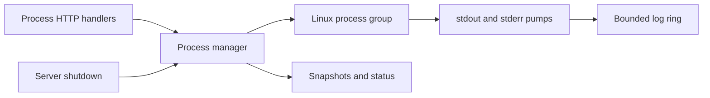

# Plan: Phase 04 - Managed Processes API

**Date:** 2026-08-23
**Status:** DRAFT
**Risk Level:** High

---

## Phase Goal

Implement Linux pipe-based managed process groups and one-shot execution, including immutable snapshots, bounded ordered logs, stdin, runtime configuration, termination, deletion, shutdown, and all `/v1/processes` HTTP handlers. Phase 04 is independent of ACP and may execute after phase 01 in parallel with phases 02-03.

## References

- Authoritative contract: `docs/plans/20260815-agent-bridge.md`, especially "Non-ACP endpoints", process requirements beneath that table, body limits, and shutdown requirements.
- Phase 01 plan: `docs/plans/20260823-01-scaffolding.md`. Extend `httpapi.Server` in `internal/httpapi/server.go`; reuse `NewServer`, `Server.Handler`, `Problem`, `WriteProblem`, `DecodeJSON`, authentication/logging, the lifecycle registry, and `childenv.Sanitized` from `internal/childenv/env.go`.
- Behavioral reference only: `/home/viethoangcr/Workspace/github/rivet/sandbox-agent/server/packages/sandbox-agent/src/process_runtime.rs` and the process handlers in `server/packages/sandbox-agent/src/router.rs`. The Go specification overrides Rust behavior: no PTY, WebSocket, owner, restart, follow-log, or caller-controlled signal wait APIs.

## Assumptions and Boundaries

- Phase 01 provides Go 1.26 Linux setup, `httpapi.Server` backed by `http.ServeMux`, `NewServer`, `Server.Handler`, auth/logging, RFC 9457 problem writing, strict JSON/body helpers, and coordinated shutdown hooks.
- Phase 01 provides `childenv.Sanitized(environ []string) []string`. Call it once during application composition; process request `env` overlays that fresh sanitized base and does not replace it. `cwd` defaults to the bridge startup cwd captured once.
- This phase has no dependency on Phase 02 or Phase 03. Application composition injects one `process.Manager` into `httpapi.Server` and registers one manager shutdown callback with the Phase 01 lifecycle registry.
- Use only the standard library. Linux process groups use `exec.Cmd.SysProcAttr = &syscall.SysProcAttr{Setpgid: true}` and are signaled with `syscall.Kill(-pid, signal)`. Never signal a bare child PID for stop, kill, timeout, reaper, or shutdown.
- Processes are in-memory only. Restarting the bridge does not restore snapshots or logs and must not inspect or signal old PIDs.
- The API is pipe-only: stdin/stdout/stderr are pipes; no TTY, PTY, terminal resize, WebSocket, restart policy, process owner, log follow/SSE, or stdin-close endpoint.
- Exact public snapshots are `{id,command,args,cwd,status,pid?,exitCode?,createdAtMs,exitedAtMs?}`. `cwd` is always the effective cwd. PID is omitted after exit; exit code is omitted when unavailable (including signal termination).
- Process runtime methods return process-package sentinel/typed errors; methods on `httpapi.Server` map them through Phase 01 `httpapi.Problem`/`WriteProblem`: validation 400, decoded/body limits 413, not found 404, state/capacity conflict 409, and spawn/I/O failure 502. Do not add duplicate problem writers or middleware.

The process package introduces `NewManager(baseEnv []string, cwd string) *Manager`. `internal/app/app.go` must pass `childenv.Sanitized(os.Environ())` and the bridge startup cwd. `NewManager` defensively copies both values; no process method reads the bridge environment later.

## Required Behavior

- Defaults are max concurrent managed processes 64, default run timeout 30000ms, max run timeout 300000ms, max one-shot output 1048576 bytes per stream, log ring 10485760 raw bytes per process, and decoded input 65536 bytes per request.
- Every config field is positive and `defaultRunTimeoutMs <= maxRunTimeoutMs`. Invalid updates are rejected atomically. Lowering concurrency below the current running count does not kill anything; it blocks starts until below the limit.
- Managed starts reserve capacity atomically, spawn in an independent process group, return a running snapshot, asynchronously pump stdout/stderr in bridge-observed 8KiB chunks, and retain exited snapshots until DELETE.
- Log entries are `{sequence,stream,timestampMs,data,encoding}` with `encoding:"base64"`; sequence is monotonic per process. Ring capacity counts raw bytes, evicts oldest whole entries, and may retain one chunk larger than a newly lowered limit only for already-running processes because each process captures its creation-time log limit.
- Logs apply `since` exclusively, then stream filter, then `tail` by entry count. `stream` is `stdout|stderr|combined`, defaults to combined; `tail=0` is valid and returns no entries.
- Input accepts exactly `base64` or `utf8`; decoded bytes are limited by the active config and written fully/flushed. Unknown/exited process states map exactly as specified.
- One-shot runs share the managed concurrency budget, use independent caps for stdout and stderr while draining beyond caps to avoid deadlock, replace invalid UTF-8, kill the whole group on timeout, and report duration. Requested timeout/output caps above active maxima are 400, not silently clamped.
- Stop sends SIGTERM to the group and waits at most two seconds; kill sends SIGKILL and waits at most one second. Calling either on an exited process is idempotent and returns its snapshot. DELETE rejects running processes.
- Shutdown blocks new starts/runs, kills all managed and one-shot groups, waits for watchers/pumps, and completes under the phase 01 global 10-second deadline.

## Target Flow

## Tasks

### Task 4.1: Define Configuration and Public Runtime Types

**Description:** Establish process-only types and atomic runtime configuration before process execution code.

**Files:** `internal/process/types.go`, `internal/process/config.go`, `internal/process/config_test.go`

**Symbols:** `Config`, `DefaultConfig`, `Config.Validate`, `Status`, `Snapshot`, `LogEntry`, `LogQuery`, `StartRequest`, `RunRequest`, `RunResult`

**References:** Master "Non-ACP endpoints" process table and process configuration requirements.

**Dependencies:** Phase 01 only.

**Risk:** Low

**Reversibility:** Easy to revert

**RED:**

- [ ] Add tests for all exact defaults and JSON field names/omission rules in snapshots, logs, config, and run results.
- [ ] Add table tests rejecting zero for every config field and rejecting default timeout above max; prove a failed update leaves the prior config unchanged.
- [ ] Test returned config values are copies and concurrent readers observe either the old or complete new config, never a partial update.
- [ ] Run `go test ./internal/process -run 'Test(Config|JSON)'` and confirm failure.

**GREEN:**

- [ ] Define the minimum API types without PTY/owner/restart fields.
- [ ] Store config as one immutable value behind `sync.RWMutex` or `atomic.Pointer`; validate before replacement.
- [ ] Run `go test ./internal/process -run 'Test(Config|JSON)'`.

**Verify:** `go test -race ./internal/process -run 'Test(Config|JSON)'`

### Task 4.2: Implement the Bounded Ordered Log Ring

**Description:** Capture bridge-observed stdout/stderr chunks in a byte-bounded FIFO with stable sequence filtering.

**Files:** `internal/process/logring.go`, `internal/process/logring_test.go`

**Symbols:** `logRing`, `newLogRing`, `logRing.append`, `logRing.query`

**References:** Master process log chunking, retention, ordering, and query semantics.

**Dependencies:** Task 4.1.

**Risk:** Medium

**Reversibility:** Easy to revert

**RED:**

- [ ] Test monotonic sequence starting at 1, stream/timestamp assignment, standard padded base64 data, and raw-byte accounting rather than encoded length.
- [ ] Test oldest whole-entry eviction at the byte limit, including a single 8KiB chunk and limits not divisible by chunk size.
- [ ] Test query order: exclusive `since`, stream filter, then tail; cover `stdout`, `stderr`, `combined`, no matches, `tail=0`, tail larger than available, and snapshots that cannot mutate the ring.
- [ ] Run `go test ./internal/process -run 'TestLogRing'` and confirm failure.

**GREEN:**

- [ ] Implement one mutex-protected deque/slice and byte counter; append copies input bytes before encoding and query returns copied entries.
- [ ] Keep stream merge order at the lock acquisition order of stdout/stderr pumps; do not infer ordering from child timestamps.
- [ ] Run `go test ./internal/process -run 'TestLogRing'`.

**Verify:** `go test -race ./internal/process -run 'TestLogRing'`

### Task 4.3: Start, Watch, Snapshot, List, and Delete Managed Groups

**Description:** Add capacity-safe process creation and durable-in-memory lifecycle records.

**Files:** `internal/process/manager.go`, `internal/process/managed.go`, `internal/process/manager_test.go`, `internal/process/testdata/helper/main.go`

**Symbols:** `Manager`, `NewManager(baseEnv []string, cwd string)`, `Manager.Start`, `Manager.List`, `Manager.Get`, `Manager.Delete`, `managedProcess`, `managedProcess.snapshot`, `Manager.reserve`, `Manager.release`

**References:** Master process start/snapshot/delete requirements; Phase 01 `childenv.Sanitized`.

**Dependencies:** Tasks 4.1-4.2 and Phase 01 `childenv.Sanitized`.

**Risk:** High

**Reversibility:** Needs careful rollback because process leaks are possible

**RED:**

- [ ] Build a stdlib-only helper subprocess fixture with modes for output, blocking, environment/cwd reporting, chosen exit code, signal handling, child spawning, stdin echo, and invalid UTF-8.
- [ ] Test empty/whitespace command validation; omitted args/env; effective cwd default and override; request environment overlays the base supplied to `NewManager`; bridge controls removed by `childenv.Sanitized` remain absent while credentials remain; spawn failure does not consume capacity or create a snapshot.
- [ ] Race more starts than the configured limit and prove exactly the limit succeeds. Include one-shot reservations once Task 6 exists; initially expose the shared reservation primitive to tests in-package.
- [ ] Test IDs are unique, snapshots are sorted lexicographically by ID, caller mutation cannot alter stored command/args, running snapshots include group leader PID, natural exit records exit code/time and omits PID, and unknown get/delete is not found.
- [ ] Test DELETE running is conflict, DELETE exited removes snapshot/logs, and a failed/removed ID is never reused.
- [ ] Run `go test ./internal/process -run 'TestManager_(Start|Capacity|Snapshot|Delete)'` and confirm failure.

**GREEN:**

- [ ] Reserve shared capacity under one lock before spawn and release it on spawn failure or watcher-observed exit; generate opaque `proc_<monotonic>` IDs without reuse.
- [ ] Defensively copy constructor environment/cwd, merge request overrides without mutating either input, and build `exec.Cmd` with explicit effective cwd/env, three pipes, and `Setpgid`; capture PID only after successful `Start`.
- [ ] Insert the fully initialized managed record before exposing its snapshot, start two 8KiB pumps and one waiter, and ensure the waiter marks exit only after `Wait` while shutdown can await pumps.
- [ ] Sort copied snapshots by ID and retain exited records until DELETE.
- [ ] Run `go test ./internal/process -run 'TestManager_(Start|Capacity|Snapshot|Delete)'`.

**Verify:** `go test -race ./internal/process -run 'TestManager_(Start|Capacity|Snapshot|Delete)'`

### Task 4.4: Pump and Query Managed Logs

**Description:** Connect stdout/stderr pipes to the per-process ring and expose filtered snapshots after output and exit.

**Files:** `internal/process/managed.go`, `internal/process/logring.go`, `internal/process/manager.go`, `internal/process/manager_test.go`

**Symbols:** `pump`, `Manager.Logs`, `managedProcess.wait`

**References:** Master 8KiB base64 log chunks and per-process ring behavior.

**Dependencies:** Tasks 4.2-4.3.

**Risk:** Medium

**Reversibility:** Easy to revert

**RED:**

- [ ] Test output larger than 8KiB is split into bridge read chunks, stdout/stderr entries decode to the original bytes per stream, and all entries have increasing per-process sequence numbers.
- [ ] Test a small configured creation-time ring evicts oldest chunks; a later config change affects only newly created process rings.
- [ ] Test logs remain queryable after exit and disappear after DELETE; unknown process is not found.
- [ ] Test waiter/pumps terminate on normal exit and stream read errors do not deadlock process completion.
- [ ] Run `go test ./internal/process -run 'TestManager_Logs'` and confirm failure.

**GREEN:**

- [ ] Read each stream with an 8KiB buffer until EOF and append non-empty reads immediately.
- [ ] Make process completion coordinate `Wait` and both pumps so tests/shutdown can wait for all observed output without holding manager locks.
- [ ] Implement `Manager.Logs` as a lookup plus ring query.
- [ ] Run `go test ./internal/process -run 'TestManager_Logs'`.

**Verify:** `go test -race ./internal/process -run 'TestManager_Logs'`

### Task 4.5: Implement Input, Stop, Kill, and Group Semantics

**Description:** Add bounded stdin writes and idempotent whole-group signaling.

**Files:** `internal/process/managed.go`, `internal/process/manager.go`, `internal/process/manager_test.go`

**Symbols:** `Manager.WriteInput`, `Manager.Stop`, `Manager.Kill`, `managedProcess.signalGroup`, `managedProcess.waitUntil`

**References:** Master process input, fixed stop/kill waits, process-group, and shutdown requirements.

**Dependencies:** Tasks 4.3-4.4.

**Risk:** High

**Reversibility:** Needs careful rollback because wrong PID signs can kill unrelated processes

**RED:**

- [ ] Test utf8 and base64 bytes round-trip through stdin, invalid base64/encoding is validation failure, decoded length at limit succeeds, one byte over is payload-too-large, and exited process input is conflict.
- [ ] Test concurrent writes are serialized and each successful call reports its complete byte count; pipe write/flush failure maps to gateway failure without corrupting status.
- [ ] Test stop sends SIGTERM to the negative group ID, waits no longer than two seconds, and returns the current snapshot; kill uses SIGKILL/one second; both are idempotent for exited processes.
- [ ] Use the helper's spawned grandchild to prove stop/kill terminate descendants in the same group. Assert tests never signal PID 0, 1, a negative-unvalidated PID, or a PID after the record has exited.
- [ ] Run `go test ./internal/process -run 'TestManager_(Input|Stop|Kill|ProcessGroup)'` and confirm failure.

**GREEN:**

- [ ] Keep stdin and writes under a per-process mutex; check running state and active config's decoded input limit before writing all bytes.
- [ ] Read the current live group leader PID under the process lock, validate `pid > 1`, then call `syscall.Kill(-pid, signal)`; treat `ESRCH` as already exited and map other errors.
- [ ] Wait on an exit channel with fixed server-owned deadlines, not polling and not request-controlled durations.
- [ ] Run `go test ./internal/process -run 'TestManager_(Input|Stop|Kill|ProcessGroup)'`.

**Verify:** `go test -race ./internal/process -run 'TestManager_(Input|Stop|Kill|ProcessGroup)'`

### Task 4.6: Implement One-Shot Run with Independent Output Caps

**Description:** Execute bounded commands using the same capacity/environment/group rules without retaining snapshots or logs.

**Files:** `internal/process/run.go`, `internal/process/run_test.go`, `internal/process/manager.go`

**Symbols:** `Manager.Run`, `capture`, `RunRequest.Validate`

**References:** Master one-shot timeout, output cap, truncation, UTF-8, and duration requirements.

**Dependencies:** Tasks 4.1, 4.3, and 4.5.

**Risk:** High

**Reversibility:** Needs careful rollback because timeout leaks can leave groups alive

**RED:**

- [ ] Test success/non-zero exit, effective cwd/environment, separate stdout/stderr, duration, and invalid UTF-8 replacement using `strings.ToValidUTF8` semantics.
- [ ] Test default timeout, exact requested timeout, zero/non-positive timeout rejection, timeout above active max rejection, timeout killing a spawned descendant group, `timedOut:true`, and omitted exit code when killed.
- [ ] Test default output cap, requested cap at max, cap above active max rejection, independent stdout/stderr truncation flags, exact-boundary non-truncation, and continued draining after truncation with no pipe deadlock.
- [ ] Test one-shot and managed starts share one atomic concurrency budget; reservation is released after every success, spawn error, wait error, timeout, and cancellation.
- [ ] Run `go test ./internal/process -run 'TestManager_Run'` and confirm failure.

**GREEN:**

- [ ] Snapshot active config once, validate requested values without clamping, reserve capacity, and spawn with null stdin, two pipes, effective cwd/env, and `Setpgid`.
- [ ] Capture each stream concurrently up to its own cap while reading/discarding the remainder; mark truncation upon the first discarded byte.
- [ ] Race `cmd.Wait` against a timer/context; on timeout kill the group and always reap it before returning. Join captures and convert invalid UTF-8 deterministically.
- [ ] Run `go test ./internal/process -run 'TestManager_Run'`.

**Verify:** `go test -race ./internal/process -run 'TestManager_Run'`

### Task 4.7: Add Process HTTP Types, Validation, and Config Handlers

**Description:** Register process routes and implement strict JSON/query validation plus atomic config GET/POST.

**Files:** `internal/httpapi/process.go`, `internal/httpapi/process_test.go`, `internal/httpapi/server.go`

**Symbols:** `Server.registerProcessRoutes`, `Server.handleProcessConfig`, `decodeProcessJSON`, `parseLogsQuery`, `mapProcessError`

**References:** Master "Authentication and errors", process config endpoint, and body-limit requirements; Phase 01 `httpapi.Server`.

**Dependencies:** Tasks 4.1-4.6 and Phase 01 HTTP foundation.

**Risk:** Medium

**Reversibility:** Easy to revert

**RED:**

- [ ] Test `GET /v1/processes/config` exact defaults and `POST` full replacement. Reject missing fields, unknown fields, malformed/trailing JSON, wrong types, every non-positive value, and default timeout above max with 400; prove no partial update.
- [ ] Test all JSON process endpoints require `application/json` with optional media parameters and use the phase 01 10MiB JSON limit except input's active decoded limit; wrong/missing content type is 415.
- [ ] Test process route method mismatches and unknown paths still return RFC 9457 JSON through phase 01; no endpoint accepts PTY/owner/restart/follow/signal-wait fields because unknown JSON fields are rejected.
- [ ] Run `go test ./internal/httpapi -run 'TestProcess(Config|Validation)'` and confirm failure.

**GREEN:**

- [ ] Extend Phase 01 `httpapi.Dependencies` with `Processes *process.Manager`, retain `NewServer(deps) *Server` and `Server.Handler() http.Handler`, store the manager on `Server`, register exact Go 1.26 method/path patterns, and reuse Phase 01 body/problem helpers.
- [ ] Define private handler DTOs only where runtime types cannot directly provide exact JSON; use `DisallowUnknownFields` and require EOF.
- [ ] Wire config GET/POST to atomic manager operations.
- [ ] Run `go test ./internal/httpapi -run 'TestProcess(Config|Validation)'`.

**Verify:** `go test ./internal/httpapi -run 'TestProcess(Config|Validation)' && go vet ./internal/httpapi`

### Task 4.8: Add Managed Process and Logs HTTP Handlers

**Description:** Expose start/list/get/stop/kill/delete/log/input behavior with exact statuses and response bodies.

**Files:** `internal/httpapi/process.go`, `internal/httpapi/process_test.go`, `internal/httpapi/server.go`

**Symbols:** `Server.handleProcessStart`, `Server.handleProcessList`, `Server.handleProcessGet`, `Server.handleProcessStop`, `Server.handleProcessKill`, `Server.handleProcessDelete`, `Server.handleProcessLogs`, `Server.handleProcessInput`

**References:** Master `/v1/processes` start/list/get/stop/kill/delete/log/input endpoint contracts.

**Dependencies:** Task 4.7.

**Risk:** Medium

**Reversibility:** Easy to revert

**RED:**

- [ ] Test `POST /v1/processes` returns 200 with the running snapshot itself, exactly `{id,command,args,cwd,status,pid,createdAtMs}` while omitting `exitCode`/`exitedAtMs`; no response wrapper is allowed.
- [ ] Test `GET /v1/processes` returns 200 with exactly `{"processes":[snapshot...]}` sorted by ID, and `GET /v1/processes/{id}` returns 200 with the snapshot itself. For exited snapshots assert `pid` is omitted, `exitCode` appears only when available, and `exitedAtMs` appears; unknown IDs are 404.
- [ ] Test stop and kill return snapshots after their fixed waits, DELETE exited is 204 empty, DELETE running is 409, and process capacity conflict is 409.
- [ ] Test logs return 200 with exactly `{"entries":[{sequence,stream,timestampMs,data,encoding}]}` and no additional top-level fields. Test default combined, each stream option, strict decimal `since`, non-negative decimal `tail` including zero, repeated/empty/unknown values as 400, and filtering as exclusive since followed by tail.
- [ ] Test input defaults only if the authoritative request explicitly chooses one; otherwise require exact `encoding:base64|utf8`, decode before enforcing active limit, return `{"bytesWritten":N}`, map oversized decoded data to 413, invalid data to 400, and exited process to 409.
- [ ] Test spawn and pipe I/O failures map to 502 without exposing environment values.
- [ ] Run `go test ./internal/httpapi -run 'TestProcess(Start|List|Get|Stop|Kill|Delete|Logs|Input)'` and confirm failure.

**GREEN:**

- [ ] Implement thin handlers that validate, call `process.Manager`, and serialize exact master DTOs; define the logs response only as `struct { Entries []process.LogEntry }` with field tag `json:"entries"`. Keep lifecycle logic out of HTTP code.
- [ ] Parse logs with `url.Values`, reject repeated scalar keys, and preserve `tail=0` distinctly from omission.
- [ ] Require `encoding` because the authoritative request schema names it without an optional/default marker; do not retain Rust's `text` alias or default base64 behavior.
- [ ] Run `go test ./internal/httpapi -run 'TestProcess(Start|List|Get|Stop|Kill|Delete|Logs|Input)'`.

**Verify:** `go test -race ./internal/httpapi -run 'TestProcess(Start|List|Get|Stop|Kill|Delete|Logs|Input)'`

### Task 4.9: Add Run Handler and Coordinated Shutdown

**Description:** Complete one-shot HTTP execution and terminate every current process group during bridge shutdown.

**Files:** `internal/httpapi/process.go`, `internal/httpapi/process_test.go`, `internal/process/manager.go`, `internal/process/shutdown_test.go`, `internal/integration/process_test.go`, `internal/app/app.go`, `internal/app/app_test.go`

**Symbols:** `Server.handleProcessRun`, `Manager.Shutdown`, `TestProcessHTTP`, `TestProcessShutdown`

**References:** Master `/v1/processes/run` and "Environment, shutdown, and image" sections; Phase 01 lifecycle registry.

**Dependencies:** Tasks 4.6-4.8.

**Risk:** High

**Reversibility:** Needs careful rollback because shutdown ordering affects process leaks

**RED:**

- [ ] Test `POST /v1/processes/run` returns 200 with exactly `{exitCode?,timedOut,stdout,stderr,stdoutTruncated,stderrTruncated,durationMs}` and no wrapper. Cover success/non-zero exit, omission of unavailable `exitCode` on timeout, independent truncation flags, duration, validation, capacity conflict, and 502 spawn/wait failures through a real HTTP server.
- [ ] Test shutdown atomically rejects new managed starts and runs, closes managed stdin, sends SIGKILL to all current managed and one-shot groups, waits for watchers/pumps, and is idempotent.
- [ ] Test descendants are gone after shutdown, exited records need no signal, no stale PID is signaled, and the manager finishes inside the phase 01 10-second global deadline.
- [ ] Add an integration lifecycle covering start, input echo, logs, stop, get, delete, run timeout, config update, auth/problem middleware, and server shutdown.
- [ ] Run `go test ./internal/process ./internal/httpapi ./internal/integration -run 'Test(ProcessRun|ProcessShutdown|ProcessHTTP)'` and confirm failure before final wiring.

**GREEN:**

- [ ] Implement the run handler as strict decode plus `Manager.Run` and exact result serialization.
- [ ] Track active one-shot groups separately from retained managed records; mark manager closing under the reservation lock, snapshot current groups, kill outside global locks, then await one shared `WaitGroup`.
- [ ] In `internal/app/app.go`, call `process.NewManager(childenv.Sanitized(os.Environ()), startupCWD)`, pass it through `httpapi.Dependencies` to `httpapi.NewServer(...).Handler()`, and register manager shutdown so it runs before Phase 01 removes the PID file/exits. Bound the operation with the existing shutdown context rather than independent long waits per process.
- [ ] Run `go test ./internal/process ./internal/httpapi ./internal/integration -run 'Test(ProcessRun|ProcessShutdown|ProcessHTTP)'`.

**Verify:** `go test -race ./internal/process ./internal/httpapi ./internal/integration -run 'TestProcess' && CGO_ENABLED=0 go test ./...`

## Dependencies

| Task | Depends On |
|---|---|
| 4.1 | Phase 01 |
| 4.2 | 4.1 |
| 4.3 | 4.1-4.2, Phase 01 `internal/childenv` |
| 4.4 | 4.2-4.3 |
| 4.5 | 4.3-4.4 |
| 4.6 | 4.1, 4.3, 4.5 |
| 4.7 | 4.1-4.6, Phase 01 HTTP foundation |
| 4.8 | 4.7 |
| 4.9 | 4.6-4.8 |

## Deliverables

- Linux process-group manager with atomic shared capacity, snapshots, fixed signal waits, and coordinated shutdown.
- Per-process 8KiB base64 chunk log rings with byte-bounded retention and exact query semantics.
- Bounded stdin and one-shot execution with timeout, independent output caps, UTF-8 replacement, and descendant termination.
- Complete process config/start/list/get/stop/kill/delete/log/input/run HTTP handlers and race/integration tests.

## Completion Criteria

- [ ] Every endpoint in the authoritative process table is registered with exact request/response/status behavior; no excluded PTY/WebSocket/follow/restart/owner API exists.
- [ ] `go test -race ./internal/process ./internal/httpapi ./internal/integration -run 'TestProcess'` passes on Linux.
- [ ] `go test ./...` and `go vet ./...` pass.
- [ ] `CGO_ENABLED=0 go build ./cmd/agent-bridge` succeeds.
- [ ] Capacity cannot be oversubscribed under race, all spawned commands use independent process groups, and every timeout/shutdown test proves descendants terminate.
- [ ] Log/input/output limits count decoded/raw bytes as specified and never permit pipe deadlocks or unbounded memory growth.
