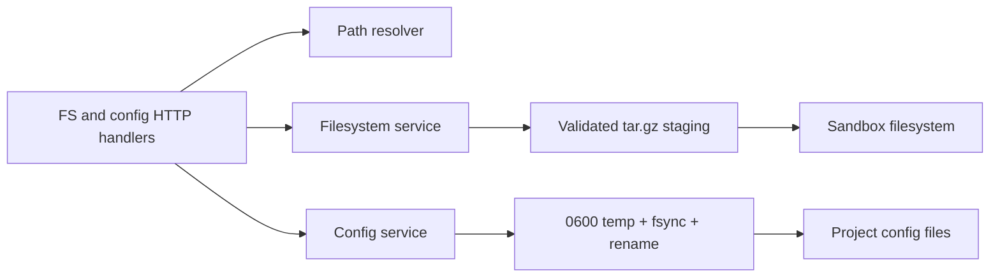

# Plan: Phase 05 - Filesystem and Config APIs

**Date:** 2026-08-23
**Revised:** 2026-09-12
**Status:** DRAFT
**Risk Level:** High

---

## Overview

Implement the Linux filesystem and per-project configuration APIs for `agent-bridge`. This phase ports the externally relevant Rust path behavior, adds bounded staged `tar.gz` uploads with traversal and symlink defenses, and provides atomic mode-0600 MCP and skills JSON files using only the Go standard library.

## Phase Goal

Deliver all `/v1/fs/*` and `/v1/config/{mcp,skills}` routes with deterministic responses, RFC 9457 errors, strict body limits, safe upload extraction, and atomic configuration replacement. The phase is complete only when service tests and HTTP contract tests cover success, validation, limits, and failure atomicity.

## References And Assumptions

### Authoritative References

- `docs/plans/20260815-agent-bridge.md`, especially "Platform and dependencies", "Authentication and errors", and "Non-ACP endpoints".
- Project ground rules: `docs/references/go-project-layout.md` (structure, ownership, hygiene) and `docs/references/go-coding-standards.md` (coding rules) are binding for all tasks; the specification and phase plans remain authoritative for behavior.
- Rust behavior reference: `/home/viethoangcr/Workspace/github/rivet/sandbox-agent/server/packages/sandbox-agent/src/router/support.rs`, symbols `resolve_fs_path` and `sanitize_relative_path`.
- Rust handler reference: `/home/viethoangcr/Workspace/github/rivet/sandbox-agent/server/packages/sandbox-agent/src/router.rs`, symbols `get_v1_fs_entries`, `get_v1_fs_file`, `put_v1_fs_file`, `delete_v1_fs_entry`, `post_v1_fs_mkdir`, `post_v1_fs_move`, `get_v1_fs_stat`, `post_v1_fs_upload_batch`, and the config handlers.

### Assumptions Fixed By This Plan

- Phase 01 provides module `github.com/viethoangcr/agent-bridge` and the standard `internal/httpapi.Server` in `internal/httpapi/server.go`, plus RFC 9457 `Problem` responses, JSON decoding, route registration, authentication, and body-limit helpers. Phase 05 extends that exact server type rather than introducing an adapter or parallel router.
- The revised specification overrides current Rust details: relative filesystem paths resolve under `$HOME`, config endpoints replace one whole JSON object, uploads are gzip-compressed tar archives, delete is recursive for directories, and uploads return file path/size objects.
- General filesystem endpoints may follow symlinks because the sandbox itself is the trust boundary. Directory entries use `os.Stat` on each joined entry to follow symlinks; dangling symlinks and entries whose targets are not regular files/directories are skipped, while other stat errors fail the listing deterministically. Upload is stricter: archive links/devices and every existing symlink component below the destination are rejected.
- Upload permits only regular files and directories. Existing regular files are overwritten; existing directories are reused; file/directory type conflicts are rejected. Validation or staging failure leaves the destination unchanged. A filesystem error during the final multi-file merge can leave a partial merge; the specification does not require a transactional directory swap.
- No new module is allowed. Use `archive/tar`, `compress/gzip`, `encoding/json`, `io`, `io/fs`, `os`, `path/filepath`, `sort`, `sync`, and `time`.

## Requirements

- Absolute paths are allowed and used with `filepath.Clean` semantics. Safe non-empty relative paths resolve under `$HOME`.
- Before `filepath.Clean`, inspect every raw relative component and reject any `..`; reject NUL, an empty path/directory, and relative paths when `HOME` is empty or unset with 400. `.` components are allowed, so `.` explicitly names `$HOME`; cleaning must never erase evidence of a raw parent component.
- `GET /v1/fs/entries?directory=&type=all|file|dir` defaults `type` to `all` and returns 200 `{"entries":[{"name","path","type","size","modifiedMs"}]}` sorted by path; entry `type` values are only `file` or `dir`.
- `GET /v1/fs/file?path=` streams raw bytes as `application/octet-stream`.
- `PUT /v1/fs/file?path=` accepts at most 512 MiB, creates parents, overwrites the file, and returns 200 `{path,size}`.
- `DELETE /v1/fs/entry?path=` removes files and recursively removes directories, returns 204 empty, and returns 404 for a missing path.
- `POST /v1/fs/mkdir` accepts `{directory,name}` where `name` is exactly one non-dot path component, returns 200 `{path}`, and succeeds for an existing directory.
- `POST /v1/fs/move` accepts `{source,destination}`, creates destination parents, and calls `os.Rename` without first deleting the destination. Compatible atomic replacement is allowed; incompatible types, a non-empty destination directory, other destination conflicts, and `EXDEV` return conflict/error without deleting destination content. It returns 200 `{path}` containing the resolved destination path.
- `GET /v1/fs/stat?path=` returns `{path,type,size,modifiedMs,mode}` with `type` set to `file` or `dir`, `mode` set to permission bits only as `uint32(info.Mode().Perm())`, and modification time as Unix milliseconds.
- `POST /v1/fs/upload-batch?directory=` enforces 512 MiB compressed and cumulative extracted limits, validates the complete archive, extracts into staging, rejects unsafe entries and destination symlink components, then merges.
- Config files are exactly `{resolved directory}/.agent-bridge/config/mcp.json` and `{resolved directory}/.agent-bridge/config/skills.json`.
- Config PUT accepts one JSON object. MCP values are `{command:string,args?:string[],env?:map[string]string}`; skills values may be any JSON object. Arrays, scalars, `null`, unknown MCP fields, empty MCP commands, and trailing JSON are 400.
- Config writes use same-directory temporary files, mode 0600, `fsync`, atomic rename, and directory `fsync`. PUT and DELETE return 204 empty; missing GET and DELETE return 404.
- All malformed inputs, missing query values, OS failures, and body-limit failures use the shared `application/problem+json` response path; payload excess is 413.
- The master plan is authoritative for public HTTP strictness and exact schemas. JSON requests require a parsed `application/json` Content-Type (case-insensitive type/subtype, parameters allowed); missing/malformed/other types are 415. JSON DTOs reject unknown fields and trailing values. Scalar query keys are allowlisted, occur at most once, and reject unknown/repeated/empty required values with 400. Raw file PUT and tar.gz upload are body-oriented and accept any Content-Type (the master specification defines no media type for them).
- One process-wide `sync.Mutex`, constructed in `internal/app`, serializes every bridge-originated filesystem mutation: file PUT, delete, mkdir, move, upload preflight/merge, and config PUT/DELETE. Reads need not take it. Threat model: authenticated clients can execute arbitrary commands, so pathname checks and this process-local lock cannot defend concurrent external OS mutation; the sandbox is the security boundary. Upload checks defend non-concurrent extraction mistakes, and all symlink/type rechecks immediately before mutation remain required.
- For every RED section, first make the test compile when the symbol already exists, run it before implementation, and retain the failing behavioral assertion. A compile failure is acceptable evidence only for a genuinely new symbol and must be replaced by behavioral RED evidence once compilation is possible.

## Target State



## Interfaces

### `internal/filesystem.Service`

```go
const MaxFileBytes int64 = 512 << 20
const MaxUploadCompressedBytes int64 = 512 << 20
const MaxUploadExtractedBytes int64 = 512 << 20

type Entry struct {
    Name       string `json:"name"`
    Path       string `json:"path"`
    Type       string `json:"type"`
    Size       int64  `json:"size"`
    ModifiedMs int64  `json:"modifiedMs"`
}

type Stat struct {
    Path       string `json:"path"`
    Type       string `json:"type"`
    Size       int64  `json:"size"`
    ModifiedMs int64  `json:"modifiedMs"`
    Mode       uint32 `json:"mode"`
}

type UploadedFile struct {
    Path string `json:"path"`
    Size int64  `json:"size"`
}

type FileResult struct {
    Path string `json:"path"`
    Size int64  `json:"size"`
}

type PathResult struct {
    Path string `json:"path"`
}

type Service struct { /* immutable HOME, limits, and injected shared mutation lock */ }

func New(home string, mutations *sync.Mutex) (*Service, error)
func (s *Service) Resolve(raw string) (string, error)
func (s *Service) Entries(directory, entryType string) ([]Entry, error)
func (s *Service) Open(path string) (*os.File, Stat, error)
func (s *Service) WriteFile(path string, src io.Reader) (FileResult, error)
func (s *Service) Remove(path string) error
func (s *Service) Mkdir(directory, name string) (PathResult, error)
func (s *Service) Move(source, destination string) (PathResult, error)
func (s *Service) Stat(path string) (Stat, error)
func (s *Service) Upload(directory string, src io.Reader) ([]UploadedFile, error)
```

- `New` may receive an empty home so absolute paths continue to work; only resolving a non-empty relative path then fails. `Resolve("")` is always `invalid`, making service behavior match public required-path behavior; callers use `.` to explicitly address HOME.
- Service errors preserve a machine-readable kind (`invalid`, `not_found`, `conflict`, `too_large`, `internal`) for the HTTP adapter.
- `Open` returns an open descriptor so the handler does not check then reopen a potentially changed path.
- `Upload` owns the complete gzip/tar validation, staging cleanup, and merge. The handler additionally enforces the compressed HTTP body limit.

### `internal/projectconfig.Service`

```go
type MCPServer struct {
    Command string            `json:"command"`
    Args    []string          `json:"args,omitempty"`
    Env     map[string]string `json:"env,omitempty"`
}

type Service struct { /* filesystem resolver plus the same injected mutation lock */ }

func New(files *filesystem.Service, mutations *sync.Mutex) *Service
func (s *Service) Get(kind, directory string) (json.RawMessage, error)
func (s *Service) Put(kind, directory string, body json.RawMessage) error
func (s *Service) Delete(kind, directory string) error
```

- `kind` is internal and must be exactly `mcp` or `skills`; routes do not accept arbitrary filenames.
- MCP is decoded as `map[string]MCPServer` with unknown fields rejected. Skills is decoded as `map[string]json.RawMessage` so each top-level value can have arbitrary JSON shape.
- `Put` serializes a canonical indented object plus trailing newline before atomic replacement.

### `internal/httpapi.Server`

```go
type fsMkdirRequest struct {
    Directory string `json:"directory"`
    Name      string `json:"name"`
}

type fsMoveRequest struct {
    Source      string `json:"source"`
    Destination string `json:"destination"`
}

func (s *Server) registerFilesystemRoutes(mux *http.ServeMux)
func (s *Server) handleFSEntries(w http.ResponseWriter, r *http.Request)
func (s *Server) handleFSFile(w http.ResponseWriter, r *http.Request)
func (s *Server) handleFSEntry(w http.ResponseWriter, r *http.Request)
func (s *Server) handleFSMkdir(w http.ResponseWriter, r *http.Request)
func (s *Server) handleFSMove(w http.ResponseWriter, r *http.Request)
func (s *Server) handleFSStat(w http.ResponseWriter, r *http.Request)
func (s *Server) handleFSUploadBatch(w http.ResponseWriter, r *http.Request)
func (s *Server) registerConfigRoutes(mux *http.ServeMux)
func (s *Server) handleMCPConfig(w http.ResponseWriter, r *http.Request)
func (s *Server) handleSkillsConfig(w http.ResponseWriter, r *http.Request)
```

- Extend Phase 01 `httpapi.Dependencies`/`Server` with injected `*filesystem.Service` and `*projectconfig.Service` fields. `internal/app` constructs the one shared mutation mutex and both services; `httpapi` only consumes dependencies and must not construct services. Phase 06 owns final all-phase application/image integration.

## Tasks

### Task 5.1: Implement Rust-Compatible Path Resolution And Metadata

**Description:** Add the shared filesystem service, safe relative-path resolver, typed errors, deterministic entry listing, and stat conversion used by every later task.
**Files:** Create `internal/filesystem/service.go`; create `internal/filesystem/service_test.go`.
**Symbols:** `Service`, `New`, `Resolve`, `Entries`, `Stat`, `statFromInfo`, `validateRelativePath`, `Error`, `ErrorKind`.
**References:** Authoritative specification sections "Non-ACP endpoints" and its filesystem/config rules; Rust `resolve_fs_path` and `sanitize_relative_path`.
**Risk:** Medium. Incorrect normalization can expose paths outside the intended relative root or reject compatible paths.
**Reversibility:** Easy to revert before handlers consume the service.
**Dependencies:** Phase 01 only.

**RED:**

- [x] Write table tests proving absolute paths remain unchanged and are cleaned only with `filepath.Clean` semantics.
- [x] Write tests proving `a/./b` resolves below HOME, while `../a`, `a/../b`, repeated-slash parent forms, NUL, empty input, and empty HOME with a relative path return `invalid`. These tests must prove raw components are rejected before cleaning.
- [x] Write tests for `.` explicitly resolving to HOME, Linux backslashes remaining ordinary filename characters, and absolute paths working without HOME.
- [x] Write tests for sorted entries, omitted/`all` filters returning both `file` and `dir`, `file` and `dir` filters returning only their exact type, invalid filter rejection, and missing/not-directory errors. Use `os.Stat(joinedPath)` to prove entry symlinks are followed; dangling links and special targets are skipped, while other stat failures error. Assert milliseconds and `uint32(info.Mode().Perm())` only.
- [x] Run `go test ./internal/filesystem -run 'Test(ServiceResolve|ServiceEntries|ServiceStat)'` and retain behavioral assertion failures for raw traversal, symlink handling, and permission bits where feasible.

**GREEN:**

- [x] Capture HOME once in `New`; do not read mutable process environment per request.
- [x] Reject empty/NUL input before `filepath` operations. For relative paths, iterate raw lexical components and reject every exact `..` before `filepath.Clean`; do not use cleaned-component or prefix-string containment checks.
- [x] Map `fs.ErrNotExist` to `not_found`, invalid input to `invalid`, destination/type collisions to `conflict`, and unexpected I/O to `internal` without exposing stack traces.
- [x] Use `os.ReadDir`, `os.Stat(filepath.Join(directory, entry.Name()))`, and explicit `sort.Slice` by absolute path. Skip `fs.ErrNotExist` caused by dangling/racing entries and non-file/non-directory targets; map other stat failures normally.
- [x] Implement `Stat` from `os.Stat`, mapping regular files to `file` and directories to `dir`; unsupported entry types return `invalid`.
- [x] Run `gofmt -w internal/filesystem/service.go internal/filesystem/service_test.go`.

**Verify:** `go test ./internal/filesystem -run 'Test(ServiceResolve|ServiceEntries|ServiceStat)' -count=1`

### Task 5.2: Implement Core Filesystem Mutations

**Description:** Add raw file open/write, recursive delete, one-component mkdir, and overwrite rename while retaining exact error semantics.
**Files:** Modify `internal/filesystem/service.go`; modify `internal/filesystem/service_test.go`.
**Symbols:** `Open`, `WriteFile`, `Remove`, `Mkdir`, `Move`, `validateName`.
**References:** Interfaces in this plan; specification FS endpoint table and overwrite rules.
**Risk:** High. Delete and overwrite bugs can destroy unintended sandbox data.
**Reversibility:** Code is easy to revert; filesystem side effects in a live sandbox are irreversible, so tests must use `t.TempDir()`.
**Dependencies:** Task 5.1.

**RED:**

- [x] Test binary-safe read and overwrite write, parent creation, directory-as-file rejection, and source read failure without a successful response.
- [x] Test recursive directory deletion, file deletion, and 404-equivalent missing deletion.
- [x] Test mkdir idempotence and reject empty, `.`, `..`, slash-containing, and NUL names.
- [x] Test `Move(source, destination)` creates destination parents, atomically replaces compatible file/file and directory/empty-directory destinations where supported, rejects incompatible types and non-empty destination directories without changing them, rejects a missing source, returns the resolved destination path, and maps cross-device `EXDEV` to conflict without copy fallback or destination deletion. Other unexpected rename I/O remains internal error.
- [x] Test the injected shared mutex prevents file PUT, delete, mkdir, and move from interleaving with upload/config mutations. Run `go test ./internal/filesystem -run 'TestService(Open|WriteFile|Remove|Mkdir|Move)'` and retain a behavioral failure before implementation where feasible.

**GREEN:**

- [x] Use `os.Open` plus descriptor `Stat` for reads.
- [x] Stream writes through a same-directory temporary file and rename it over the target so failed reads do not truncate an existing destination; create missing parents first.
- [x] Keep PUT-created file permissions at 0644 subject to umask; config permissions are handled separately.
- [x] Use `os.Lstat` before deletion so a symlink itself is removed rather than recursively following it.
- [x] Validate mkdir `name` with `filepath.Base(name) == name` plus explicit dot/NUL rejection.
- [x] Lock the injected process-wide mutation mutex around every mutating service operation. For `Move(source, destination)`, call `os.Rename` directly after parent creation; never recursively remove or otherwise pre-delete the destination, and do not implement cross-filesystem copying.

**Verify:** `go test ./internal/filesystem -run 'TestService(Open|WriteFile|Remove|Mkdir|Move)' -count=1`

### Task 5.3: Validate And Stage Bounded Tar.Gz Uploads

**Description:** Parse and validate an entire gzip-compressed tar stream, enforce both limits, reject dangerous entries, and extract only into a destination-filesystem staging directory.
**Files:** Create `internal/filesystem/upload.go`; create `internal/filesystem/upload_test.go`.
**Symbols:** `Upload`, `validateArchivePath`, `archiveManifest`, `archiveItem`, `countingReader`, `extractArchive`, `rejectSymlinkComponents`.
**References:** `MaxUploadCompressedBytes`, `MaxUploadExtractedBytes`, specification upload requirements.
**Risk:** High. Archive extraction is an untrusted-input boundary with traversal, decompression bomb, and symlink risks.
**Reversibility:** Easy to revert; staging is temporary and must be cleaned on all exits.
**Dependencies:** Tasks 5.1-5.2.

**RED:**

- [x] Build archives in tests with stdlib helpers and cover regular files, directories, nested files, empty archives, and deterministic response sorting.
- [x] Test rejection of absolute names, `..` at any component, empty/NUL names, symlink and hard-link entries, character/block devices, FIFO, sparse/unknown types, duplicate paths, and file/parent conflicts.
- [x] Test compressed input at limit and limit+1, cumulative declared/actual extracted size at limit and limit+1, truncated gzip, corrupt tar, headers lying about content size, concatenated gzip members, and one trailing byte after a valid archive.
- [x] Test that invalid archives and extraction failures leave a pre-existing destination byte-for-byte unchanged and leave no staging directory.
- [x] Test existing symlinks at destination root descendants and parent components are rejected, including a symlink pointing back inside the destination.
- [x] Use injected small compressed/extracted limits for ordinary tests and one bounded production-limit test that verifies configured 512MiB boundaries without allocating huge bodies. Run `go test ./internal/filesystem -run 'TestUpload'` and retain behavioral assertion failures for limit/EOF handling where feasible.

**GREEN:**

- [x] Wrap input with a max+1 counting reader using injected service limits, reject once compressed bytes exceed the active compressed limit, and close `gzip.Reader` on every path.
- [x] Validate each tar header lexically with `filepath.IsAbs` and component iteration before joining. Accept only `tar.TypeReg`, `tar.TypeRegA`, and `tar.TypeDir`.
- [x] Sum regular-file header sizes with overflow checks before copying, then enforce actual copied bytes with `io.LimitedReader`; reject negative sizes and short entries.
- [x] Detect duplicate normalized names and ancestor/descendant type conflicts before destination mutation.
- [x] Disable gzip multistream handling and require tar EOF, gzip EOF, and underlying compressed-input EOF; reject concatenated members or any trailing byte.
- [x] Create staging with `os.MkdirTemp` under the resolved destination's nearest existing parent so final renames stay on one filesystem; always defer `os.RemoveAll`.
- [x] Extract files with `O_CREATE|O_EXCL|O_WRONLY`, directories with 0755, and files with archive permission bits masked to 0777. Do not apply ownership, setuid/setgid, device, or timestamp metadata.
- [x] Before merge, walk each existing destination component with `os.Lstat`; reject any symlink. Repeat immediately before each final rename to narrow TOCTOU exposure.
- [x] Return only regular files as `{path,size}`, sorted by final absolute path.

**Verify:** `go test ./internal/filesystem -run 'TestUpload' -count=1`

### Task 5.4: Merge Validated Uploads With Defined Overwrite Semantics

**Description:** Complete upload by merging only after validation/extraction succeeds, preserving existing directories and replacing regular files.
**Files:** Modify `internal/filesystem/upload.go`; modify `internal/filesystem/upload_test.go`.
**Symbols:** `mergeStaging`, `preflightMerge`, `mergeItem`.
**References:** Task 5.3 manifest; specification "validate/extract in staging before merge" and overwrite requirements.
**Risk:** High. Merge ordering and destination type conflicts can produce partial or destructive results.
**Reversibility:** Needs backup for real destination data; tests use temporary trees.
**Dependencies:** Task 5.3.

**RED:**

- [x] Test overwrite of existing regular files, reuse of existing directories, creation of nested trees, and preservation of unrelated destination files.
- [x] Test preflight rejection when archive file meets destination directory, archive directory meets destination file, or any destination component is a symlink; assert no destination changes.
- [x] Test a forced merge I/O failure returns `internal` and always removes staging.
- [x] Run `go test ./internal/filesystem -run 'TestUploadMerge'` and record failure.

**GREEN:**

- [x] Preflight every manifest destination before the first mutation, including type conflicts and symlink components.
- [x] Create directories shallowest-first, then move files in sorted order using same-directory temporary destination names and `os.Rename` replacement.
- [x] Do not delete unrelated destination content and do not claim full transactionality after merge begins.
- [x] Hold the one injected process-wide mutation mutex across upload destination validation, preflight, rechecks, and merge so no bridge file/config mutation can interleave. Document that this does not serialize arbitrary commands or external OS writers and therefore is not a security boundary.

**Verify:** `go test ./internal/filesystem -run 'TestUpload(Merge|Symlink|Limit|Invalid)' -count=1`

### Task 5.5: Expose Filesystem HTTP Handlers

**Description:** Register all filesystem routes and translate service values/errors into the exact HTTP contract and shared problem format.
**Files:** Create `internal/httpapi/filesystem.go`; create `internal/httpapi/filesystem_test.go`; modify `internal/httpapi/server.go` to inject `*filesystem.Service` and register routes.
**Symbols:** `registerFilesystemRoutes`, `handleFSEntries`, `handleFSFile`, `handleFSEntry`, `handleFSMkdir`, `handleFSMove`, `handleFSStat`, `handleFSUploadBatch`, `writeFilesystemError`.
**References:** Phase 01 HTTP helpers and all filesystem interfaces in this plan.
**Risk:** Medium. Incorrect limits or route patterns can bypass service protections.
**Reversibility:** Easy to revert.
**Dependencies:** Tasks 5.1-5.4 and Phase 01.

**RED:**

- [x] Add `httptest` table coverage for every method/path, exact request/response schema, required non-empty query parameter, exact status/body, content type, sorting, 404, 409, and malformed JSON case. For every scalar query, reject unknown keys, repeats, and empty supplied required values per the master public contract.
- [x] Test entries omission defaults to `all`; `all|file|dir` filtering and `file|dir` response values are exact; unknown or repeated `type` is 400; the body is `{"entries":[...]}` sorted by path.
- [x] Test `GET /v1/fs/file` returns exact arbitrary bytes. With an injected small limit, test PUT at limit overwrites and returns 200 `{"path":<resolved path>,"size":<bytes>}`, while limit+1 returns 413 without changing an existing file; one bounded production test verifies the configured limit is exactly 512MiB without allocating or transferring 512MiB.
- [x] Test DELETE file/directory returns 204 with an empty body and missing returns 404.
- [x] Test mkdir decodes exactly `{directory,name}`, is idempotent, and returns 200 `{"path":<resolved path>}`.
- [x] Test move decodes exactly `{source,destination}`, rejects empty/legacy/unknown fields, safely replaces only compatible destinations, preserves incompatible/non-empty destinations, and returns 200 `{"path":<resolved destination>}`.
- [x] Test upload accepts gzip data without requiring a Content-Type, returns `{"files":[...]}`, rejects compressed excess with 413, and maps unsafe archives to 400.
- [x] Test JSON handlers require `application/json` with optional parameters and reject missing/wrong Content-Type with 415; raw PUT/upload accept any Content-Type. Test auth still applies to every new `/v1/*` route; wrong methods return the shared problem+json 405 with sorted `Allow` produced by the Phase 01 `/` fallback (this phase registers no methodless same-path fallbacks).
- [x] Run `go test ./internal/httpapi -run 'TestFS'` and retain behavioral failures for strict query/schema/media-type handling where feasible.

**GREEN:**

- [x] Register only method-specific Go 1.26 patterns for the exact endpoints; use one method-switch handler only where GET and PUT share a path. Wrong-method 405s come from the Phase 01 `/` fallback, never from methodless same-path registrations.
- [x] Require non-empty `directory`/`path` query values where specified; reject duplicate ambiguous values through the Phase 01 query helper.
- [x] Use `http.MaxBytesReader` with injected limits and max+1 detection for PUT and upload. Stream rather than calling `io.ReadAll` for production-sized bodies; keep one bounded production-boundary test and use small limits elsewhere.
- [x] Stream opened files with `io.Copy`; set `Content-Length` from descriptor metadata and `application/octet-stream`.
- [x] Decode mkdir `{directory,name}` and move `{source,destination}` with the shared 10 MiB JSON limit, exactly one JSON value, and unknown fields rejected; use `source` and `destination` names through handler/service calls.
- [x] Encode only the exact master responses: entries wrapper, PUT `{path,size}`, empty DELETE 204, mkdir/move `{path}`, stat object, and upload files wrapper.
- [x] Map typed service errors to 400/404/409/413/500 RFC 9457 responses without leaking host paths for unexpected errors.

**Verify:** `go test ./internal/httpapi -run 'TestFS' -count=1`

### Task 5.6: Implement Atomic MCP And Skills Config Service

**Description:** Validate complete project config objects and atomically replace or remove the fixed config files with mode 0600.
**Files:** Create `internal/projectconfig/service.go`; create `internal/projectconfig/service_test.go`.
**Symbols:** `MCPServer`, `Service`, `New`, `Get`, `Put`, `Delete`, `configPath`, `validateMCP`, `validateSkills`, `writeAtomic`.
**References:** Config interfaces in this plan; authoritative specification section "Non-ACP endpoints" for exact config location, schema, status, and atomic-write requirements.
**Risk:** High. Non-atomic or concurrent writes can corrupt user project configuration.
**Reversibility:** Code is easy to revert; replacing user config requires backup, so tests use temporary projects.
**Dependencies:** Task 5.1.

**RED:**

- [x] Test absolute and HOME-relative project directories resolve exactly to `<project>/.agent-bridge/config/mcp.json` and `<project>/.agent-bridge/config/skills.json`, with no alternate config root created.
- [x] Test MCP accepts valid command/args/env maps and rejects non-object top level, malformed JSON, null, unknown fields, empty command, non-string args/env, and trailing data.
- [x] Test skills accepts an empty object and arbitrary nested values but rejects arrays, scalars, null, malformed JSON, and trailing data.
- [x] Test pretty JSON plus newline, file mode 0600 on create and overwrite, parent mode subject to umask, missing GET/DELETE as `not_found`, and no temp-file residue.
- [x] Test a failed replacement leaves previous bytes intact and concurrent PUT/GET never observes malformed or partial JSON. Prove config PUT/DELETE use the same injected mutation mutex as every filesystem mutation.
- [x] Run `go test ./internal/projectconfig` and record the expected compile/test failure.

**GREEN:**

- [x] Reuse `filesystem.Service.Resolve(directory)` and append only the fixed `.agent-bridge/config/<kind>.json` suffix.
- [x] Decode MCP with `json.Decoder.DisallowUnknownFields`; decode skills into `map[string]json.RawMessage`; require decoder EOF.
- [x] Serialize validated values with `json.MarshalIndent` so invalid raw bytes are never persisted.
- [x] Under the injected process-wide mutation mutex, create parents, `os.CreateTemp` in the target directory, `Chmod(0600)`, write, `Sync`, close, rename, then open and sync the parent directory. Defer temp cleanup.
- [x] On overwrite, explicitly chmod the temporary file; never rely on the existing target mode.
- [x] Delete under that same shared mutex and sync the parent directory after removal.

**Verify:** `go test ./internal/projectconfig -count=1`

### Task 5.7: Expose Config Handlers And Run Phase Verification

**Description:** Register whole-object MCP/skills handlers, consume application-injected services, and run all phase and repository checks.
**Files:** Create `internal/httpapi/config.go`; create `internal/httpapi/config_test.go`; modify Phase 01 `internal/httpapi/server.go` dependencies/fields and route registration; modify `internal/app/app.go` and `internal/app/app_test.go` for service construction.
**Symbols:** `registerConfigRoutes`, `handleMCPConfig`, `handleSkillsConfig`, `handleProjectConfig`, `writeProjectConfigError`.
**References:** Phase 01 server construction and `internal/projectconfig.Service`.
**Risk:** Medium. Wiring errors can expose inconsistent endpoint behavior despite correct service code.
**Reversibility:** Easy to revert.
**Dependencies:** Tasks 5.5-5.6 and Phase 01.

**RED:**

- [x] Add HTTP tests for GET/PUT/DELETE on both routes, required non-empty single `directory`, rejection of unknown/repeated query keys, exact object round-trip, 204 empty writes/deletes, missing 404, malformed/non-object/unknown MCP fields/trailing JSON 400, strict JSON Content-Type 415, and the master 10MiB JSON body excess 413.
- [x] Add a regression test issuing concurrent PUTs and GETs through HTTP and assert every successful GET is one complete submitted object with mode 0600 on disk.
- [x] Run `go test ./internal/httpapi -run 'Test(MCP|Skills)Config'` and retain behavioral failures for strict HTTP and shared-lock behavior where feasible.

**GREEN:**

- [x] Route only `GET /v1/config/mcp`, `PUT /v1/config/mcp`, `DELETE /v1/config/mcp`, and equivalent skills patterns.
- [x] Preserve request JSON as `json.RawMessage` only until service validation; do not add agent-specific transformation.
- [x] In `internal/app`, instantiate one process-wide mutation mutex, pass it to the filesystem and project-config constructors, and inject both services through `httpapi.Dependencies`; `httpapi` constructs neither. Keep this phase independently composable; Phase 06 owns final cross-phase/runtime-image integration.
- [x] Run formatting, static analysis, focused tests, full tests, and the static build command.

- [x] Review addenda (2026-09-12, oracle-driven): post-tar gzip data is rejected (immediate gzip EOF + compressed EOF); upload holds the shared mutation mutex from destination validation through staging cleanup and merge; only regular destination files may be replaced (type rechecked immediately before rename); explicit MCP `args:null`/`env:null` rejected while omission/`[]`/`{}` stay valid; allowlisted query parsing rejects `url.ParseQuery` errors and unknown keys (fs/config/process/ACP); oversized files split.

**Verify:**

```sh
gofmt -w internal/filesystem internal/projectconfig internal/httpapi cmd/agent-bridge
go vet ./...
go test ./internal/filesystem ./internal/projectconfig ./internal/httpapi -count=1
go test ./... -count=1
CGO_ENABLED=0 go build -trimpath -o /tmp/agent-bridge ./cmd/agent-bridge
```

## Dependencies

| Task | Depends On |
|---|---|
| 5.1 | Phase 01 |
| 5.2 | 5.1 |
| 5.3 | 5.1, 5.2 |
| 5.4 | 5.3 |
| 5.5 | 5.1-5.4, Phase 01 |
| 5.6 | 5.1 |
| 5.7 | 5.5, 5.6, Phase 01 |

Phase 05's isolated package tasks (5.1-5.4 and 5.6) may execute after Phase 01 in parallel with Phases 02-04. Tasks 5.5 and 5.7 extend shared `httpapi`/`internal/app` files and require Phase 03 completion. The phase must not depend on ACP or process internals.

## Deliverables

- Rust-compatible Linux path resolver and typed filesystem service.
- Complete filesystem HTTP API with deterministic metadata and strict limits.
- Fully validated staged `tar.gz` extraction with traversal, link/device, decompression, duplicate, conflict, and destination-symlink defenses.
- Atomic mode-0600 whole-object MCP and skills config service and handlers.
- Focused service and HTTP regression tests using only Go stdlib test tooling.

## Completion Criteria

- [x] Every route listed in the Phase 05 goal is registered and protected by Phase 01 authentication/error middleware.
- [x] Relative raw-component traversal, explicit `.`, absolute, empty, missing-HOME, and NUL path cases pass tests.
- [x] File PUT and upload enforce their 512 MiB limits and return 413 on excess.
- [x] Entries default to `all`, accept only `all|file|dir`, follow symlinks with `os.Stat`, skip dangling/special entries, return only `file|dir` values, expose permission-only mode in stat, and are wrapped under `entries` in sorted order.
- [x] File PUT returns 200 `{path,size}`; entry DELETE returns 204 empty; mkdir returns 200 `{path}`; move accepts `{source,destination}` and returns 200 `{path}` without pre-deleting any destination.
- [x] No rejected upload mutates its destination or leaves staging files.
- [x] Upload rejects every non-file/directory tar type and every existing destination symlink component.
- [x] Config files exist only at `{resolved directory}/.agent-bridge/config/{mcp,skills}.json`, contain complete valid JSON, are mode 0600 and atomically replaced, return 204 empty for PUT/DELETE, and return 404 for absent GET/DELETE.
- [x] One application-injected mutation lock serializes all bridge file/config mutations; tests and documentation make no protection claim against arbitrary commands or external OS mutation.
- [x] `go vet ./...`, `go test ./... -count=1`, and the `CGO_ENABLED=0` build pass.

## Open Questions

- None.
