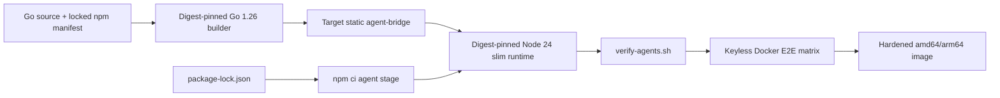

# Plan: Phase 06 - Runtime Image, E2E, Hardening, And Docs

**Date:** 2026-08-23
**Status:** DRAFT
**Risk Level:** High

---

## Overview

Package the completed bridge and pinned ACP agents into a reproducible, target-aware, non-root Node 24 runtime image; verify installed agent binaries; exercise the image through keyless Docker end-to-end tests; harden lifecycle behavior; and document the supported operator contract.

## Phase Goal

Produce a digest-pinned multi-stage image for Linux amd64 and arm64 that contains one static `agent-bridge` binary plus Claude Code ACP 0.68.0, Codex ACP 1.3.0, and OpenCode 1.18.18. Prove through repeatable Docker tests that keyless real-agent initialization, strict mock protocol flows, persistence/restart, idle reaping, process-group cleanup, and graceful shutdown satisfy the authoritative specification.

## References And Assumptions

### Authoritative References

- `docs/plans/20260815-agent-bridge.md`, all requirements, especially "Agent resolution", "Environment, shutdown, and image", and the final open question about authenticated E2E.
- Completed Phase 01-05 plans and implementation. This plan is self-contained about expected externally visible behavior and must not weaken earlier tests.
- Rust lifecycle references: `/home/viethoangcr/Workspace/github/rivet/sandbox-agent/server/packages/acp-http-adapter/src/process.rs` and `/home/viethoangcr/Workspace/github/rivet/sandbox-agent/server/packages/sandbox-agent/src/acp_proxy_runtime.rs`.

### Assumptions Fixed By This Plan

- The npm package names are `@agentclientprotocol/claude-agent-acp@0.68.0`, `@agentclientprotocol/codex-acp@1.3.0`, and `opencode-ai@1.18.18`; implementation must fail rather than substitute a package if these names do not expose `claude-agent-acp`, `codex-acp`, and `opencode` respectively.
- Runtime image files are under `docker/runtime/`: `Dockerfile`, `Dockerfile.dockerignore`, `package.json`, and `package-lock.json`. The Docker build context remains the repository root so Go source is available. `npm ci` runs without `--ignore-scripts`, `--omit=optional`, or flags that suppress optional dependencies/lifecycle scripts.
- Every `FROM` reference is pinned by digest at implementation. In particular the final stage is `node:24-bookworm-slim@sha256:<verified multi-platform manifest digest>`; no placeholder digest may remain in a completed change.
- Docker BuildKit/buildx is available for image verification. Regular E2E runs use the host architecture; CI or release verification runs the explicit `linux/amd64,linux/arm64` build.
- E2E tests are Go stdlib tests under build tag `e2e`, invoke the Docker CLI, bind an ephemeral localhost port discovered by Docker, and skip with a precise reason only when Docker is unavailable. Once Docker is available, individual behavioral failures must not skip.
- The private `mock` agent is exercised only by tests and is omitted from `README.md`, image labels, and public examples.
- Real-agent tests are keyless. Claude/Codex `session/new` may succeed or return an ACP auth-required error. OpenCode `session/new` must succeed; its first prompt may return an auth error. OpenCode 1.18.18 `session/load` is not required to include `sessionId`.
- Authenticated prompt/resume tests remain deferred until isolated credentials exist in CI. No test reads developer credential files or forwards host credentials into containers.
- Expected image size is at least 1 GB because optional agent dependencies are preserved. There is no artificial image-size upper bound in this phase.

## Requirements

- Build `agent-bridge` with Go 1.26, `CGO_ENABLED=0`, `-trimpath`, and target `TARGETOS/TARGETARCH` in a builder stage.
- Use digest-pinned builder and runtime bases; avoid network access after dependency installation stages.
- Install exact npm versions from committed lockfile with `npm ci`; preserve install scripts and optional dependencies.
- Run as a fixed non-root user with writable HOME and workdir. Set `AGENT_BRIDGE_HOST=0.0.0.0`, `DISABLE_AUTOUPDATER=1`, and `NO_BROWSER=1`.
- Do not add runtime install/update code. The image only contains pre-provisioned agents.
- `scripts/verify-agents.sh` must fail on a missing binary, mismatched package version, wrong default OpenCode invocation, or bridge dynamic linkage.
- Keyless Docker E2E covers the real-agent matrix plus a strict mock matrix.
- Lifecycle E2E covers durable state, stale live-state recovery after restart, exited-server reinitialization rules, idle reaping, DELETE, SIGTERM/SIGKILL process groups, PID file cleanup, SSE closure, DB checkpoint/close, and shutdown within 10 seconds.
- Final checks cover auth, problem+json errors, request logging redaction, body/output limits, race tests, static binary inspection, non-root runtime, and absence of runtime package mutation.
- README documents build/run/configuration/API/persistence/shutdown behavior and explicitly calls out keyless limitations without documenting `mock`.

## Target State



## Interfaces

### `docker/runtime/package.json`

```json
{
  "private": true,
  "dependencies": {
    "@agentclientprotocol/claude-agent-acp": "0.68.0",
    "@agentclientprotocol/codex-acp": "1.3.0",
    "opencode-ai": "1.18.18"
  }
}
```

- The generated lockfile must use lockfileVersion 3 and exact resolved integrity entries.
- No semver ranges, npm aliases, post-generation edits, global npm installs, or uncommitted lock regeneration are allowed.

### Runtime Image Contract

```text
ENTRYPOINT ["/usr/local/bin/agent-bridge"]
USER agentbridge (fixed numeric UID/GID)
HOME=/home/agentbridge
PATH=/opt/agents/node_modules/.bin:<base PATH>
AGENT_BRIDGE_HOST=0.0.0.0
DISABLE_AUTOUPDATER=1
NO_BROWSER=1
EXPOSE 2468
```

- The bridge runs directly; there is no shell entrypoint and no public subcommand.
- `/opt/agents` and the bridge binary are root-owned and not writable by the runtime user.
- HOME, workdir, DB parent, optional PID-file parent, and agent state are writable by the runtime user.

### `scripts/verify-agents.sh`

```sh
scripts/verify-agents.sh [--image IMAGE]
```

- Without `--image`, validate the current filesystem (used in the Docker build).
- With `--image`, run the same script inside the named image and assert its configured non-root user.
- Verify npm package versions from `/opt/agents/node_modules/*/package.json`, executable resolution for all three expected commands, `opencode acp` startup/help viability without browser launch, and static bridge linkage.

### `tests/e2e` Harness

```go
type container struct { /* ID, mapped address, volume, logs */ }

func buildImage(t *testing.T) string
func startContainer(t *testing.T, image string, env map[string]string, volume string) *container
func (c *container) request(method, path string, body []byte) (*http.Response, []byte)
func (c *container) waitHealthy(ctx context.Context) error
func (c *container) stop(signal string, timeout time.Duration)
func rpc(id any, method string, params any) []byte
func initialize(t *testing.T, c *container, serverID, agent string) rpcEnvelope
```

- Helpers use `os/exec`, `net/http`, `encoding/json`, `bufio`, and `testing` only.
- Cleanup always captures `docker logs`, removes the container, and removes uniquely created volumes/images unless `AGENT_BRIDGE_E2E_KEEP=1`.
- Polling uses bounded contexts and diagnostic errors; no fixed sleeps as the sole readiness mechanism.

## Tasks

### Task 6.1: Lock Runtime Agent Packages

**Description:** Commit the exact npm manifest and npm-generated lockfile used only by the image agent-install stage.
**Files:** Create `docker/runtime/package.json`; create `docker/runtime/package-lock.json`.
**Symbols:** npm dependency entries for the three pinned packages.
**References:** Runtime pin requirements and package assumptions in this plan.
**Risk:** High. Wrong packages or lock resolution produce a large image that cannot launch required commands.
**Reversibility:** Easy to revert; npm registry artifacts remain external.
**Dependencies:** None for file creation; network access is required once to generate the lock.

**RED:**

- [ ] Add a temporary verification invocation showing `npm ci --prefix docker/runtime` cannot pass before manifest/lock creation.
- [ ] Confirm with `npm view <package>@<version> version bin --json` that each exact package/version exists and exposes the required binary; stop and update the explicit assumption rather than silently substituting.
- [ ] Record failure of `npm ci --prefix docker/runtime --dry-run` before the lockfile exists.

**GREEN:**

- [ ] Write the minimal private manifest with exact versions and run `npm install --package-lock-only --ignore-scripts=false --include=optional --prefix docker/runtime` using the Node/npm version from the pinned Node 24 image.
- [ ] Inspect the lock for exact top-level versions, integrity hashes, optional platform packages, and lifecycle metadata.
- [ ] Run a clean `npm ci --prefix docker/runtime` without suppressing scripts/optional dependencies, verify `docker/runtime/node_modules/.bin/claude-agent-acp`, `codex-acp`, and `opencode`, then remove untracked `node_modules` without changing `.gitignore`.
- [ ] Ensure `git diff --check -- docker/runtime/package.json docker/runtime/package-lock.json` passes.

**Verify:** `npm ci --prefix docker/runtime --dry-run --include=optional`

### Task 6.2: Build A Digest-Pinned Target-Aware Runtime Image

**Description:** Add a multi-stage Dockerfile that cross-compiles the static bridge for the requested target and installs locked agents into a non-root Node 24 runtime.
**Files:** Create `docker/runtime/Dockerfile`; create `docker/runtime/Dockerfile.dockerignore`; modify no root `.gitignore`.
**Symbols:** stages `bridge-build`, `agent-deps`, `runtime`; BuildKit args `BUILDPLATFORM`, `TARGETOS`, `TARGETARCH`.
**References:** Runtime image contract in this plan and authoritative environment defaults.
**Risk:** High. Architecture, libc, permissions, or digest mistakes can make published images non-reproducible or unbootable.
**Reversibility:** Easy to revert image files; already published tags are not mutable deliverables in this phase.
**Dependencies:** Task 6.1 and completed compilable Go implementation.

**RED:**

- [ ] Add shell assertions that a pre-change image build is unavailable and that every `FROM` must contain `@sha256:`.
- [ ] Resolve current multi-platform manifest digests for the selected Go 1.26 builder and Node 24 bookworm-slim images with `docker buildx imagetools inspect`; record architecture support.
- [ ] Run the planned host build command and retain the expected failure before Dockerfile creation.

**GREEN:**

- [ ] Use `FROM --platform=$BUILDPLATFORM <go-1.26-image>@sha256:<digest>` and compile with `CGO_ENABLED=0 GOOS=$TARGETOS GOARCH=$TARGETARCH go build -trimpath -ldflags='-s -w' -o /out/agent-bridge ./cmd/agent-bridge`.
- [ ] Cache Go module/build directories with BuildKit mounts while copying `go.mod`/`go.sum` before source for stable layers.
- [ ] In the digest-pinned Node 24 `agent-deps` stage, set `WORKDIR /opt/agents`, copy `docker/runtime/package.json` and `docker/runtime/package-lock.json` there, and run `npm ci --include=optional`. This makes the committed lock resolve directly to `/opt/agents/node_modules`, matching runtime PATH. Do not use `npm install -g`, `--ignore-scripts`, or runtime installs.
- [ ] Use the digest-pinned target-platform Node 24 bookworm-slim stage, install only required OS packages with apt version pins recorded from the base snapshot, `--no-install-recommends`, and remove apt lists in the same layer.
- [ ] Create fixed UID/GID `10001`, copy `/opt/agents` and `/usr/local/bin/agent-bridge` as root, then switch permanently to that user and `/home/agentbridge`.
- [ ] Set the required environment, `EXPOSE 2468`, and exec-form entrypoint. Do not bake secrets or add a healthcheck that cannot authenticate when a token is set.
- [ ] Keep `docker/runtime/Dockerfile.dockerignore` minimal: VCS metadata, local binaries, DB/WAL/PID files, all `node_modules`, and test output only; do not exclude source needed by the root-context build.

**Verify:**

```sh
docker buildx build --load --platform "linux/$(go env GOARCH)" -f docker/runtime/Dockerfile -t agent-bridge:e2e .
docker image inspect agent-bridge:e2e --format '{{.Config.User}} {{json .Config.Entrypoint}} {{json .Config.Env}}'
scripts/verify-agents.sh --image agent-bridge:e2e
```

### Task 6.3: Add In-Image Agent And Binary Verification

**Description:** Create one POSIX shell verification script and execute it during image build and standalone verification.
**Files:** Create `scripts/verify-agents.sh`; modify `docker/runtime/Dockerfile` to copy/run it before `USER` and preserve it for `--image` checks.
**Symbols:** shell functions `fail`, `package_version`, `require_command`, `verify_local`, `verify_image`.
**References:** Pinned package/binary and non-root contracts.
**Risk:** Medium. Weak checks can allow a broken image to pass; overly interactive version commands can hang builds.
**Reversibility:** Easy to revert.
**Dependencies:** Tasks 6.1-6.2.

**RED:**

- [ ] Run the script against fixtures/mutated image layers with one missing command, one mismatched package version, and a dynamically linked fake bridge; each must fail non-zero with the offending component named.
- [ ] Run against the valid image before implementation and record the missing-script failure.

**GREEN:**

- [ ] Use `set -eu`, `command -v`, and Node to read installed package JSON exactly; do not parse human-oriented npm output.
- [ ] Check versions equal 0.68.0, 1.3.0, and 1.18.18 and resolved commands remain below `/opt/agents/node_modules/.bin`.
- [ ] Use bounded non-interactive version/help invocations. Probe `opencode acp` with an explicit timeout, terminate and reap it on timeout/success, and reject browser-launch output; no verification command may leave the bridge or an agent server running.
- [ ] Verify `agent-bridge` is an executable ELF for the current architecture and has no dynamic interpreter/`NEEDED` entries using tools installed only in a disposable verification stage, not retained in runtime.
- [ ] For `--image`, inspect/run the image and fail if UID is 0, HOME is wrong, `/opt/agents` is writable, or required environment is absent.
- [ ] Run the local verification in the Docker build so a broken package layout cannot produce the final stage.

**Verify:** `scripts/verify-agents.sh --image agent-bridge:e2e`

### Task 6.4: Build The Docker E2E Harness And Strict Mock Matrix

**Description:** Add an isolated Docker harness and strict protocol tests using the private mock agent to verify raw ACP routing and HTTP/SSE behavior without credentials.
**Files:** Create `tests/e2e/harness_test.go`; create `tests/e2e/mock_test.go`.
**Symbols:** `buildImage`, `startContainer`, `container.request`, `container.waitHealthy`, `rpc`, `initialize`, `TestDockerMockProtocol`.
**References:** Complete ACP HTTP contract in the authoritative specification; private mock behavior from Phase 02/03.
**Risk:** High. Flaky orchestration can hide lifecycle bugs or make CI unreliable.
**Reversibility:** Easy to revert tests; cleanup protects host Docker state.
**Dependencies:** Tasks 6.2-6.3 and completed Phases 01-03.

**RED:**

- [ ] Implement harness setup/cleanup first, then add a smoke assertion that fails until the container responds to authenticated `/v1/health` on its Docker-assigned port.
- [ ] Add one ordered strict mock test covering first POST agent requirement, initialize, session/new cwd persistence, synchronous request correlation preserving numeric/string IDs, notification 202, reverse-call/client response completion, and raw payload equality.
- [ ] Extend it with duplicate in-flight ID 409, timeout/late persisted response, invalid stdout synthetic event, exited synthetic event, stderr redaction/cap, and reinitialize-only recreation.
- [ ] Verify SSE subscribe-before-watermark behavior, heartbeat framing, `Last-Event-ID: 0`, replay/live no-gap sequence, reconnect, lag catch-up, and closure on DELETE.
- [ ] Verify status/event endpoints, sorted server/session lists, event filtering/pagination/order, unknown session 404, and DELETE pruning.
- [ ] Run `go test -tags=e2e ./tests/e2e -run TestDockerMockProtocol -count=1 -v` and record failures before fixes.

**GREEN:**

- [ ] Use a unique image tag/container/volume per test process and register `t.Cleanup` immediately after creation.
- [ ] Start with `AGENT_BRIDGE_TOKEN`, a persistent DB path, short request timeout only where tested, and no host credential mounts.
- [ ] Decode SSE with a scanner that supports comments, event, id, and multi-line data fields; compare persisted raw JSON as `json.RawMessage` rather than normalized structs.
- [ ] Poll status/DB-visible endpoints with context deadlines; never infer readiness from log text alone.
- [ ] On failure, include container logs, inspect state, HTTP status/body, and last observed SSE sequence.
- [ ] Fix product behavior in its owning Phase 01-03 file rather than weakening assertions or adding mock-only HTTP branches.

**Verify:** `go test -tags=e2e ./tests/e2e -run TestDockerMockProtocol -count=1 -v -timeout=5m`

### Task 6.5: Add The Keyless Real-Agent Matrix

**Description:** Exercise each pinned real agent in the built image without credentials and assert only the version-specific outcomes allowed by the specification.
**Files:** Create `tests/e2e/agents_test.go`; modify `tests/e2e/harness_test.go` only for shared ACP helpers.
**Symbols:** `TestDockerKeylessAgents`, `testClaudeKeyless`, `testCodexKeyless`, `testOpenCodeKeyless`, `assertACPAuthRequired`.
**References:** Keyless and OpenCode 1.18.18 assumptions in this plan.
**Risk:** High. Third-party startup behavior can vary despite pinned versions; assertions must remain strict within the allowed outcomes.
**Reversibility:** Easy to revert tests.
**Dependencies:** Task 6.4.

**RED:**

- [ ] Create table subtests for `claude`, `codex`, and `opencode`; each must first complete ACP `initialize` and persist its response/event.
- [ ] For Claude/Codex, send `session/new` with a container-writable cwd and accept only success or a valid ACP auth-required error envelope; reject crashes, HTTP problems, hangs, and unrelated errors.
- [ ] For OpenCode, require `session/new` success and a non-empty session ID, then send one prompt and accept success or ACP auth failure while requiring the process to remain supervised.
- [ ] If session load is exercised, tolerate OpenCode's omitted `sessionId` only in the 1.18.18 response while requiring bridge session state to retain the requested ID.
- [ ] Assert no host credential paths, API-key environment variables, or browser processes are present in the container.
- [ ] Run the matrix and record failures before image/runtime corrections.

**GREEN:**

- [ ] Correct image PATH, HOME, package installation, default agent args, or process environment sanitization as indicated; do not add special success paths for E2E.
- [ ] Bound each initialize/session operation independently so one agent hang identifies the exact binary.
- [ ] Keep auth-error matching structural (ACP error envelope and auth semantics), not a broad substring that accepts arbitrary failures.

**Verify:** `go test -tags=e2e ./tests/e2e -run TestDockerKeylessAgents -count=1 -v -timeout=10m`

### Task 6.6: Verify Persistent State And Container Restart Recovery

**Description:** Prove SQLite-backed events/sessions survive bridge restart while stale live process metadata becomes exited and follows reinitialization rules.
**Files:** Create `tests/e2e/state_test.go`.
**Symbols:** `TestDockerStateRestart`, `restartContainer`, `assertServerStatus`.
**References:** Authoritative ACP lifecycle/persistence and schema requirements.
**Risk:** High. Restart defects can corrupt durable state or signal unrelated reused host/container PIDs.
**Reversibility:** Easy to revert tests; persistent test volumes are disposable.
**Dependencies:** Task 6.4 and completed Phases 02-03.

**RED:**

- [ ] Create a mock server/session/event sequence on a named volume, capture status/PID/last sequence, and terminate the container without DELETE.
- [ ] Start a new container against the same volume and assert prior `creating|idle|busy` becomes `exited`, PID is omitted, events/session cwd remain, and no persisted PID is signaled.
- [ ] Assert a non-`initialize` POST returns 409 with reinitialization guidance; then initialize recreates the process without deleting old events.
- [ ] Send explicit `session/load` or `session/resume`; prove the bridge does not synthesize/replay prompts and new event sequence continues monotonically.
- [ ] Reconnect SSE with the old last ID and prove replay/live continuity after restart.
- [ ] Run the test and record failure before lifecycle fixes.

**GREEN:**

- [ ] Fix startup recovery transaction, stale PID clearing, event sequence allocation, or recreation state in owning persistence/runtime code.
- [ ] Do not inspect or signal persisted PIDs during startup.
- [ ] Keep one SQL connection/WAL/foreign keys/5s busy timeout and preserve prune-on-DELETE-only retention.

**Verify:** `go test -tags=e2e ./tests/e2e -run TestDockerStateRestart -count=1 -v -timeout=5m`

### Task 6.7: Verify Idle Reaper, Process Groups, And Graceful Shutdown

**Description:** Exercise idle TTL, DELETE, managed process cleanup, SSE closure, PID file lifecycle, and bounded SIGTERM shutdown in the actual container.
**Files:** Create `tests/e2e/lifecycle_test.go`; modify owning runtime files only when a failing test exposes a defect.
**Symbols:** `TestDockerIdleReaper`, `TestDockerDeleteKillsProcessGroup`, `TestDockerGracefulShutdown`, `containerPID`, `processExists`.
**References:** Authoritative status, reaper, process-group, and shutdown requirements.
**Risk:** High. Leaked processes and incomplete DB shutdown are production resource/data-integrity failures.
**Reversibility:** Tests are easy to revert; runtime fixes require normal code review.
**Dependencies:** Tasks 6.4 and 6.6; completed Phases 01-04.

**RED:**

- [ ] With a short nonzero idle TTL, initialize mock, transition busy then idle, assert TTL starts at the transition, process group exits, status becomes exited, synthetic event persists, and sessions/events remain. Repeat with TTL 0 and assert no reap.
- [ ] Start mock and managed processes that fork children; DELETE/stop/kill each and assert both leader and descendant disappear with specified 2s/1s bounds.
- [ ] Open SSE, start ACP and managed process groups, configure a PID file on the persistent volume, then send Docker SIGTERM.
- [ ] Assert acceptance stops, SSE reaches EOF, all groups die, pumps/commits finish, container exits 0 within 10s, PID file is removed, and DB reopens cleanly with committed events.
- [ ] Assert WAL checkpoint behavior by restarting on the same volume and reading state; do not require WAL file absence as the sole correctness signal.
- [ ] Repeat abrupt SIGKILL followed by restart to prove startup recovery without claiming clean-shutdown guarantees.
- [ ] Run each test and retain failing logs/process diagnostics before fixes.

**GREEN:**

- [ ] Fix reaper timer ownership so stale timers cannot kill a newly busy/recreated process.
- [ ] Ensure all kill paths address negative process-group IDs on Linux and wait for pump goroutines/process reap.
- [ ] Preserve shutdown ordering: stop HTTP acceptance, close SSE, stop reaper, kill ACP/managed groups, wait pumps/commits, checkpoint/close DB, remove PID file, return exit code 0.
- [ ] Keep one 10-second outer shutdown budget and log bounded failures without hanging indefinitely.

**Verify:** `go test -tags=e2e ./tests/e2e -run 'TestDocker(IdleReaper|DeleteKillsProcessGroup|GracefulShutdown)' -count=1 -v -timeout=10m`

### Task 6.8: Run Final Security And Reliability Hardening

**Description:** Add regression checks for cross-cutting requirements and fix only concrete failures found by full test, race, static, and image inspection.
**Files:** Modify existing owning tests/code as required; create `tests/e2e/hardening_test.go`; no speculative subsystem or dependency additions.
**Symbols:** `TestDockerHardeningContract` plus existing Phase 01-05 symbols implicated by failures.
**References:** Every requirement in `docs/plans/20260815-agent-bridge.md`.
**Risk:** High. This is the release gate for security boundaries and data-loss behavior.
**Reversibility:** Individual fixes should be easy to revert; do not combine unrelated rewrites.
**Dependencies:** Tasks 6.1-6.7 and all prior phases.

**RED:**

- [ ] Add image-level assertions for non-root UID/GID, writable HOME, root-owned non-writable binary/dependencies, static target architecture, exact package versions, required env, and no npm cache/source/build toolchain in final layers.
- [ ] Add HTTP assertions that root remains public, every `/v1/*` route including health requires bearer auth when configured, token checks do not log Authorization, and representative 404/405/body-limit failures are RFC 9457 problem+json.
- [ ] Assert child environments remove `AGENT_BRIDGE_TOKEN`, `AGENT_BRIDGE_PID_FILE`, and `AGENT_BRIDGE_INTERNAL_MOCK_AGENT` while a benign credential-shaped test variable survives; do not print its value.
- [ ] Exercise ACP 10 MiB, FS 512 MiB, process input/output/log limits, invalid server IDs, media negotiation, and 8 KiB redacted stderr through representative boundary tests.
- [ ] Run `go test -race ./...` and focused E2E repeatedly; capture every race/flaky failure before changing code.

**GREEN:**

- [ ] Make the smallest owning-code correction for each demonstrated failure; do not add compatibility routes, retry layers, telemetry, runtime installers, or dependencies.
- [ ] Ensure request logs contain method, URI, status, and latency but never Authorization or request bodies.
- [ ] Run `go vet`, full unit/integration tests, race tests, strict shell syntax, image verification, and E2E matrix.

**Verify:**

```sh
go vet ./...
go test ./... -count=1
go test -race ./... -count=1
sh -n scripts/verify-agents.sh
scripts/verify-agents.sh --image agent-bridge:e2e
go test -tags=e2e ./tests/e2e -count=1 -v -timeout=20m
```

### Task 6.9: Document Build, Runtime, Persistence, And API Usage

**Description:** Write concise public operator documentation matching only shipped behavior and excluding the private mock agent.
**Files:** Create `README.md`.
**Symbols:** Documentation sections `Build`, `Run`, `Configuration`, `Agents`, `ACP`, `Processes`, `Filesystem And Project Config`, `Persistence`, `Shutdown`, `Testing`, `Limitations`.
**References:** Authoritative specification and verified behavior from Tasks 6.1-6.8.
**Risk:** Medium. Incorrect operational guidance can cause inaccessible health checks, lost state, or credential exposure.
**Reversibility:** Easy to revert.
**Dependencies:** Tasks 6.1-6.8.

**RED:**

- [ ] Create a documentation checklist test/review proving all public environment variables, agent versions/default commands, required volume paths, token behavior, key endpoint families, limits, and shutdown semantics are currently absent.
- [ ] Search the intended public text for `mock` and require no match.

**GREEN:**

- [ ] Document host build and `docker buildx` commands, supported `linux/amd64` and `linux/arm64`, expected large image size, non-root user, port 2468, and immutable preinstalled agents.
- [ ] Document all public environment defaults/overrides, JSON-array agent args, credential inheritance, token behavior including authenticated health probes, PID file, DB persistence, and idle/request timeout controls.
- [ ] Provide minimal curl examples for health, initialize, SSE, process, filesystem, upload, and whole-object MCP/skills config without exposing private mock behavior.
- [ ] Explain that ACP content is raw passthrough, one process lives per server ID, DELETE prunes durable state, restart marks stale live servers exited, clients must initialize then load/resume, and retention is unbounded until DELETE.
- [ ] Explain keyless outcomes and explicitly defer authenticated prompt/resume E2E; never imply credentials are included in the image.
- [ ] Document graceful shutdown's 10-second contract and which paths must be mounted for persistence.

**Verify:**

```sh
test -s README.md
! grep -i 'mock' README.md
grep -q 'AGENT_BRIDGE_TOKEN' README.md
grep -q 'AGENT_BRIDGE_DB' README.md
grep -q 'OpenCode 1.18.18' README.md
```

### Task 6.10: Verify Multi-Architecture Reproducibility And Release Gate

**Description:** Build both target architectures from a clean context, verify manifests/image contents, and run the complete release gate without publishing.
**Files:** Modify only files implicated by failed checks; optionally create `dist/` outputs locally but do not commit them.
**Symbols:** None new.
**References:** All previous tasks.
**Risk:** High. This determines whether the artifact is reproducible and release-ready.
**Reversibility:** No source change is required when green; local images/build cache are disposable.
**Dependencies:** Tasks 6.1-6.9.

**RED:**

- [ ] Run a no-cache host architecture build and compare package/binary verification against the cached build.
- [ ] Run a two-platform build to a local OCI archive or registry-backed test tag and verify both manifest entries and target ELF architectures.
- [ ] Run all checks from a clean worktree snapshot/context and capture any undeclared generated-file or network-at-runtime dependency.

**GREEN:**

- [ ] Remove nondeterministic build inputs such as unpinned base tags, semver ranges, generated lock drift, timestamps embedded by custom scripts, or architecture-hardcoded copies.
- [ ] Confirm repeated builds use the same base digests, npm lock integrity, Go module sums, and target-specific binary path. Byte-identical whole-image IDs are not required because OCI metadata may vary; dependency identity is required.
- [ ] Execute the final command set and retain CI logs as release evidence.

**Verify:**

```sh
gofmt -w cmd internal tests
go vet ./...
go test ./... -count=1
go test -race ./... -count=1
CGO_ENABLED=0 go build -trimpath -o /tmp/agent-bridge ./cmd/agent-bridge
docker buildx build --no-cache --load --platform "linux/$(go env GOARCH)" -f docker/runtime/Dockerfile -t agent-bridge:release-check .
scripts/verify-agents.sh --image agent-bridge:release-check
go test -tags=e2e ./tests/e2e -count=1 -v -timeout=20m
rm -f /tmp/agent-bridge.oci
docker buildx build --platform linux/amd64,linux/arm64 -f docker/runtime/Dockerfile --output type=oci,dest=/tmp/agent-bridge.oci .
tar -tf /tmp/agent-bridge.oci
tar -xOf /tmp/agent-bridge.oci index.json
git diff --check
```

## Dependencies

| Task | Depends On |
|---|---|
| 6.1 | npm registry availability |
| 6.2 | 6.1, completed Go implementation |
| 6.3 | 6.1, 6.2 |
| 6.4 | 6.2, 6.3, Phases 01-03 |
| 6.5 | 6.4 |
| 6.6 | 6.4, Phases 02-03 |
| 6.7 | 6.4, 6.6, Phases 01-04 |
| 6.8 | 6.1-6.7, Phases 01-05 |
| 6.9 | 6.1-6.8 |
| 6.10 | 6.1-6.9 |

Phase 06 is the final sequential phase and begins only after Phases 01-05 are integrated. Each task remains independently verifiable with its listed command.

## Deliverables

- Exact committed npm package manifest and lockfile for all three runtime agents.
- Digest-pinned target-aware multi-stage Dockerfile for Linux amd64/arm64.
- Non-root runtime with immutable agent dependencies and required environment defaults.
- Reusable `scripts/verify-agents.sh` image gate.
- Strict mock and keyless real-agent Docker E2E suites.
- Persistence/restart, idle reaper, process-group, and graceful shutdown E2E coverage.
- Cross-cutting hardening checks and public `README.md`.
- Multi-architecture release verification evidence without publishing an image.

## Completion Criteria

- [ ] No Docker base tag is unpinned and no npm dependency uses a range.
- [ ] `npm ci` from the committed lock installs all optional dependencies and runs required lifecycle scripts.
- [ ] The final image runs as UID/GID 10001, has writable HOME, immutable agent files, and contains no build toolchain.
- [ ] `verify-agents.sh` proves exact versions, expected commands/default OpenCode ACP invocation, target architecture, and static bridge linkage.
- [ ] Strict mock E2E passes every required ACP correlation, persistence, SSE, deletion, timeout, invalid-output, and redaction assertion.
- [ ] Keyless Claude, Codex, and OpenCode outcomes match only the explicitly allowed matrix.
- [ ] State survives restart; stale live state becomes exited without signaling persisted PIDs; initialize plus explicit load/resume restores use.
- [ ] Idle reap, DELETE, stop, kill, and shutdown terminate full process groups; clean shutdown exits 0 within 10 seconds and removes the PID file.
- [ ] Auth, RFC 9457 errors, limits, logging redaction, race tests, static build, and all prior phase tests pass.
- [ ] README matches shipped public behavior and contains no private mock documentation.
- [ ] Both `linux/amd64` and `linux/arm64` images build and contain the correct target binary.

## Open Questions

- Authenticated real-agent prompt and resume E2E remains intentionally deferred until CI supplies isolated test credentials; keyless and strict private-mock coverage are the release gate for this phase.
