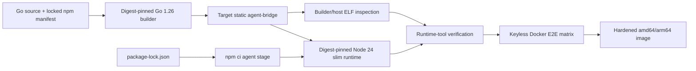

# Plan: Phase 06 - Runtime Image, E2E, Hardening, And Docs

**Date:** 2026-08-23
**Status:** DRAFT
**Risk Level:** High

---

## Overview

Package the completed bridge and pinned ACP agents into a reproducible, target-aware, non-root Node 24 runtime image; verify installed agent binaries; exercise the image through keyless Docker end-to-end tests; harden lifecycle behavior; and document the supported operator contract.

## Phase Goal

Produce a digest-pinned multi-stage image for Linux amd64 and arm64 that contains one static `agent-bridge` binary plus Claude Code ACP 0.68.0, Codex ACP 1.3.0, and OpenCode 1.18.18. Prove through repeatable Docker tests that keyless real-agent initialization, strict mock protocol flows, persistence/restart, idle reaping, process-group cleanup, and graceful shutdown satisfy the authoritative specification. Record dual-side ACP transcripts from each pinned real agent once on a credentialed machine, and replay them in CI through the bridge and against the strict mock, so real-agent compatibility for all three supported agents is validated byte-exactly without credentials.

## References And Assumptions

### Authoritative References

- `docs/plans/20260815-agent-bridge.md`, all requirements, especially "Agent resolution", "Environment, shutdown, and image", and the final open question about authenticated E2E.
- Completed Phase 01-05 plans and implementation. This plan is self-contained about expected externally visible behavior and must not weaken earlier tests.
- Rust lifecycle references: `/home/viethoangcr/Workspace/github/rivet/sandbox-agent/server/packages/acp-http-adapter/src/process.rs` and `/home/viethoangcr/Workspace/github/rivet/sandbox-agent/server/packages/sandbox-agent/src/acp_proxy_runtime.rs`.

### Assumptions Fixed By This Plan

- The npm package names are `@agentclientprotocol/claude-agent-acp@0.68.0`, `@agentclientprotocol/codex-acp@1.3.0`, and `opencode-ai@1.18.18`; implementation must fail rather than substitute a package if these names do not expose `claude-agent-acp`, `codex-acp`, and `opencode` respectively.
- Runtime image files are under `docker/runtime/`: `Dockerfile`, `Dockerfile.dockerignore`, `package.json`, and `package-lock.json`. The Docker build context remains the repository root so Go source is available. `npm ci` runs without `--ignore-scripts`, `--omit=optional`, or flags that suppress optional dependencies/lifecycle scripts.
- Every `FROM` reference is pinned by digest at implementation. In particular the final stage is `node:24-bookworm-slim@sha256:<verified multi-platform manifest digest>`; no placeholder digest may remain in a completed change.
- Docker BuildKit/buildx is available for image verification. Regular E2E runs use the host architecture; CI or release verification runs the explicit `linux/amd64,linux/arm64` build.
- E2E tests are Go stdlib tests under build tag `e2e`, invoke the Docker CLI, bind an ephemeral localhost port discovered by Docker, and skip with a precise reason only when Docker is unavailable. Once Docker is available, individual behavioral failures must not skip.
- The private `mock` agent is exercised only by tests and is omitted from `README.md`, image labels, and public examples.
- Real-agent tests are keyless. Claude/Codex `session/new` may succeed or return an ACP auth-required error. OpenCode `session/new` must succeed; its first prompt may return an auth error. OpenCode 1.18.18 `session/load` is not required to include `sessionId`.
- Authenticated prompt/resume tests remain deferred until isolated credentials exist in CI. No test reads developer credential files or forwards host credentials into containers.
- Expected image size is at least 1 GB because optional agent dependencies are preserved. There is no artificial image-size upper bound in this phase.
- Phase 01 rejects an empty token on non-loopback hosts unless `AGENT_BRIDGE_ALLOW_INSECURE_REMOTE=1`. Because the image binds `0.0.0.0`, every E2E container and documented deployment must provide `AGENT_BRIDGE_TOKEN`; the unsafe override is tested only as an explicit negative-security escape hatch and is never the image default.
- TDD RED evidence is a failing behavioral assertion against a minimal compilable seam/fake where feasible. Missing files or symbols are setup evidence only. Lifecycle and limit tests use injected clocks/small limits in unit tests; expensive real maximum-boundary and real-time checks run once at the appropriate integration layer rather than in repeated/race loops.

## Requirements

- Build `agent-bridge` with Go 1.26, `CGO_ENABLED=0`, `-trimpath`, and target `TARGETOS/TARGETARCH` in a builder stage.
- Use digest-pinned builder and runtime bases; avoid network access after dependency installation stages.
- Install exact npm versions from committed lockfile with `npm ci`; preserve install scripts and optional dependencies.
- Include a version-pinned `tini` (or equivalent proven subreaper) and run it as PID 1; its exec-form entrypoint launches the bridge, forwards signals, and reaps orphaned descendants while the container remains running.
- Run as a fixed non-root user with writable HOME and workdir. Set `AGENT_BRIDGE_HOST=0.0.0.0`, `DISABLE_AUTOUPDATER=1`, and `NO_BROWSER=1`.
- Do not add runtime install/update code. The image only contains pre-provisioned agents.
- In-image `scripts/verify-agents.sh` checks only with runtime-available tools and must fail on a missing binary, mismatched package version, wrong default OpenCode invocation, wrong user/permissions/environment, or incorrect PID-1 entrypoint. Static ELF architecture/interpreter/`NEEDED` inspection runs in a disposable builder/tooling stage or on the host, never by requiring inspection tools in the final image.
- Keyless Docker E2E covers the real-agent matrix plus a strict mock matrix.
- Lifecycle E2E covers durable state, stale live-state recovery after restart, exited-server reinitialization rules, idle reaping, DELETE, SIGTERM/SIGKILL process groups, PID file cleanup, SSE closure, DB checkpoint/close, PID-1 orphan reaping, and shutdown within 10 seconds.
- Final checks cover auth, problem+json errors, request logging redaction, body/output limits, race tests, static binary inspection, non-root runtime, and absence of runtime package mutation.
- README is finalized from the Phase 01 skeleton and documents build/run/configuration/API/persistence/shutdown behavior, mandatory image token configuration, the unsafe remote override warning, and keyless limitations without documenting `mock`.
- `.github/workflows/ci.yml` triggers on `pull_request`, pushes to `main`, a weekly `schedule`, and `workflow_dispatch`. Unit/vet/race/static and authenticated host-architecture Docker E2E jobs run only for `pull_request` and pushes to `main`; the non-publishing amd64/arm64 build/inspection job runs only for pushes to `main`, the weekly schedule, and `workflow_dispatch`, never an ordinary pull request. Every non-local `uses:` reference is pinned to an immutable full 40-character commit SHA.

## Target State



## Interfaces

### `docker/runtime/package.json`

```json
{
  "private": true,
  "dependencies": {
    "@agentclientprotocol/claude-agent-acp": "0.68.0",
    "@agentclientprotocol/codex-acp": "1.3.0",
    "opencode-ai": "1.18.18"
  }
}
```

- The generated lockfile must use lockfileVersion 3 and exact resolved integrity entries.
- No semver ranges, npm aliases, post-generation edits, global npm installs, or uncommitted lock regeneration are allowed.

### Runtime Image Contract

```text
ENTRYPOINT ["/usr/bin/tini", "--", "/usr/local/bin/agent-bridge"]
USER agentbridge (fixed numeric UID/GID)
HOME=/home/agentbridge
PATH=/opt/agents/node_modules/.bin:<base PATH>
AGENT_BRIDGE_HOST=0.0.0.0
DISABLE_AUTOUPDATER=1
NO_BROWSER=1
EXPOSE 2468
```

- Pinned `tini` is PID 1 and directly execs the bridge; there is no shell entrypoint and no public subcommand.
- `/opt/agents` and the bridge binary are root-owned and not writable by the runtime user.
- HOME, workdir, DB parent, optional PID-file parent, and agent state are writable by the runtime user.

### `scripts/verify-agents.sh`

```sh
scripts/verify-agents.sh [--image IMAGE]
```

- Without `--image`, validate the current runtime filesystem using only commands included in the final image.
- With `--image`, inspect configuration from the host and run the runtime checks inside the named image as its configured non-root user.
- Verify npm package versions from `/opt/agents/node_modules/*/package.json`, executable resolution for all three expected commands, `opencode acp` startup/help viability without browser launch, bridge executability, required environment/permissions, and the `tini -- agent-bridge` entrypoint. Static linkage and target ELF architecture are explicitly outside this script and are checked in the Docker tooling stage/CI host.

### `tests/e2e` Harness

```go
type container struct { /* ID, mapped address, volume, logs */ }

func buildImage(t *testing.T) string
func startContainer(t *testing.T, image, token string, env map[string]string, volume string) *container
func (c *container) request(method, path string, body []byte) (*http.Response, []byte)
func (c *container) waitHealthy(ctx context.Context) error
func (c *container) stop(signal string, timeout time.Duration)
func rpc(id any, method string, params any) []byte
func initialize(t *testing.T, c *container, serverID, agent string) rpcEnvelope
```

- Helpers use `os/exec`, `net/http`, `encoding/json`, `bufio`, and `testing` only.
- `startContainer` requires a non-empty per-test token, always passes `AGENT_BRIDGE_TOKEN`, and authenticates health and API requests; no image E2E relies on the insecure-remote override.
- Cleanup always captures `docker logs`, removes the container, and removes uniquely created volumes/images unless `AGENT_BRIDGE_E2E_KEEP=1`.
- Polling uses bounded contexts and diagnostic errors; no fixed sleeps as the sole readiness mechanism.

## Tasks

### Task 6.1: Integrate Application Services And Final Route Composition

**Description:** Integrate the independently completed Phase 02-05 services before packaging. Finalize `httpapi.Dependencies`, construct stores/runtimes/reapers and their dependencies in `internal/app`, compose every route in one server, resolve integration conflicts, and prove the staged shutdown contract.
**Files:** Modify `internal/app/*`, `internal/httpapi/server.go`, and their tests only as required for final integration; do not move service construction into `internal/httpapi`.
**Symbols:** final `httpapi.Dependencies`, `httpapi.NewServer`, app-owned service construction, pre-drain and post-drain hook registration.
**References:** Phase 01 foundation and completed Phase 02-05 public interfaces.
**Risk:** High. Parallel phases can compile independently while route wiring or lifecycle ownership remains incomplete.
**Reversibility:** Integration corrections are localized; preserve each phase's public contract unless a demonstrated conflict requires the smallest owning change.
**Dependencies:** Completed Phases 01-05.

**RED:**

- [ ] Add an app-level integration test with minimal fake services and behavioral assertions that every Phase 02-05 route is reachable through the single `httpapi.Server`, receives the intended dependency, and shares auth/logging middleware.
- [ ] Add channel-driven lifecycle assertions proving exact order: stop listener acceptance; pre-drain closes SSE, stops reapers, and signal-and-wait terminates ACP/managed groups through process reap and pump completion; `http.Server.Shutdown` waits now-unblocked handlers; post-drain idempotently confirms process/pump completion, waits any non-process commit work, and checkpoints/closes DB; PID removal is last.
- [ ] Assert an open SSE handler cannot block shutdown because its pre-drain closure occurs before `http.Server.Shutdown`. Inject the absolute deadline and verify all stage contexts share one ten-second deadline and retain only remaining time.
- [ ] Run focused app/httpapi integration tests and retain failing route/dependency/order assertions. Compilation conflicts or missing symbols may be recorded as setup evidence but do not replace behavioral RED.

**GREEN:**

- [ ] Finalize `httpapi.Dependencies` as references to already-constructed services/handlers only. Keep all concrete store, runtime, process supervisor, reaper, and lifecycle construction in `internal/app`.
- [ ] Compose one route table from Phases 02-05 and remove duplicate phase-local assembly paths only where integration proves they conflict; do not add an alternate router or service locator.
- [ ] Register explicit pre-drain signal-and-wait process/pump termination and post-drain idempotent confirmation/non-process commit/DB cleanup ownership. Continue best-effort within one absolute ten-second deadline, passing fresh non-canceled contexts with that same deadline to each stage and reporting joined bounded errors.
- [ ] Resolve integration conflicts before Docker work, then run full unit/race tests with injected clocks and small limits rather than repeated real-duration waits.

**Verify:** `go test -race ./internal/app ./internal/httpapi -count=1 && go test ./... -count=1`

### Task 6.2: Lock Runtime Agent Packages

**Description:** Commit the exact npm manifest and npm-generated lockfile used only by the image agent-install stage.
**Files:** Create `docker/runtime/package.json`; create `docker/runtime/package-lock.json`; extend `internal/projectdocs/projectdocs_test.go` with the lock contract.
**Symbols:** npm dependency entries for the three pinned packages.
**References:** Runtime pin requirements and package assumptions in this plan.
**Risk:** High. Wrong packages or lock resolution produce a large image that cannot launch required commands.
**Reversibility:** Easy to revert; npm registry artifacts remain external.
**Dependencies:** Task 6.1; network access is required once to generate the lock.

**RED:**

- [ ] Confirm with `npm view <package>@<version> version bin --json` that each exact package/version exists and exposes the required binary; stop and update the explicit assumption rather than silently substituting.
- [ ] Add a small manifest/lock contract check, seed a deliberately incomplete fixture if the real files do not yet exist, and retain behavioral failures for missing exact versions, bin mappings, integrity, or optional-package lock entries. Missing production files are setup evidence only.

**GREEN:**

- [ ] Write the minimal private manifest with exact versions and run `npm install --package-lock-only --ignore-scripts=false --include=optional --prefix docker/runtime` using the Node/npm version from the pinned Node 24 image.
- [ ] Inspect the lock for exact top-level versions, integrity hashes, optional platform packages, and lifecycle metadata.
- [ ] Run a clean `npm ci --prefix docker/runtime` without suppressing scripts/optional dependencies, verify `docker/runtime/node_modules/.bin/claude-agent-acp`, `codex-acp`, and `opencode`, then remove untracked `node_modules` without changing `.gitignore`.
- [ ] Ensure `git diff --check -- docker/runtime/package.json docker/runtime/package-lock.json` passes.

**Verify:** `npm ci --prefix docker/runtime --dry-run --include=optional`

### Task 6.3: Build A Digest-Pinned Target-Aware Runtime Image

**Description:** Add a multi-stage Dockerfile that cross-compiles the static bridge for the requested target and installs locked agents into a non-root Node 24 runtime.
**Files:** Create `docker/runtime/Dockerfile`; create `docker/runtime/Dockerfile.dockerignore`; extend `internal/projectdocs/projectdocs_test.go` with the Dockerfile contract; modify no root `.gitignore`.
**Symbols:** stages `bridge-build`, `binary-verify`, `agent-deps`, `runtime`; BuildKit args `BUILDPLATFORM`, `TARGETOS`, `TARGETARCH`.
**References:** Runtime image contract in this plan and authoritative environment defaults.
**Risk:** High. Architecture, libc, permissions, or digest mistakes can make published images non-reproducible or unbootable.
**Reversibility:** Easy to revert image files; already published tags are not mutable deliverables in this phase.
**Dependencies:** Tasks 6.1-6.2.

**RED:**

- [ ] Add behavioral Dockerfile contract assertions against a minimal fixture for digest-pinned bases, target args, non-root user, token-safe host defaults, and the `tini -- agent-bridge` entrypoint; retain assertion failures rather than treating a missing Dockerfile as RED.
- [ ] Resolve current multi-platform manifest digests for the selected Go 1.26 builder and Node 24 bookworm-slim images with `docker buildx imagetools inspect`; record architecture support.
- [ ] Run the planned host build command and retain the expected failure before Dockerfile creation.

**GREEN:**

- [ ] Use `FROM --platform=$BUILDPLATFORM <go-1.26-image>@sha256:<digest>` and compile with `CGO_ENABLED=0 GOOS=$TARGETOS GOARCH=$TARGETARCH go build -trimpath -ldflags='-s -w' -o /out/agent-bridge ./cmd/agent-bridge`.
- [ ] Add a disposable target-aware `binary-verify` tooling stage that uses `file`/`readelf` (or equivalent pinned tooling) to reject the wrong ELF architecture, a dynamic interpreter, or `NEEDED` entries. Copy only the verified binary onward; do not retain these tools in runtime.
- [ ] Cache Go module/build directories with BuildKit mounts while copying `go.mod`/`go.sum` before source for stable layers.
- [ ] In the digest-pinned Node 24 `agent-deps` stage, set `WORKDIR /opt/agents`, copy `docker/runtime/package.json` and `docker/runtime/package-lock.json` there, and run `npm ci --include=optional`. This makes the committed lock resolve directly to `/opt/agents/node_modules`, matching runtime PATH. Do not use `npm install -g`, `--ignore-scripts`, or runtime installs.
- [ ] Use the digest-pinned target-platform Node 24 bookworm-slim stage, install only required OS packages including an exact Debian-version-pinned `tini`, with apt version pins recorded from the base snapshot, `--no-install-recommends`, and remove apt lists in the same layer. Verify the package version during build.
- [ ] Create fixed UID/GID `10001`, copy `/opt/agents` and `/usr/local/bin/agent-bridge` as root, then switch permanently to that user and `/home/agentbridge`.
- [ ] Set the required environment, `EXPOSE 2468`, and `ENTRYPOINT ["/usr/bin/tini", "--", "/usr/local/bin/agent-bridge"]`. Do not bake a token, default the unsafe remote override, or add a healthcheck that cannot authenticate; operators must supply `AGENT_BRIDGE_TOKEN` because the image host is `0.0.0.0`.
- [ ] Keep `docker/runtime/Dockerfile.dockerignore` minimal: VCS metadata, local binaries, DB/WAL/PID files, all `node_modules`, and test output only; do not exclude source needed by the root-context build.

**Verify:**

```sh
docker buildx build --load --platform "linux/$(go env GOARCH)" -f docker/runtime/Dockerfile -t agent-bridge:e2e .
docker image inspect agent-bridge:e2e --format '{{.Config.User}} {{json .Config.Entrypoint}} {{json .Config.Env}}'
scripts/verify-agents.sh --image agent-bridge:e2e
```

### Task 6.4: Add In-Image Agent And Binary Verification

**Description:** Create one POSIX shell script for checks possible with final-runtime tools, execute it during image build and standalone verification, and keep static ELF inspection in the disposable tooling stage/host CI.
**Files:** Create `scripts/verify-agents.sh`; modify `docker/runtime/Dockerfile` to copy/run it before `USER` and preserve it for `--image` checks.
**Symbols:** shell functions `fail`, `package_version`, `require_command`, `verify_local`, `verify_image`.
**References:** Pinned package/binary and non-root contracts.
**Risk:** Medium. Weak checks can allow a broken image to pass; overly interactive version commands can hang builds.
**Reversibility:** Easy to revert.
**Dependencies:** Tasks 6.2-6.3.

**RED:**

- [ ] Run a minimal script seam against fixtures/mutated image layers with one missing command, one mismatched package version, a root user, writable dependencies, and a wrong PID-1 entrypoint; each behavioral assertion must fail non-zero with the offending component named. A missing script is setup evidence only.
- [ ] Separately feed a dynamically linked or wrong-architecture fake bridge to the `binary-verify` stage/host inspection and retain that behavioral failure.

**GREEN:**

- [ ] Use `set -eu`, `command -v`, and Node to read installed package JSON exactly; do not parse human-oriented npm output.
- [ ] Check versions equal 0.68.0, 1.3.0, and 1.18.18 and resolved commands remain below `/opt/agents/node_modules/.bin`.
- [ ] Use bounded non-interactive version/help invocations. Probe `opencode acp` with an explicit timeout, terminate and reap it on timeout/success, and reject browser-launch output; no verification command may leave the bridge or an agent server running.
- [ ] With runtime tools, verify `agent-bridge` is executable; do not invoke `file`, `readelf`, `ldd`, or assume those tools exist in the final image. Let the already-required tooling stage/host inspection own architecture and static-link assertions.
- [ ] For `--image`, inspect/run the image and fail if UID is 0, HOME is wrong, `/opt/agents` is writable, required environment is absent, or the entrypoint is not pinned `tini -- agent-bridge`.
- [ ] Run the local verification in the Docker build so a broken package layout cannot produce the final stage.

**Verify:** `scripts/verify-agents.sh --image agent-bridge:e2e`

### Task 6.5: Build The Docker E2E Harness And Strict Mock Matrix

**Description:** Add an isolated Docker harness and strict protocol tests using the private mock agent to verify raw ACP routing and HTTP/SSE behavior without agent credentials; bridge bearer authentication remains mandatory.
**Files:** Create `tests/e2e/harness_test.go`; create `tests/e2e/mock_test.go`.
**Symbols:** `buildImage`, `startContainer`, `container.request`, `container.waitHealthy`, `rpc`, `initialize`, `TestDockerMockProtocol`.
**References:** Complete ACP HTTP contract in the authoritative specification; private mock behavior from Phase 02/03.
**Risk:** High. Flaky orchestration can hide lifecycle bugs or make CI unreliable.
**Reversibility:** Easy to revert tests; cleanup protects host Docker state.
**Dependencies:** Tasks 6.1, 6.3-6.4 and completed Phases 01-03.

**RED:**

- [ ] Implement harness setup/cleanup first, then add a smoke assertion that fails until a container supplied with a unique non-empty `AGENT_BRIDGE_TOKEN` responds to authenticated `/v1/health` on its Docker-assigned port. Also assert image startup without a token fails clearly because `0.0.0.0` is non-loopback.
- [ ] Add one ordered strict mock test covering first POST agent requirement, initialize, session/new cwd persistence, synchronous request correlation preserving numeric/string IDs, notification 202, reverse-call/client response completion, and raw payload equality.
- [ ] Extend it with duplicate in-flight ID 409, timeout/late persisted response, invalid stdout synthetic event, exited synthetic event, stderr redaction/cap, and reinitialize-only recreation.
- [ ] Verify SSE subscribe-before-watermark behavior, heartbeat framing, `Last-Event-ID: 0`, replay/live no-gap sequence, reconnect, lag catch-up, and closure on DELETE.
- [ ] Verify status/event endpoints, sorted server/session lists, event filtering/pagination/order, unknown session 404, and DELETE pruning.
- [ ] Run `go test -tags=e2e ./tests/e2e -run TestDockerMockProtocol -count=1 -v` and record failures before fixes.

**GREEN:**

- [ ] Use a unique image tag/container/volume per test process and register `t.Cleanup` immediately after creation.
- [ ] Require a unique `AGENT_BRIDGE_TOKEN` in `startContainer`, authenticate every `/v1/*` request including health/SSE, use a persistent DB path and short request timeout only where tested, and mount no host credentials.
- [ ] Decode SSE with a scanner that supports comments, event, id, and multi-line data fields; compare persisted raw JSON as `json.RawMessage` rather than normalized structs.
- [ ] Poll status/DB-visible endpoints with context deadlines; never infer readiness from log text alone.
- [ ] On failure, include container logs, inspect state, HTTP status/body, and last observed SSE sequence.
- [ ] Fix product behavior in its owning Phase 01-03 file rather than weakening assertions or adding mock-only HTTP branches.

**Verify:** `go test -tags=e2e ./tests/e2e -run TestDockerMockProtocol -count=1 -v -timeout=5m`

### Task 6.6: Add The Keyless Real-Agent Matrix

**Description:** Exercise each pinned real agent in the built image without credentials and assert only the version-specific outcomes allowed by the specification.
**Files:** Create `tests/e2e/agents_test.go`; modify `tests/e2e/harness_test.go` only for shared ACP helpers.
**Symbols:** `TestDockerKeylessAgents`, `testClaudeKeyless`, `testCodexKeyless`, `testOpenCodeKeyless`, `assertACPAuthRequired`.
**References:** Keyless and OpenCode 1.18.18 assumptions in this plan.
**Risk:** High. Third-party startup behavior can vary despite pinned versions; assertions must remain strict within the allowed outcomes.
**Reversibility:** Easy to revert tests.
**Dependencies:** Task 6.5.

**RED:**

- [ ] Create table subtests for `claude`, `codex`, and `opencode`; each must first complete ACP `initialize` and persist its response/event.
- [ ] For Claude/Codex, send `session/new` with a container-writable cwd and accept only success or a valid ACP auth-required error envelope; reject crashes, HTTP problems, hangs, and unrelated errors.
- [ ] For OpenCode, require `session/new` success and a non-empty session ID, then send one prompt and accept success or ACP auth failure while requiring the process to remain supervised.
- [ ] If session load is exercised, tolerate OpenCode's omitted `sessionId` only in the 1.18.18 response while requiring bridge session state to retain the requested ID.
- [ ] Assert no host credential paths, API-key environment variables, or browser processes are present in the container.
- [ ] Run the matrix and record failures before image/runtime corrections.

**GREEN:**

- [ ] Correct image PATH, HOME, package installation, default agent args, or process environment sanitization as indicated; do not add special success paths for E2E.
- [ ] Bound each initialize/session operation independently so one agent hang identifies the exact binary.
- [ ] Keep auth-error matching structural (ACP error envelope and auth semantics), not a broad substring that accepts arbitrary failures.

**Verify:** `go test -tags=e2e ./tests/e2e -run TestDockerKeylessAgents -count=1 -v -timeout=10m`

### Task 6.7: Verify Persistent State And Container Restart Recovery

**Description:** Prove SQLite-backed events/sessions survive bridge restart while stale live process metadata becomes exited and follows reinitialization rules.
**Files:** Create `tests/e2e/state_test.go`.
**Symbols:** `TestDockerStateRestart`, `restartContainer`, `assertServerStatus`.
**References:** Authoritative ACP lifecycle/persistence and schema requirements.
**Risk:** High. Restart defects can corrupt durable state or signal unrelated reused host/container PIDs.
**Reversibility:** Easy to revert tests; persistent test volumes are disposable.
**Dependencies:** Task 6.5 and completed Phases 02-03.

**RED:**

- [ ] Create a mock server/session/event sequence on a named volume, capture status/PID/last sequence, and terminate the container without DELETE.
- [ ] Start a new container against the same volume and assert prior `creating|idle|busy` becomes `exited`, PID is omitted, events/session cwd remain, and no persisted PID is signaled.
- [ ] Assert a non-`initialize` POST returns 409 with reinitialization guidance; then initialize recreates the process without deleting old events.
- [ ] Send explicit `session/load` or `session/resume`; prove the bridge does not synthesize/replay prompts and new event sequence continues monotonically.
- [ ] Reconnect SSE with the old last ID and prove replay/live continuity after restart.
- [ ] Run the test and record failure before lifecycle fixes.

**GREEN:**

- [ ] Fix startup recovery transaction, stale PID clearing, event sequence allocation, or recreation state in owning persistence/runtime code.
- [ ] Do not inspect or signal persisted PIDs during startup.
- [ ] Keep one SQL connection/WAL/foreign keys/5s busy timeout and preserve prune-on-DELETE-only retention.

**Verify:** `go test -tags=e2e ./tests/e2e -run TestDockerStateRestart -count=1 -v -timeout=5m`

### Task 6.8: Verify Idle Reaper, Process Groups, Orphan Reaping, And Graceful Shutdown

**Description:** Exercise idle TTL, DELETE, managed process cleanup, PID-1 orphan reaping, SSE closure, PID file lifecycle, and bounded SIGTERM shutdown in the actual container.
**Files:** Create `tests/e2e/lifecycle_test.go`; modify owning runtime files only when a failing test exposes a defect.
**Symbols:** `TestDockerIdleReaper`, `TestDockerDeleteKillsProcessGroup`, `TestDockerInitReapsOrphans`, `TestDockerGracefulShutdown`, `containerPID`, `processState`.
**References:** Authoritative status, reaper, process-group, and shutdown requirements.
**Risk:** High. Leaked processes and incomplete DB shutdown are production resource/data-integrity failures.
**Reversibility:** Tests are easy to revert; runtime fixes require normal code review.
**Dependencies:** Tasks 6.5 and 6.7; completed Phases 01-04.

**RED:**

- [ ] With an injected clock in owning unit tests, prove idle TTL starts at the idle transition and stale timers cannot reap a newly busy/recreated process. In one Docker check use a short nonzero TTL to assert process-group exit/status/event persistence, then use TTL 0 to assert no reap; do not repeat real timer boundaries in race loops.
- [ ] Start mock and managed processes that fork children; DELETE/stop/kill each and inspect `/proc/<pid>/stat` while the container is still running. Distinguish missing PIDs from state `Z`: both leaders and descendants must disappear, and a zombie is a failure rather than evidence of cleanup.
- [ ] Deliberately orphan a short-lived grandchild under the bridge, keep the container running, verify `tini` remains PID 1, and poll `/proc` until the descendant is absent rather than zombie. This specifically proves subreaper behavior independent of container exit cleanup.
- [ ] Open SSE, start ACP and managed process groups, configure a PID file on the persistent volume, then send Docker SIGTERM.
- [ ] Assert acceptance stops first; pre-drain closes SSE, stops reapers, and signal-and-wait terminates groups through process reap and pump completion before handler drain; `http.Server.Shutdown` then completes; post-drain idempotently confirms completion, waits any non-process commit work, and checkpoints/closes DB; PID removal is last. Assert container exit 0 within one 10s budget and DB reopens with committed events.
- [ ] Assert WAL checkpoint behavior by restarting on the same volume and reading state; do not require WAL file absence as the sole correctness signal.
- [ ] Repeat abrupt SIGKILL followed by restart to prove startup recovery without claiming clean-shutdown guarantees.
- [ ] Run each test and retain failing logs/process diagnostics before fixes.

**GREEN:**

- [ ] Fix reaper timer ownership so stale timers cannot kill a newly busy/recreated process.
- [ ] Ensure all kill paths address negative process-group IDs on Linux and wait for pump goroutines/process reap.
- [ ] Preserve staged shutdown ownership: close listener acceptance; run pre-drain hooks that close SSE, stop reapers, and signal-and-wait process groups through process reap and pump completion; call `http.Server.Shutdown` to wait handlers; run post-drain hooks only to idempotently confirm process/pump completion, wait non-process commits, and checkpoint/close DB; remove PID last; return exit code 0.
- [ ] Keep one absolute 10-second outer deadline created from a non-canceled parent. Give every stage a fresh context with that same deadline so remaining time is useful, continue best-effort after bounded errors, and never wait for SSE before pre-drain closes it.

**Verify:** `go test -tags=e2e ./tests/e2e -run 'TestDocker(IdleReaper|DeleteKillsProcessGroup|InitReapsOrphans|GracefulShutdown)' -count=1 -v -timeout=10m`

### Task 6.9: Run Final Security And Reliability Hardening

**Description:** Add regression checks for cross-cutting requirements and fix only concrete failures found by full test, race, static, and image inspection.
**Files:** Modify existing owning tests/code as required; create `tests/e2e/hardening_test.go`; no speculative subsystem or dependency additions.
**Symbols:** `TestDockerHardeningContract` plus existing Phase 01-05 symbols implicated by failures.
**References:** Every requirement in `docs/plans/20260815-agent-bridge.md`.
**Risk:** High. This is the release gate for security boundaries and data-loss behavior.
**Reversibility:** Individual fixes should be easy to revert; do not combine unrelated rewrites.
**Dependencies:** Tasks 6.1-6.8 and all prior phases.

**RED:**

- [ ] Add image-level assertions for non-root UID/GID, writable HOME, root-owned non-writable binary/dependencies, static target architecture, exact package versions, required env, and no npm cache/source/build toolchain in final layers.
- [ ] Add HTTP assertions that root remains public, every `/v1/*` route including health requires bearer auth when configured, token checks do not log Authorization, non-loopback startup rejects an empty token unless the explicit unsafe override is `1`, and representative handler-level 404/405/body-limit failures are RFC 9457 problem+json. Do not assert that `net/http` transport parser/header errors use bridge problem JSON.
- [ ] Assert child environments remove `AGENT_BRIDGE_TOKEN`, `AGENT_BRIDGE_PID_FILE`, `AGENT_BRIDGE_INTERNAL_MOCK_AGENT`, and `AGENT_BRIDGE_ALLOW_INSECURE_REMOTE` while a benign credential-shaped test variable survives; do not print its value.
- [ ] Exercise ACP, filesystem, process input/output/log, invalid server ID, media negotiation, and redacted stderr behavior primarily through injected small limits. Run each actual 10 MiB/512 MiB/8 KiB compatibility boundary at most once in its owning integration layer, not in repeated/race suites.
- [ ] Run `go test -race ./...` repeatedly only for fast injected-clock/limit tests; run expensive Docker and real-boundary E2E once per gate. Capture every race/flaky failure before changing code.

**GREEN:**

- [ ] Make the smallest owning-code correction for each demonstrated failure; do not add compatibility routes, retry layers, telemetry, runtime installers, or dependencies.
- [ ] Ensure request logs contain method, URI, status, and latency but never Authorization or request bodies.
- [ ] Run `go vet`, full unit/integration tests, race tests, strict shell syntax, image verification, and E2E matrix.

**Verify:**

```sh
go vet ./...
go test ./... -count=1
go test -race ./... -count=1
sh -n scripts/verify-agents.sh
scripts/verify-agents.sh --image agent-bridge:e2e
go test -tags=e2e ./tests/e2e -count=1 -v -timeout=20m
```

### Task 6.10: Finalize Build, Runtime, Persistence, And API Documentation

**Description:** Finalize the existing concise public operator documentation to match only shipped behavior and exclude the private mock agent.
**Files:** Modify the existing Phase 01 `README.md`; do not create or replace it wholesale.
**Symbols:** Documentation sections `Build`, `Run`, `Configuration`, `Agents`, `ACP`, `Processes`, `Filesystem And Project Config`, `Persistence`, `Shutdown`, `Testing`, `Limitations`.
**References:** Authoritative specification and verified behavior from Tasks 6.1-6.9.
**Risk:** Medium. Incorrect operational guidance can cause inaccessible health checks, lost state, or credential exposure.
**Reversibility:** Easy to revert.
**Dependencies:** Tasks 6.1-6.9.

**RED:**

- [ ] Extend the Phase 01 documentation checklist test with the final public environment variables, agent versions/default commands, required volume paths, remote-token safety, key endpoint families, limits, and staged shutdown semantics; retain behavioral failures for incomplete existing content rather than treating README absence as RED.
- [ ] Search the intended public text for `mock` and require no match.

**GREEN:**

- [ ] Document host build and `docker buildx` commands, supported `linux/amd64` and `linux/arm64`, expected large image size, non-root user, pinned PID-1 init/subreaper, port 2468, and immutable preinstalled agents.
- [ ] Document all public environment defaults/overrides, JSON-array agent args, credential inheritance, token behavior including authenticated health probes, PID file, DB persistence, and idle/request timeout controls. State that the image's `0.0.0.0` bind requires `AGENT_BRIDGE_TOKEN`; label `AGENT_BRIDGE_ALLOW_INSECURE_REMOTE=1` unsafe and never use it in deployment examples.
- [ ] Provide minimal curl examples for health, initialize, SSE, process, filesystem, upload, and whole-object MCP/skills config without exposing private mock behavior.
- [ ] Explain that ACP content is raw passthrough, one process lives per server ID, DELETE prunes durable state, restart marks stale live servers exited, clients must initialize then load/resume, and retention is unbounded until DELETE.
- [ ] Explain keyless outcomes and explicitly defer authenticated prompt/resume E2E; never imply credentials are included in the image.
- [ ] Document graceful shutdown's one-budget 10-second staged contract and which paths must be mounted for persistence.

**Verify:**

```sh
test -s README.md
! grep -i 'mock' README.md
grep -q 'AGENT_BRIDGE_TOKEN' README.md
grep -q 'AGENT_BRIDGE_DB' README.md
grep -q 'OpenCode 1.18.18' README.md
```

### Task 6.11: Add CI And Verify Multi-Architecture Release Gate

**Description:** Add CI ownership for fast checks and Docker gates, then build both target architectures from a clean context, verify manifests/image contents, and run the complete release gate without publishing.
**Files:** Create `.github/workflows/ci.yml`; extend `internal/projectdocs/projectdocs_test.go` with the workflow contract; modify only files implicated by failed checks; optionally create `dist/` outputs locally but do not commit them.
**Symbols:** None new.
**References:** All previous tasks.
**Risk:** High. This determines whether the artifact is reproducible and release-ready.
**Reversibility:** No source change is required when green; local images/build cache are disposable.
**Dependencies:** Tasks 6.1-6.10.

**RED:**

- [ ] Add workflow contract assertions that fail until CI contains a read-only formatting gate, unit/vet/race/static checks, authenticated host-architecture Docker E2E, and a non-publishing amd64/arm64 build/inspection job. Assert exact `pull_request`, `push` to `main`, weekly `schedule`, and `workflow_dispatch` triggers; exact job conditions below; and a full 40-character hexadecimal SHA after `@` for every non-local `uses:` reference. A missing workflow is setup evidence only; retain the failing required-job assertions.
- [ ] Run a no-cache host architecture build and compare package/binary verification against the cached build.
- [ ] Run a two-platform build to a local OCI archive or registry-backed test tag and verify both manifest entries and target ELF architectures.
- [ ] Run all checks from a clean worktree snapshot/context and capture any undeclared generated-file or network-at-runtime dependency.

**GREEN:**

- [ ] Create `.github/workflows/ci.yml` with least-privilege read permissions and only these triggers: `pull_request`; `push` with `branches: [main]`; one weekly `schedule`; and `workflow_dispatch`. Pin every non-local action, including GitHub-owned and Docker actions, as `owner/repository@<full-40-character-commit-SHA>`; tags, branches, abbreviated SHAs, and floating major versions are forbidden.
- [ ] Gate formatting/unit/vet/race/static jobs and the authenticated host-architecture Docker E2E job with `if: github.event_name == 'pull_request' || (github.event_name == 'push' && github.ref == 'refs/heads/main')`. Formatting must only detect drift with `test -z "$(gofmt -l cmd internal tests)"` or an equivalent non-writing check; verification must never run `gofmt -w`. Static checks include the `CGO_ENABLED=0` build, host/tooling-stage ELF inspection, pinned staticcheck 2026.2.1, and pinned govulncheck v1.7.0; the credential-free host replay suite (`go test -tags=replay ./tests/replay`) runs with the unit checks.
- [ ] In the host-architecture Docker E2E job, build the image, run runtime verification, supply a generated non-empty test token, and execute keyless/mock E2E without agent credentials. Do not print the token or use the insecure-remote override.
- [ ] Gate the non-publishing `linux/amd64,linux/arm64` build/OCI inspection job with `if: (github.event_name == 'push' && github.ref == 'refs/heads/main') || github.event_name == 'schedule' || github.event_name == 'workflow_dispatch'`. It must not run for `pull_request`; manual execution occurs only through `workflow_dispatch`. Keep live authenticated real-agent prompt/resume as a separate deferred gate until isolated CI credentials exist; recorded-transcript replay (Tasks 6.13-6.14) already covers those flows credential-free in CI.
- [ ] Remove nondeterministic build inputs such as unpinned base tags, semver ranges, generated lock drift, timestamps embedded by custom scripts, or architecture-hardcoded copies.
- [ ] Confirm repeated builds use the same base digests, npm lock integrity, Go module sums, and target-specific binary path. Byte-identical whole-image IDs are not required because OCI metadata may vary; dependency identity is required.
- [ ] Execute the final command set and retain CI logs as release evidence.

**Verify:**

```sh
test -z "$(gofmt -l cmd internal tests)"
go vet ./...
go run honnef.co/go/tools/cmd/staticcheck@2026.2.1 ./...
go run golang.org/x/vuln/cmd/govulncheck@v1.7.0 ./...
go test ./... -count=1
go test -race ./... -count=1
go test -tags=replay ./tests/replay -count=1 -v
CGO_ENABLED=0 go build -trimpath -o /tmp/agent-bridge ./cmd/agent-bridge
docker buildx build --no-cache --load --platform "linux/$(go env GOARCH)" -f docker/runtime/Dockerfile -t agent-bridge:release-check .
scripts/verify-agents.sh --image agent-bridge:release-check
# Run the same static ELF/interpreter/NEEDED inspection used by the Docker binary-verify stage.
go test -tags=e2e ./tests/e2e -count=1 -v -timeout=20m
rm -f /tmp/agent-bridge.oci
docker buildx build --platform linux/amd64,linux/arm64 -f docker/runtime/Dockerfile --output type=oci,dest=/tmp/agent-bridge.oci .
tar -tf /tmp/agent-bridge.oci
tar -xOf /tmp/agent-bridge.oci index.json
git diff --check
```

### Task 6.12: Capture Real-Agent ACP Transcripts

**Description:** Record dual-side ACP JSONL transcripts (client-to-agent and agent-to-client) from each pinned real agent — Claude, Codex, and OpenCode — using a deterministic Go stdio client, sanitize credentials, and commit the fixtures that Tasks 6.13-6.14 replay in CI. Recording runs once on a credentialed developer machine; CI never records and never needs credentials. The private `mock` agent is never recorded because it is test-only. A Go command (not a Node script) keeps the whole validation toolchain in one language, is testable under this repo's TDD conventions, and mirrors the `acpruntime` JSON-RPC framing semantics it records.

**Files:** `cmd/capture-acp-traces/main.go` (build tag `capture`), `cmd/capture-acp-traces/capture_test.go`, `testdata/agents/README.md`, `testdata/agents/{claude,codex,opencode}/manifest.json`, `testdata/agents/{claude,codex,opencode}/{initialize,session-new,prompt,permission,session-load,session-resume,unknown-session,close-exit}.jsonl`; extend `internal/projectdocs/projectdocs_test.go`.

**Symbols:** `captureAgent`, `driveScenario`, `sanitizeLine`; flags `--agent`, `--all`, `--out`; manifest fields `{agent, package, version, capturedAt, outcomes:[{scenario, outcome}]}`.

**References:** Master "Agent resolution"; Task 6.2 locked packages; Phase 01 `childenv` sanitation conventions.

**Risk:** High. Fixtures are the compatibility contract; a mis-recorded transcript produces false green in every later suite.

**Reversibility:** Fixtures are data; re-record after any pinned agent version change.

**Dependencies:** Task 6.2 (npm-installed binaries). Node remains required on the recording machine only to install agents via `npm ci`; the recorder itself needs only the Go toolchain already present for this repo.

**RED:**

- [ ] Write table-driven `go test` assertions driving the recorder against a stub echo agent (a small test helper binary, `--agent echo`): transcript format is one object per line, `dir` exactly `C` or `A`, `C` payloads byte-identical to what the client sent, `A` payloads the agent's raw stdout lines, strict scenario ordering, and one manifest entry per scenario.
- [ ] Assert sanitization removes every value under keys matching `token|key|secret|password|apiKey|api_key|auth` (case-insensitive, nested, both sides) before writing, and that the command exits non-zero if any such value survives.
- [ ] Assert the command fails non-zero when a pinned binary is missing from `docker/runtime/node_modules/.bin`, when the agent exits unexpectedly, and when an agent stdout line is not one JSON object.
- [ ] Retain these behavioral failures before the recorder is implemented; a missing package/symbol is setup evidence only.

**GREEN:**

- [ ] Implement with `os/exec`, `bufio`, and `encoding/json` only. Scenarios per agent: `initialize`, `session-new` (with cwd), `prompt` (text), `permission` (record the reverse-call and its client response if the agent emits one; otherwise record the observed outcome), `session-load`, `session-resume`, `unknown-session-error`, `close-exit`. Record whatever the agent emits — success or an ACP auth-required error envelope — and mark the outcome in the manifest; never fail recording on an auth-required envelope.
- [ ] Compact every `C` payload to one line before sending so Task 6.13 replay comparison is exact; keep `A` payloads byte-identical to agent stdout after stripping only JSONL framing whitespace.
- [ ] Record all eight scenarios for claude, codex, and opencode on a credentialed machine, run the sanitize self-check, and commit the fixtures and manifests. `testdata/agents/README.md` documents the recording command (`go run ./cmd/capture-acp-traces`), credential requirement, and the re-record policy (mandatory on any pinned version bump).
- [ ] Extend the projectdocs checklist to assert the recorder package, fixture README, and per-agent manifests exist with the required scenario entries.

**Verify:** `go vet -tags=capture ./cmd/capture-acp-traces && go test -tags=capture ./cmd/capture-acp-traces -count=1 && go run ./cmd/capture-acp-traces --all --out testdata/agents && git diff --check -- testdata/agents cmd/capture-acp-traces`

### Task 6.13: Replay Captured Transcripts Through The Bridge

**Description:** Host-level suite that launches the bridge against a test-only fixture agent subprocess and proves byte-exact passthrough, persistence, and SSE replay of the real-agent transcripts recorded in Task 6.12. No Docker, no credentials, runs in CI.

**Files:** `tests/replay/fixtureagent/main.go` (build tag `replay`), `tests/replay/replay_test.go`, `tests/replay/harness_test.go`, `testdata/agents/synthetic/initialize.jsonl` (minimal RED fixture), `Makefile`.

**Symbols:** fixture agent env `REPLAY_TRANSCRIPT`; `startBridge(t, agent, transcript)`, `TestReplayInitialize`, `TestReplaySessionNew`, `TestReplayPrompt`, `TestReplayPermission`, `TestReplayLoadResume`, `TestReplayUnknownSession`; Makefile target `replay`.

**References:** Master "ACP HTTP contract" and "ACP lifecycle and persistence"; Phase 02 `Runtime.Post`; Task 6.12 fixtures.

**Risk:** High. Replay is the credential-free validation of the project's core real-agent compatibility requirement.

**Reversibility:** Test-only files; fixtures are re-recorded in Task 6.12.

**Dependencies:** Task 6.12 fixtures; completed Phases 01-03; Phase 01 `AGENT_BRIDGE_{CLAUDE,CODEX,OPENCODE}_BIN` overrides.

**RED:**

- [ ] Build the fixture agent: read the transcript, assert each incoming stdin line equals `json.Compact(C)` of the next `C` record, emit the matching `A` record's raw payload bytes to stdout, and exit non-zero on mismatch or EOF. Build tag `replay` keeps it out of the image and out of plain `go build ./...`.
- [ ] Start the bridge binary on a free port with the fixture agent as `AGENT_BRIDGE_CLAUDE_BIN` (repeat per agent) and replay the recorded `C` sequence over HTTP against the synthetic fixture; retain failing assertions for exact response bytes, notification 202s, and fixture-observed input compaction.
- [ ] Assert the recorded `A` sequence replays over SSE and `/v1/acp/{id}/events` byte-exactly: no re-marshal, no compaction, no reordering, every sequence id present.
- [ ] Assert `session-new`/`session-load`/`session-resume` scenarios persist the recorded `sessionId` and cwd; an `unknown-session` error envelope passes through as an HTTP 200 JSON-RPC error; an auth-required envelope in a keyless recording also passes as 200.
- [ ] **RED evidence:** Run the replay suite against the synthetic fixture and retain the behavioral failures listed above before the harness is complete.

**GREEN:**

- [ ] Implement the harness (stdlib only): build `cmd/agent-bridge` once per run; `REPLAY_TRANSCRIPT` is inherited because it does not collide with the four sanitized `AGENT_BRIDGE_*` variables; drive the real recorded fixtures for claude, codex, and opencode as table subtests.
- [ ] Assert session/SSE byte fidelity against the fixture as the source of truth; do not weaken assertions when a recording contains an auth-required envelope — the envelope bytes themselves are the expected result.
- [ ] Add a `replay` target to the Makefile: `go test -tags=replay ./tests/replay -count=1`.
- [ ] **GREEN evidence:** Run the full replay suite and record all per-agent subtests passing with the committed fixtures.

**Verify:** `go build -tags=replay ./tests/replay/fixtureagent && go test -tags=replay ./tests/replay -count=1 -v`

### Task 6.14: Mock-Agent Conformance Against Recorded Transcripts

**Description:** Drive `internal/mockagent` with every recorded `C` sequence and assert structural conformance with the recorded `A` side within documented per-agent allowances, so the Phase 02/03 protocol tests exercise real agent semantics instead of invented ones.

**Files:** `tests/replay/conformance_test.go`, per-agent `manifest.json` `allowances` field.

**Symbols:** `TestMockConformance`, `driveMock`, `assertConformant`; manifest field `allowances`.

**References:** Phase 02 `internal/mockagent`; Task 6.12 fixtures.

**Risk:** Medium. Conformance is structural, not byte-exact; excessive allowances would silently hide mock drift.

**Reversibility:** Easy to revert; allowances are data.

**Dependencies:** Task 6.12 fixtures; completed Phase 02 mock.

**RED:**

- [ ] Run the conformance driver against the synthetic fixture first; retain failures for mismatched envelope order, id correlation, method names, and `sessionId` presence before any allowance is applied.
- [ ] Assert the driver fails when a mock envelope has no corresponding recorded envelope, and when an allowance names a scenario/agent pair that has no fixture.

**GREEN:**

- [ ] Implement structural comparison over the three envelope kinds: request/response/notification order, id correlation, method names, `sessionId` presence, and `result`/`error` presence. Initialize capability content (`agentCapabilities`, `authMethods`, `agentInfo`, `protocolVersion`) is compared by key set only, because agents legitimately differ.
- [ ] Document allowances in each manifest, limited to observed agent behavior: e.g. OpenCode 1.18.18 may omit `sessionId` on `session/load`; keyless Claude/Codex `session-new` may record an auth-required error while the mock returns success. No allowance may weaken correlation or envelope-order assertions.
- [ ] Require all three manifests to pass with their recorded allowances; a new recorded scenario without a conformance allowance fails the suite.

**Verify:** `go test -tags=replay ./tests/replay -run TestMockConformance -count=1`

## Dependencies

| Task | Depends On |
|---|---|
| 6.1 | Completed Phases 01-05 |
| 6.2 | 6.1, npm registry availability |
| 6.3 | 6.1, 6.2 |
| 6.4 | 6.2, 6.3 |
| 6.5 | 6.1, 6.3, 6.4, Phases 01-03 |
| 6.6 | 6.5 |
| 6.7 | 6.5, Phases 02-03 |
| 6.8 | 6.5, 6.7, Phases 01-04 |
| 6.9 | 6.1-6.8, Phases 01-05 |
| 6.10 | 6.1-6.9 |
| 6.11 | 6.1-6.10 |
| 6.12 | 6.2, npm registry availability, host Node >= 20 |
| 6.13 | 6.1, 6.12, Phases 01-03 |
| 6.14 | 6.12, Phase 02 |

Phase 06 is the final sequential phase and begins only after Phases 01-05 are integrated. Each task remains independently verifiable with its listed command.

## Deliverables

- Exact committed npm package manifest and lockfile for all three runtime agents.
- Final app-owned service construction, `httpapi.Dependencies`, route composition, and staged lifecycle integration across Phases 02-05.
- Digest-pinned target-aware multi-stage Dockerfile for Linux amd64/arm64.
- Non-root runtime with immutable agent dependencies, pinned PID-1 init/subreaper, and required environment defaults.
- Reusable `scripts/verify-agents.sh` image gate.
- Strict mock and keyless real-agent Docker E2E suites.
- Persistence/restart, idle reaper, process-group, and graceful shutdown E2E coverage.
- Cross-cutting hardening checks and public `README.md`.
- CI workflow with read-only formatting, unit/vet/race/static checks and authenticated host-architecture Docker E2E on pull requests/pushes to `main`, plus non-publishing multi-architecture verification on pushes to `main`, weekly schedule, and manual dispatch.
- `cmd/capture-acp-traces` (build tag `capture`) and committed dual-side ACP transcripts for all three supported agents (claude, codex, opencode), sanitized, with per-agent manifests documenting outcomes and allowances.
- Host-level replay suite proving byte-exact real-agent passthrough, persistence, and SSE replay without Docker or credentials.
- Mock conformance suite tying Phase 02/03 protocol tests to recorded real-agent behavior.
- Multi-architecture release verification evidence without publishing an image.

## Completion Criteria

- [ ] No Docker base tag is unpinned and no npm dependency uses a range.
- [ ] `npm ci` from the committed lock installs all optional dependencies and runs required lifecycle scripts.
- [ ] The final image runs as UID/GID 10001 under version-pinned `tini` PID 1, has writable HOME, immutable agent files, and contains no build toolchain or ELF inspection tooling.
- [ ] `verify-agents.sh` proves runtime-visible versions, expected commands/default OpenCode ACP invocation, user/permissions/environment, and entrypoint; the builder/host tooling gate separately proves target architecture and static bridge linkage.
- [ ] Strict mock E2E passes every required ACP correlation, persistence, SSE, deletion, timeout, invalid-output, and redaction assertion.
- [ ] Keyless Claude, Codex, and OpenCode outcomes match only the explicitly allowed matrix.
- [ ] Transcripts exist for all eight scenarios per supported agent, sanitized, with manifests documenting outcomes and allowances; the capture tool self-check rejects surviving credential-shaped values.
- [ ] The replay suite passes byte-exact response/SSE/event assertions for every recorded transcript without Docker or credentials; the fixture agent never appears in the image or non-tagged builds.
- [ ] Mock conformance passes for all three agents with only documented allowances; no allowance weakens correlation or envelope ordering.
- [ ] State survives restart; stale live state becomes exited without signaling persisted PIDs; initialize plus explicit load/resume restores use.
- [ ] Idle reap, DELETE, stop, kill, and shutdown terminate full process groups; pinned PID 1 reaps orphaned descendants without zombies while the container remains running; clean shutdown exits 0 within one 10-second budget and removes the PID file last.
- [ ] The image and E2E require a token for the `0.0.0.0` bind; empty-token non-loopback startup fails unless the explicit unsafe override is `1`.
- [ ] Auth, handler-level RFC 9457 errors, limits, logging redaction, race tests, static build, and all prior phase tests pass; transport parser/header errors are not claimed as problem JSON.
- [ ] README matches shipped public behavior and contains no private mock documentation.
- [ ] Both `linux/amd64` and `linux/arm64` images build and contain the correct target binary.
- [ ] `.github/workflows/ci.yml` uses only full 40-character SHA action pins, detects formatting drift without writing files, runs unit/vet/race/static and authenticated host-architecture Docker E2E only on pull requests and pushes to `main`, and runs non-publishing multiarch verification only on pushes to `main`, weekly schedule, and `workflow_dispatch`.

## Open Questions

- Live authenticated prompt/resume E2E remains deferred until CI supplies isolated test credentials. Recorded transcripts (Task 6.12) provide credential-free byte-exact replay (Task 6.13) and mock conformance (Task 6.14) for the deferred flows; re-record on a credentialed machine is mandatory whenever a pinned agent version changes.
