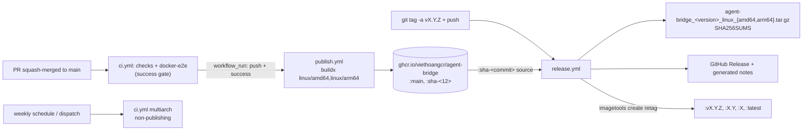

# Plan: Phase 07 - Container Publishing And GitHub Releases

**Date:** 2026-09-13
**Status:** APPROVED
**Risk Level:** Medium

---

## Overview

Turn every merge to `main` into a published multi-architecture container image
and every `v*` tag into a GitHub Release with verified Linux binaries and
versioned image tags. Nothing publishes from an untrusted context: the merge
image is gated on `ci` success, and the release image is retagged from the
exact digest-bearing edge tag for the tagged commit.

## Phase Goal

- On merge to `main`, after `ci` succeeds: push
  `ghcr.io/viethoangcr/agent-bridge:main` and `:sha-<12>` for
  `linux/amd64,linux/arm64`, using only `GITHUB_TOKEN`.
- On a `vX.Y.Z` tag: create a GitHub Release with
  `agent-bridge_<version>_linux_{amd64,arm64}.tar.gz` plus `SHA256SUMS`, and
  retag the already-published merge image as `vX.Y.Z`, `X.Y`, `X`, and
  `latest` (stable only).
- Own the versioning, tag, artifact, and rollback contract in
  `docs/references/releasing.md`, locked by `internal/projectdocs` tests.
- Add no new dependencies, no repository secrets, and no new runtime installs.

## How To Do It (Decisions Fixed By This Plan)

| Decision | Choice | Rationale |
|---|---|---|
| Registry | GHCR (`ghcr.io/viethoangcr/agent-bridge`) | Native to GitHub, `GITHUB_TOKEN`-authenticated, no Docker Hub secrets to mint or rotate, free for public packages. Docker Hub is a possible later mirror, not a v1 requirement. |
| Merge trigger | New `publish.yml` on `workflow_run` of `ci` completion, filtered to `push` on `main` with `conclusion == 'success'` | `ci.yml` is contract-locked as non-publishing, so publishing cannot live there. `workflow_run` is the only trigger that can consume the CI verdict before publishing; it also never executes PR/fork code. |
| Merge tags | `:main` (moving) and `:sha-<12>` (immutable) | `:main` is the convenience channel; `:sha-<commit>` gives byte-traceable, cache-warming pull targets and the exact source for release retagging. |
| Release trigger | Push tag matching `v*` | Tag creation is a deliberate maintainer act; releases never publish unreviewed commits. |
| Release image | Retag the existing `:sha-<commit>` index with `docker buildx imagetools create` | Zero rebuild cost and bit-identical image between the CI-tested merge and the release. A rebuild path is documented as fallback only if the sha tag is missing. |
| Release notes | `gh release create --generate-notes` with `.github/release.yml` categories | Native, zero custom changelog tooling; conventional PR titles already give readable entries. No CHANGELOG.md duplication. |
| License | MIT `LICENSE` at the repository root | Confirmed; required before the first public release. |
| Versioning start | `v0.1.0`, dry-run `v0.1.0-rc.1` | Confirmed; pre-1.0 signals an unfrozen HTTP API. |
| Release labels | `feature`, `fix`, `docs`, `ci`, `build` created in-repo; merged PRs labeled by type | Confirmed; backs the `.github/release.yml` categories. |
| Action pins | Reuse the full-SHA pins already in `ci.yml`; no new external actions | `docker/login-action` etc. are unnecessary: shell `docker login --password-stdin` plus the buildx CLI mirror the existing `ci.yml` style. |
| CI multiarch job | Narrow `ci.yml` multiarch to weekly `schedule` and `workflow_dispatch` only | `publish.yml` now performs the merge-time amd64+arm64 build; keeping the `ci` copy on every merge doubles a ~1 GB multiarch build and delays the gated publish. Scheduled/manual coverage for base-image drift stays. |

## References And Assumptions

### Authoritative References

- `docs/references/go-project-layout.md` section 8: CI ownership, full
  40-character SHA pins, no-publishing trunk gates. This plan changes that
  ownership statement first.
- `.github/workflows/ci.yml` and `.github/workflows/pr.yml`: the existing
  trigger, pin, and permissions conventions every new workflow must copy.
- `internal/projectdocs/projectdocs_validators_test.go`: the CI contract
  validator (`ciWorkflowProblems`, `ciPinnedAction`, `ciTrunkGate`,
  `ciReleaseGate`) that must be extended, not bypassed.
- `internal/projectdocs/projectdocs_ci_contract_test.go` and
  `projectdocs_pr_contract_test.go`: the fixture-rejection pattern new
  workflow contract tests must follow.
- `docker/runtime/Dockerfile`: the only image build entrypoint; publishing
  must not change it.
- `README.md`: operator-facing contract; published-image usage is added there
  in Task 7.5.

### Assumptions Fixed By This Plan

- The canonical image reference is `ghcr.io/viethoangcr/agent-bridge`; the
  `sha-` tag is exactly 12 lowercase hex characters of the checked-out commit.
- `publish.yml` exists on the default branch before the first `workflow_run`
  can fire, and `workflow_run` only reacts to `ci` runs whose event is
  `push` to `main` with a successful conclusion. Scheduled `ci` runs and
  manual publish dispatches are handled by filters, not by trusting ref text.
- Release tags are annotated SemVer tags `vMAJOR.MINOR.PATCH`, optionally
  `-rc.N`; artifact filenames drop the leading `v`. Releases are cut from
  commits that were already merged to `main` and therefore already published
  as `:sha-<commit>`; the retag job fails with a clear message when the sha
  tag is absent, and the runbook documents the backfill step.
- The repository ships an MIT `LICENSE` at the root,
  `Copyright (c) 2026 Nguyen Quang Viet Hoang`; it is committed in Task 7.1
  and is never excluded from the release source archives.
- The image is at least 1 GB and arm64 builds run under QEMU; every image job
  sets an explicit `timeout-minutes` and a `type=gha` build cache.
- GHCR packages start private; the package visibility flip to public is a
  one-time manual step recorded in Task 7.6 evidence, not a workflow step.
- Every non-local `uses:` reference is pinned to a full 40-character commit
  SHA; new workflow tests reuse the existing `ciPinnedAction` matcher.
- `/bin/` is gitignored and `dist/` is not; release artifacts are built into
  the runner workspace and uploaded to the Release only, never committed, and
  the root `.gitignore` is not modified.

## Requirements

1. `.github/workflows/publish.yml` triggers only on `workflow_run` of `ci`
   (`completed`, `branches: [main]`) and `workflow_dispatch`, and its job
   runs when the upstream run is a successful `push` on `main`, or when
   manually dispatched. It must never trigger on `pull_request`.
2. The publish job uses least-privilege permissions: repository
   `contents: read`, job-level `packages: write`; the only credential is
   `secrets.GITHUB_TOKEN`, sent via `docker login --password-stdin`, never
   printed.
3. Publishing builds `linux/amd64,linux/arm64` from
   `docker/runtime/Dockerfile`, pushes `:main` (merge path only) and
   `:sha-<12>`, carries `org.opencontainers.image.source` and
   `org.opencontainers.image.revision` labels, uses the GHA build cache, and
   asserts both platforms exist in the pushed index.
4. `.github/workflows/release.yml` triggers on tags `v*`, with `contents:
   write` for the release job and `packages: write` for the retag job. It
   builds `CGO_ENABLED=0 -trimpath` linux amd64/arm64 binaries, verifies the
   ELF architecture and static linkage with `readelf` as `ci.yml` does,
   packages `agent-bridge_<version>_linux_<arch>.tar.gz`, writes
   `SHA256SUMS`, and runs `gh release create "$tag" dist/* --generate-notes
   --verify-tag`, adding `--prerelease` for tags containing `-`.
5. The release retag job copies the `:sha-<12>` index to `vX.Y.Z`, `X.Y`,
   `X`, and (stable tags only) `latest` with `docker buildx imagetools
   create`; it fails fast when the source tag is missing.
6. `ci.yml` keeps its checks and host-architecture Docker E2E gates exactly
   as they are; its multiarch gate narrows to `schedule` and
   `workflow_dispatch` so merge-time multiarch verification is owned by
   `publish.yml`. `ci.yml` remains non-publishing and the CI contract test
   still rejects `--push`, `docker/login-action`, and
   `docker buildx imagetools create` in it.
7. `docs/references/releasing.md` owns the durable contract: versioning
   policy, tag format, workflow triggers, image tag scheme, artifact names,
   release checklist, rollback procedure, and the manual repository/package
   settings. `go-project-layout.md` and `AGENTS.md` point to it.
8. New `internal/projectdocs` contract tests lock `publish.yml`,
   `release.yml`, and `.github/release.yml` with the same
   `Problems([]byte) []string` validator plus fixture-rejection pattern used
   by the existing CI/PR contract tests.
9. README documents pulling and running the published image, the edge versus
   release tag channels, the release binaries and checksums, and links
   `docs/references/releasing.md`.
10. No new Go packages, no `go.mod` changes, no `.gitignore` changes, and no
    repository secrets. `make check` stays green.
11. `LICENSE` contains the MIT text for
    `Copyright (c) 2026 Nguyen Quang Viet Hoang`, and README links it.
12. Repository labels `feature`, `fix`, `docs`, `ci`, `build` exist before
    the first release so `.github/release.yml` categories resolve.

## Target State



## Interfaces

### `.github/workflows/publish.yml`

```yaml
name: publish

on:
  workflow_run:
    workflows: [ci]
    types: [completed]
    branches: [main]
  workflow_dispatch:
    inputs:
      ref: { description: "Commit/branch/tag to publish as :sha-<commit>", required: false, default: "" }

permissions:
  contents: read

concurrency:
  group: publish-${{ github.ref }}
  cancel-in-progress: false

jobs:
  publish:
    if: github.event_name == 'workflow_dispatch' || (github.event.workflow_run.event == 'push' && github.event.workflow_run.conclusion == 'success')
    runs-on: ubuntu-latest
    timeout-minutes: 90
    permissions:
      contents: read
      packages: write
    steps:
      - uses: actions/checkout@<existing-ci-sha> # v4
        with:
          ref: ${{ inputs.ref || github.event.workflow_run.head_sha || github.sha }}
      - uses: docker/setup-qemu-action@<existing-ci-sha> # v3
      - uses: docker/setup-buildx-action@<existing-ci-sha> # v3
      - name: Log in to GHCR
        env: { GH_TOKEN: "${{ secrets.GITHUB_TOKEN }}" }
        run: echo "$GH_TOKEN" | docker login ghcr.io -u "${{ github.actor }}" --password-stdin
      - name: Build and push
        run: |
          short="$(git rev-parse --short=12 HEAD)"
          tags=(--tag "ghcr.io/viethoangcr/agent-bridge:sha-${short}")
          [ "${{ github.event_name }}" = "workflow_run" ] && tags+=(--tag "ghcr.io/viethoangcr/agent-bridge:main")
          docker buildx build --platform linux/amd64,linux/arm64 \
            -f docker/runtime/Dockerfile "${tags[@]}" --push \
            --cache-from type=gha,scope=container --cache-to type=gha,mode=max,scope=container \
            --label "org.opencontainers.image.source=https://github.com/viethoangcr/agent-bridge" \
            --label "org.opencontainers.image.revision=$(git rev-parse HEAD)" .
      - name: Verify both platforms in the pushed index
        run: |
          ref="ghcr.io/viethoangcr/agent-bridge:sha-$(git rev-parse --short=12 HEAD)"
          for arch in amd64 arm64; do
            docker buildx imagetools inspect "$ref" | grep -q "linux/$arch" \
              || { echo "pushed index is missing linux/$arch"; exit 1; }
          done
```

- Manual dispatch publishes only `:sha-<commit>` (never moves `:main`), which
  is the documented backfill path for release retagging and edge rollback.
- No `--load`, no `--output`, no other registry.

### `.github/workflows/release.yml`

```yaml
name: release

on:
  push:
    tags: ["v*"]

permissions:
  contents: read

concurrency:
  group: release
  cancel-in-progress: false

jobs:
  binaries:
    runs-on: ubuntu-latest
    timeout-minutes: 30
    permissions:
      contents: write
    steps:
      - uses: actions/checkout@<existing-ci-sha> # v4
      - uses: actions/setup-go@<existing-ci-sha> # v5
        with: { go-version: "1.26.8", check-latest: false }
      - name: Build, inspect, package, checksum
        # CGO_ENABLED=0 GOOS=linux GOARCH=<amd64|arm64> go build -trimpath -ldflags='-s -w'
        # readelf: correct Machine, Type EXEC, no INTERP, no NEEDED (same gates as ci.yml)
        # tar.gz -> dist/agent-bridge_${VERSION}_linux_${arch}.tar.gz; sha256sum > dist/SHA256SUMS
      - name: Create GitHub Release
        env: { GH_TOKEN: "${{ secrets.GITHUB_TOKEN }}" }
        # gh release create "$GITHUB_REF_NAME" dist/*.tar.gz dist/SHA256SUMS \
        #   --title "$GITHUB_REF_NAME" --generate-notes --verify-tag [--prerelease when tag contains '-']
  image:
    needs: binaries
    runs-on: ubuntu-latest
    timeout-minutes: 15
    permissions:
      contents: read
      packages: write
    steps:
      - uses: actions/checkout@<existing-ci-sha> # v4
      - uses: docker/setup-buildx-action@<existing-ci-sha> # v3
      - name: Log in to GHCR
        env: { GH_TOKEN: "${{ secrets.GITHUB_TOKEN }}" }
        run: echo "$GH_TOKEN" | docker login ghcr.io -u "${{ github.actor }}" --password-stdin
      - name: Retag the merge image as the release
        run: |
          version="${GITHUB_REF_NAME#v}"
          major="${version%%.*}"; rest="${version#*.}"; minor="${rest%%.*}"
          source="ghcr.io/viethoangcr/agent-bridge:sha-$(git rev-parse --short=12 HEAD)"
          tags=(-t "ghcr.io/viethoangcr/agent-bridge:v${version}" \
                -t "ghcr.io/viethoangcr/agent-bridge:${major}.${minor}" \
                -t "ghcr.io/viethoangcr/agent-bridge:${major}")
          case "$GITHUB_REF_NAME" in *-*) ;; *) tags+=(-t "ghcr.io/viethoangcr/agent-bridge:latest") ;; esac
          docker buildx imagetools create "${tags[@]}" "$source"
```

- The retag job's failure mode when `:sha-<commit>` is missing must name the
  source tag and point to `gh workflow run publish.yml -f ref=<commit>`.
- No rebuild path in v1; a documented manual fallback may rebuild locally and
  push with the same tag set.

### `.github/release.yml`

```yaml
changelog:
  categories:
    - title: Features
      labels: [feature, enhancement]
    - title: Fixes
      labels: [fix, bug]
    - title: Documentation
      labels: [docs]
    - title: CI and build
      labels: [ci, build]
    - title: Other changes
      labels: ["*"]
```

- Label application is a maintainer habit recorded in the release checklist;
  unlabeled entries still appear under "Other changes".

### Naming Contract

```text
image:     ghcr.io/viethoangcr/agent-bridge
edge tags: main, sha-<12-lowercase-hex>
rel tags:  vX.Y.Z, X.Y, X, latest (stable only)
artifacts: agent-bridge_<X.Y.Z>_linux_amd64.tar.gz
           agent-bridge_<X.Y.Z>_linux_arm64.tar.gz
           SHA256SUMS
trigger:   merge to main -> publish.yml (gated on ci success); tag v* -> release.yml
```

### `docs/references/releasing.md`

Must contain, at minimum: versioning policy (SemVer, pre-1.0 expectations),
tag format and tag ruleset requirement, workflow triggers, image tag scheme
(edge versus release), artifact names and checksum verification, the release
checklist (main green, labels, tag, watch, verify, announce), the rollback
procedure for bad edge and bad release images, and the one-time manual
repository/package settings from Task 7.6.

## Tasks

### Task 7.1: Own The Release Contract In Docs

**Description:** Create the durable release/publishing reference and the MIT
license, and wire them into the documents hierarchy before any workflow
change.
**Files:** Create `docs/references/releasing.md`; create `LICENSE`; modify
`docs/references/go-project-layout.md` (section 8 CI ownership sentence,
section 10 related documents) and `AGENTS.md` (Documents list);
extend `internal/projectdocs` conventions tests.
**Symbols:** `TestReleasingDocumentContract`, `TestLicenseContract` (new).
**Risk:** Medium. An undocumented tag or trigger contract makes later
workflow edits silently undeliverable.
**Reversibility:** Easy.
**Dependencies:** None.

**RED:**

- [x] Create an empty `docs/references/releasing.md` stub (missing-file is
      setup evidence, not RED) and add a conventions test asserting the
      required contract fragments: `SemVer`, `vMAJOR.MINOR.PATCH`,
      `ghcr.io/viethoangcr/agent-bridge`, `:main`, `:sha-`, `:latest`,
      `workflow_run`, `SHA256SUMS`, `imagetools create`, `rollback`, and
      `docs/references/releasing.md` in `AGENTS.md` and
      `go-project-layout.md`.
- [x] Run `go test ./internal/projectdocs -run Releasing -count=1` and retain
      the failing fragments as RED evidence.
- [x] Add a `TestLicenseContract` assertion that `LICENSE` contains
      `MIT License`, `Copyright (c) 2026 Nguyen Quang Viet Hoang`, and the
      `Permission is hereby granted` grant clause; create the file only in
      GREEN.

**GREEN:**

- [x] Write `releasing.md` with the sections listed above and the exact
      naming contract from this plan, including the pre-1.0 (`v0.1.0`) SemVer
      policy.
- [x] Create `LICENSE` with the standard MIT text and the confirmed holder
      line; do not add license headers to source files.
- [x] Update `go-project-layout.md` section 8 to state that CI lives in
      `.github/workflows/{ci,pr,publish,release}.yml`, that publishing lives
      only in `publish.yml`/`release.yml`, and that `releasing.md` owns the
      release contract; add it to section 10.
- [x] Add `docs/references/releasing.md` to the `AGENTS.md` Documents list
      without weakening existing fragments.

**Verify:** `go test ./internal/projectdocs -count=1`

### Task 7.2: Publish The Multi-Architecture Image On Merge

**Description:** Add the gated GHCR publishing workflow and its contract test.
**Files:** Create `internal/projectdocs/projectdocs_publish_contract_test.go`;
create `.github/workflows/publish.yml`.
**Symbols:** `publishWorkflowProblems`, `TestPublishWorkflowContract`,
`TestPublishWorkflowContractRejectsWrongFixture`.
**Risk:** Medium. A wrong trigger or permission publishes untested or
unpullable images.
**Reversibility:** Easy; deleting a pushed tag is a manual registry act.
**Dependencies:** Task 7.1.

**RED:**

- [x] Add a `publishWorkflowProblems(body []byte) []string` validator and a
      deliberately wrong fixture test that must report every violation:
      missing `workflow_run`/`workflows: [ci]`/`types: [completed]`/
      `branches: [main]`, missing `github.event.workflow_run.event == 'push'`
      and `conclusion == 'success'` gate, `pull_request:` present,
      write-all/greater permissions, missing `packages: write`,
      `--platform linux/amd64,linux/arm64`, `--push`, `:main`, `sha-`,
      `type=gha` cache, `docker/runtime/Dockerfile`, `imagetools inspect`
      platform check, an unpinned `uses:`, and forbidden
      `AGENT_BRIDGE_ALLOW_INSECURE_REMOTE`, `set -x`, and `--load`.
- [x] Create the minimal `publish.yml` stub, run
      `go test ./internal/projectdocs -run Publish -count=1`, and retain the
      failing contract fragments.

**GREEN:**

- [x] Implement `publish.yml` exactly as specified in Interfaces, reusing
      the existing `ci.yml` pins for checkout, QEMU, and buildx, and adding
      no new action dependencies.
- [x] Confirm the GHCR login never echoes the token (no `set -x`, no token
      interpolation in the command string; env indirection only).

**Verify:** `go test ./internal/projectdocs -run Publish -count=1`

### Task 7.3: Narrow The CI Multiarch Gate To Scheduled And Manual Runs

**Description:** Stop building the same two-architecture image twice per merge
and let the gated publish start as soon as checks and Docker E2E finish.
**Files:** Modify `.github/workflows/ci.yml` (gate condition and header
comment); modify `internal/projectdocs/projectdocs_validators_test.go`
(`ciReleaseGate` constant, comments) and any fixture expectations.
**Symbols:** `ciReleaseGate`.
**Risk:** Low. Coverage is preserved by `publish.yml` per merge and by the
weekly/dispatch job for base drift.
**Reversibility:** Easy.
**Dependencies:** Task 7.2.

**RED:**

- [x] Change `ciReleaseGate` to
      `if: github.event_name == 'schedule' || github.event_name == 'workflow_dispatch'`
      and run `go test ./internal/projectdocs -run CIWorkflow -count=1`; the
      still-unchanged `ci.yml` must fail the expected count (RED).

**GREEN:**

- [x] Update the multiarch job condition, its header comment ("non-publishing
      two-architecture build on the weekly schedule and manual dispatch; the
      merge-time multiarch build and publish is owned by publish.yml"), and
      keep every non-publishing assertion (`--push`, `docker/login-action`,
      `imagetools create` stay forbidden).
- [x] Confirm `checks` and `docker-e2e` trunk gates are unchanged.

**Verify:** `go test ./internal/projectdocs -count=1 && go test ./... -count=1`

### Task 7.4: Create GitHub Releases From Tags And Retag The Image

**Description:** Add the tag-driven release workflow, release-notes
categories, and their contract tests.
**Files:** Create `.github/workflows/release.yml`;
create `.github/release.yml`; create
`internal/projectdocs/projectdocs_release_contract_test.go`.
**Symbols:** `releaseWorkflowProblems`, `TestReleaseWorkflowContract`,
`TestReleaseWorkflowContractRejectsWrongFixture`.
**Risk:** Medium. A wrong artifact name, checksum step, or retag source
breaks the public release contract.
**Reversibility:** Medium; a pushed tag or published release can be removed,
but consumers may have pulled it.
**Dependencies:** Task 7.1; Task 7.2 for the `:sha-` source tag.

**RED:**

- [x] Add `releaseWorkflowProblems` and its wrong-fixture test covering:
      `tags:`/`v*`, missing `contents: write` or `packages: write`, missing
      `gh release create`, `--generate-notes`, `--verify-tag`,
      `--prerelease` handling, `CGO_ENABLED=0`, `-trimpath`,
      `GOOS=linux GOARCH=amd64`, `GOOS=linux GOARCH=arm64`, `readelf`,
      `sha256sum`, `SHA256SUMS`, `imagetools create`, `:sha-`, `:latest`,
      `pull_request:` present, and any unpinned `uses:`.
- [x] Add a `.github/release.yml` fixture test asserting `changelog:`,
      `categories:`, and a catch-all `labels: ["*"]`.
- [x] Create the minimal stubs, run
      `go test ./internal/projectdocs -run Release -count=1`, and retain the
      failing fragments.

**GREEN:**

- [x] Implement `release.yml` and `.github/release.yml` exactly as specified
      in Interfaces.
- [x] Confirm `gh release create` runs only after the binary/checksum job
      produces all three files and that the retag job depends on the release
      job (`needs`).

**Verify:** `go test ./internal/projectdocs -run Release -count=1`

### Task 7.5: Document Published Images And Releases

**Description:** Extend the operator contract with the published artifact
channels without weakening any existing README contract fragment.
**Files:** Modify `README.md`; extend
`internal/projectdocs/projectdocs_conventions_test.go` expectations.
**Symbols:** None new.
**Risk:** Low.
**Reversibility:** Easy.
**Dependencies:** Tasks 7.2, 7.4.

**RED:**

- [x] Add required README fragments to the conventions test:
      `ghcr.io/viethoangcr/agent-bridge`, `:sha-`, `:main`, `:latest`,
      `SHA256SUMS`, `docs/references/releasing.md`, `MIT`, `LICENSE`; run
      `go test ./internal/projectdocs -run README -count=1` and retain the
      failures.

**GREEN:**

- [x] Add a "Published Image" subsection under Build showing
      `docker pull ghcr.io/viethoangcr/agent-bridge:latest` and explaining
      `:main`/`:sha-<commit>` as unreleased edge channels versus `:latest`
      as the stable release channel.
- [x] Add a "Releases" subsection listing the tarballs, `SHA256SUMS`
      verification (`sha256sum -c SHA256SUMS`), and the link to
      `docs/references/releasing.md`; add the same link to Contributing.
- [x] Add a short "License" section linking `LICENSE` and naming MIT.
- [x] Keep the README free of the word `mock` and keep every existing
      required fragment intact.

**Verify:** `go test ./internal/projectdocs -count=1 && make check`

### Task 7.6: Configure Repository Settings And Cut The First Release

**Description:** One-time manual repository/package setup, then an
end-to-end dry run and the first real release. No code.
**Files:** None; evidence recorded in the PR description or release notes.
**Risk:** Medium. GHCR packages start private; a missed visibility flip makes
documented pulls fail.
**Dependencies:** Tasks 7.2-7.5 merged to `main`.

**Steps:**

- [ ] Settings -> Actions -> General -> Workflow permissions: allow read and
      write (required for `packages: write` via `GITHUB_TOKEN`); verify
      organization policy does not cap it.
- [ ] After the first successful `publish` run: open the package settings for
      `agent-bridge`, connect it to the repository, and set visibility to
      Public. Verify anonymously with `docker pull ghcr.io/viethoangcr/agent-bridge:sha-<commit>`.
- [ ] Rulesets -> new tag ruleset for `v*`: restrict updates and deletions;
      keep creation available to maintainers.
- [ ] Rulesets -> verify `main`: require the `checks` and `docker-e2e`
      status checks, require pull requests with squash merges (matches the
      conventional-title gate), and enable auto-delete of head branches.
- [ ] Create labels `feature`, `fix`, `docs`, `ci`, `build` (Colors are
      free-form; keep the names exact to match `.github/release.yml`) and
      apply them to merged PRs before cutting a release.
- [ ] Confirm GitHub detects the MIT license (repository sidebar) and that
      release source archives contain `LICENSE`.
- [ ] Dry run: run `gh workflow run publish.yml` (dispatch path publishes a
      `:sha-` tag only) and confirm the image and both platforms.
- [ ] First release: after main is green and published, create a prerelease
      tag `v0.1.0-rc.1`, verify the release page, tarballs, checksums, and
      that no `latest` tag moved; then tag the stable `v0.1.0`.
- [ ] Verify the documented pull path works from a clean machine:
      `docker pull ghcr.io/viethoangcr/agent-bridge:latest` and
      `sha256sum -c SHA256SUMS` on downloaded release assets.

**Verify evidence:**

```sh
docker buildx imagetools inspect ghcr.io/viethoangcr/agent-bridge:main
docker buildx imagetools inspect ghcr.io/viethoangcr/agent-bridge:v0.1.0
gh release view v0.1.0
```

## Dependencies

| Task | Depends On |
|---|---|
| 7.1 | None |
| 7.2 | 7.1 |
| 7.3 | 7.2 |
| 7.4 | 7.1, 7.2 |
| 7.5 | 7.2, 7.4 |
| 7.6 | 7.2-7.5 merged and green on `main` |

Suggested PR slices: PR A = Tasks 7.1-7.3 (docs, publish, CI narrowing);
PR B = Tasks 7.4-7.5 (release workflow and README); Task 7.6 runs after both.

## Deliverables

- `docs/references/releasing.md` plus updated `go-project-layout.md` and
  `AGENTS.md` ownership statements.
- MIT `LICENSE` with the confirmed copyright holder, linked from README.
- `.github/workflows/publish.yml`: gated multiarch GHCR publishing of
  `:main` and `:sha-<12>`.
- `.github/workflows/release.yml`: tag-driven binaries, checksums, GitHub
  Release, and image retagging.
- `.github/release.yml`: release-note categories.
- Narrowed `.github/workflows/ci.yml` multiarch gate with updated contract
  validators.
- `internal/projectdocs` contract tests for publishing and releases.
- README published-image and release sections.
- Manual settings checklist plus first-release evidence.

## Completion Criteria

- [ ] Every merge to `main` with green `ci` publishes
      `ghcr.io/viethoangcr/agent-bridge:main` and `:sha-<12>` containing both
      `linux/amd64` and `linux/arm64`.
- [ ] A failing or cancelled `ci` run publishes nothing; a manual dispatch
      publishes only an immutable `:sha-<commit>` tag.
- [ ] Pushing `vX.Y.Z` creates a GitHub Release with both tarballs,
      `SHA256SUMS`, generated notes, and moves `vX.Y.Z`, `X.Y`, `X`, and
      (stable only) `latest` to the commit's existing image index.
- [ ] No new repository secrets, external actions, Go modules, or
      `.gitignore` changes exist; all `uses:` references remain pinned to
      full 40-character SHAs and `make check` passes.
- [ ] `docs/references/releasing.md` covers versioning, triggers, tag scheme,
      artifact names, release checklist, rollback, and manual settings, and
      `go-project-layout.md`/`AGENTS.md`/README point to it.
- [ ] `:latest` and the GitHub "Latest release" only ever move on stable
      tags; prerelease tags leave both untouched.
- [ ] `LICENSE` is present with the MIT text, README links it, and GitHub
      detects it; repository labels `feature`, `fix`, `docs`, `ci`, `build`
      exist before the first release.

## Resolved Decisions (Confirmed 2026-09-13)

- **Registry:** GHCR (`ghcr.io/viethoangcr/agent-bridge`) with
  `GITHUB_TOKEN`; no Docker Hub.
- **License:** MIT `LICENSE` in Task 7.1,
  `Copyright (c) 2026 Nguyen Quang Viet Hoang`.
- **First version:** `v0.1.0` after a `v0.1.0-rc.1` dry run; the pre-1.0
  SemVer policy is written into `releasing.md`.
- **Labels:** Adopt `feature`, `fix`, `docs`, `ci`, `build` and apply them
  to merged PRs so release notes categorize.

## Out Of Scope (Future Work)

- Build provenance/attestation (`actions/attest-build-provenance`) for
  binaries and images.
- Scheduled cleanup of stale `sha-*` GHCR tags and storage retention.
- Docker Hub or multi-registry mirrors.
- `CHANGELOG.md` or release-drafter style tooling; GitHub Releases remain
  the changelog.
- Version stamping inside the binary (no public CLI subcommands exist).
