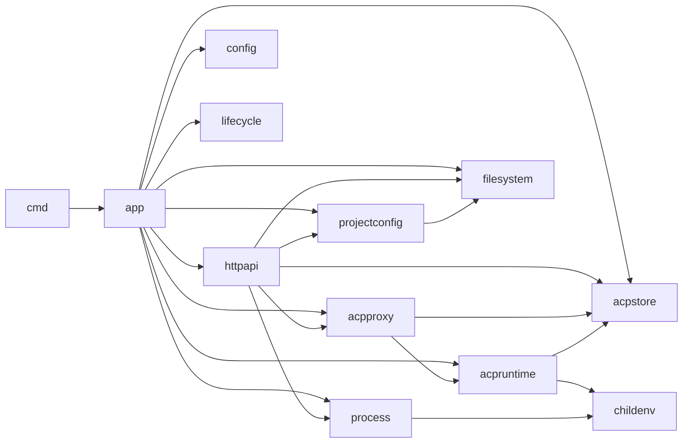

# Reference: Go Project Layout and Ground Rules

**Date:** 2026-09-12
**Status:** CURRENT
**Purpose:** Structural ground rules for the `agent-bridge` repository. The phase plans (`docs/plans/`) define behavior and task order; this document defines where code lives, how packages depend on each other, and the hygiene gates every change must pass.

**Precedence:** specification (`20260815-agent-bridge.md`) > phase plans > this document. If this document conflicts with the plans, the plans win; raise the conflict instead of silently deviating.

## 1. Non-negotiable constraints

- One module: `github.com/viethoangcr/agent-bridge`; one binary: `cmd/agent-bridge/main.go`.
- Exactly Go 1.26.8 (`.tool-versions`, `go.mod` floor plus `toolchain` directive, `make check` guard). Toolchain switching must never change the build.
- Standard library plus exactly one external module: `modernc.org/sqlite` (pinned v1.57.0, added in Phase 02). No other production or test modules, no `golang.org/x/...`, no third-party test frameworks.
- `CGO_ENABLED=0`, `-trimpath`, static Linux binary. Runtime is Linux-only.
- Everything implementation-level lives under `internal/`. No `pkg/`, no public import surface, no versioned API packages.
- No runtime installs, no public CLI subcommands, no published mock surface. The private mock is reachable only through `AGENT_BRIDGE_INTERNAL_MOCK_AGENT=1`.
- Documentation is part of the contract: `README.md` (operator) and `AGENTS.md` (contributors) are asserted by tests in `internal/projectdocs`.

## 2. Repository layout

```text
agent-bridge/
├── .github/workflows/ci.yml
├── .tool-versions
├── AGENTS.md
├── Makefile
├── README.md
├── go.mod / go.sum
├── cmd/agent-bridge/            # main package: signal wiring, one app.Run call
├── internal/
│   ├── app/                     # composition root, PID file, staged shutdown
│   ├── config/                  # environment parsing and validation
│   ├── childenv/                # child environment sanitizer (shared)
│   ├── lifecycle/               # shutdown hook registry
│   ├── httpapi/                 # routes, middleware, handlers, DTOs
│   ├── acpstore/                # SQLite schema and persistence
│   ├── acpruntime/              # stdio ACP subprocess runtime
│   ├── mockagent/               # private test agent (env-gated)
│   ├── acpproxy/                # live instance lifecycle and subscriptions
│   ├── process/                 # managed process groups and one-shot runs
│   ├── filesystem/              # filesystem service and uploads
│   ├── projectconfig/           # mcp/skills config files
│   ├── integration/             # in-repo cross-package tests
│   └── projectdocs/             # documentation/contract tests only
├── tests/e2e/                   # //go:build e2e Docker tests
├── docker/runtime/              # Dockerfile, ignore file, npm manifest/lock
├── scripts/verify-agents.sh
└── docs/{plans,references}/
```

Directory rules:

- One package per directory. No `utils`, `common`, `helpers`, `shared`, or `pkg/`; a helper without an owner belongs to the package that uses it.
- `internal/integration` and `internal/projectdocs` are test-only packages (no production files).
- `tests/e2e` is the only build-tag-gated package: every file, including helpers, carries `//go:build e2e` so plain `go test ./...` stays valid.
- `testdata/` holds golden files and archive fixtures only. Helper programs never live there; subprocess helpers re-exec the test binary (`TestMain` + control environment variable).
- `internal/acp` is explicitly forbidden. ACP concerns are split by owner: `acpstore` (persistence), `acpruntime` (stdio/runtime), `acpproxy` (lifecycle).

## 3. Package ownership

| Package | Phase | Owns | Must not |
|---|---|---|---|
| `cmd/agent-bridge` | 01 | signal wiring, one `app.Run` call, exit code | business logic |
| `internal/app` | 01+ | top-level service construction, PID file, staged shutdown | HTTP handlers, domain logic, per-server runtime creation |
| `internal/config` | 01 | environment defaults and validation | read `os.Getenv` directly |
| `internal/childenv` | 01 | child environment sanitization | know about agents or processes |
| `internal/lifecycle` | 01 | cleanup registry (separate pre-drain/post-drain instances) | construct services |
| `internal/httpapi` | 01-05 | `ServeMux`, middleware, problem+json, DTOs, request validation | construct services, stores, runtimes, reapers |
| `internal/acpstore` | 02 | schema, SQL, sequences, reconciliation, checkpoint | interpret conversation content |
| `internal/acpruntime` | 02 | resolver, process groups, pumps, `Post` correlation/compaction, stderr | serve HTTP, own server lifecycle policy |
| `internal/mockagent` | 02 | private deterministic JSONL mock | persist state, expose CLI/HTTP |
| `internal/acpproxy` | 03 | live instance map, per-server runtime creation via injected factory, recreation, reaper, subscriptions, delete/shutdown | parse output, match IDs, persist, own request deadlines, lifecycle-grace, or correlation timers |
| `internal/process` | 04 | process groups, log rings, one-shot runs, process config | PTY/WebSocket/follow/restart/owner features |
| `internal/filesystem` | 05 | path resolution, mutations, staged uploads | project-config semantics |
| `internal/projectconfig` | 05 | mcp/skills files with atomic writes | duplicate path resolution (reuse `filesystem`) |
| `internal/integration` | 03-04 | cross-package behavior tests | production exports |
| `internal/projectdocs` | 01, 06 | documentation/contract tests | production exports |
| `tests/e2e` | 06 | Docker E2E harness | Docker-specific branches in production code |

## 4. Dependency direction



- Dependencies point downward; imports must not cycle.
- `httpapi` consumes service types but never constructs them. `internal/app` constructs top-level services (stores, managers, mutexes, reapers, proxy) and injects their dependencies; `acpproxy` creates per-server runtimes through its injected runtime factory. Tests may construct their own instances.
- Cross-package consumption uses the owner's exported declarations directly: no aliases, wrapper types, or proxy-local copies of another package's models.
- One owner per concern: `acpruntime.Post` owns input compaction/correlation, `acpruntime.ClassifyClientEnvelope` is the single envelope validator, `acpstore` owns persistence, `acpproxy` owns live-instance lifecycle, and the single injected mutex serializes filesystem/config mutations.
- Wakeup channels are capacity-one notifications only; SQLite is the source of truth for events.

## 5. Naming and conventions

- Package names are short, lowercase, and underscore-free. Exported types are plain nouns (`Config`, `Store`, `Runtime`, `Proxy`, `Manager`, `Service`).
- Every exported symbol and every package gets a doc comment; package comments start `// Package foo ...` and live immediately above the package clause.
- Doc comments are the API contract: signatures plus `go doc -all ./internal/<pkg>` must let an agent or reviewer understand a package's types, invariants, ownership, and error semantics without reading implementation bodies. Keep comments contract-level; mechanics stay in the body.
- Errors: sentinel `ErrX` values for conditions the transport maps; wrap internal failures with `%w` only when callers must inspect them; error strings are lowercase without trailing punctuation and never embed stack traces.
- Environment variables use the `AGENT_BRIDGE_` prefix. Duration variables end `_MS` and are parsed with checked conversion. `config.Load` is the only interpreter of public configuration variables and receives a `getenv` function; `app` may perform private dispatch and capture `os.Environ` for `childenv.Sanitized`, but services never read mutable environment state.
- `context.Context` is the first parameter for blocking, cancellable, SQL, HTTP, subprocess, and lifecycle operations; propagate request/root contexts, call every derived cancel function, and never store contexts in structs. Some Phase 05 service methods are intentionally synchronous and context-free.
- SQL table and column names are snake_case; sequence values and DTOs are `int64` end-to-end.
- HTTP routes use Go 1.22+ method/path patterns. The root is `GET /{$}`; one methodless `/` fallback owns 404/405 by probing `mux.Handler`. Never register methodless same-path fallbacks (startup panic).
- JSON DTOs expose exactly the documented fields and reject unknown fields and trailing values. Agent-output bytes are preserved exactly after JSONL framing removal through SQLite, synchronous ACP responses, and SSE; only `Runtime.Post` applies `json.Compact` to validated client input.
- Tests use private constructors for seams (`newWithFactory`, `openWithClock`, `newManagerWithBudgets`) and keep helpers in `_test.go` files; no exported cross-package test helpers.

## 6. File and import conventions

- File names are lowercase and concern-based (`store.go`, `post.go`, `reaper.go`, `runtime_integration_test.go`). Split a file when it holds unrelated concerns or a second reason to change; target ~300 lines and treat ~500 lines as a required split. Methods of one type may span files (`session_create.go`, `session_load.go`) since Go permits receivers in any package file; `go doc Type` still lists the complete method set.
- Package overviews longer than a short paragraph live in `doc.go`, which contains only the package comment, the package clause, and no code; keep exactly one package comment per package.
- Imports are grouped standard library / external / local, separated by blank lines. `gofmt` does not reorder groups; reviewers enforce this.
- Functions stay small with early returns; comments explain intent, not mechanics.
- No `init()` unless unavoidable; construct explicitly in `app` or tests.
- Build constraints: `//go:build e2e` only in `tests/e2e`; formatting and vet must pass under the tag.

## 7. Testing layout

- Unit tests live next to their package (`foo.go` -> `foo_test.go`). Use the external test package (`package foo_test`) when exercising only the exported API, and the internal package when a seam requires it.
- Cross-package behavior tests live in `internal/integration`; Docker-only tests live in `tests/e2e`.
- Every task follows the plan's RED/GREEN policy: a failing behavioral assertion first, then the implementation, then a focused verification command. Missing files or symbols are setup evidence, not RED.
- All timing tests use injected clocks, tickers, and size limits. The single repository-wide real-time exception is `TestRealHeartbeat15Seconds`, run once with a bounded deadline and without race/repetition.
- No third-party test dependencies; `testing`, `net/http/httptest`, `testing/synctest`, and the test-binary re-exec pattern cover the need.
- Process-test evidence rules, benchmark/allocation conventions, and other test style details live in `docs/references/go-coding-standards.md` section 12.
- `e2e` tests skip only when Docker is unavailable; behavioral failures never skip.

## 8. Tooling and hygiene

Required gates (encoded in Phase 01 Task 1.1 and the Phase 06 CI workflow):

```sh
test "$(go env GOVERSION)" = go1.26.8
test -z "$(gofmt -l .)"          # formatting drift is a failure; CI uses the same non-writing check
go vet ./...
go test -race -skip 'TestRealHeartbeat15Seconds' ./...
go run honnef.co/go/tools/cmd/staticcheck@2026.2.1 ./...
go run golang.org/x/vuln/cmd/govulncheck@v1.7.0 ./...
go mod tidy && git diff --exit-code -- go.mod go.sum
CGO_ENABLED=0 go build -trimpath -o bin/agent-bridge ./cmd/agent-bridge
```

- Dev-time tools run through `go run pkg@version`; they never enter `go.mod`/`go.sum`.
- Once `tests/e2e` exists, `lint` and `vuln` add `-tags=e2e`; every file in the tagged package carries the tag.
- Never modify the root `.gitignore`; never commit `bin/`, SQLite databases, WAL files, PID files, or `node_modules`.
- CI lives in `.github/workflows/ci.yml`: full 40-character SHA action pins, read-only formatting drift detection, and the job gating described in Phase 06.
- Behavior-level coding rules are in `docs/references/go-coding-standards.md`.

## 9. Changing the rules

- A new package, dependency, environment variable, HTTP route, or exported type requires a specification or plan update first. The plans are the contract; this document only allocates structure.
- Keep the exported surface minimal: inside `internal/` everything is importable, but every exported symbol is a commitment shared with parallel phases.
- When in doubt, follow the nearest existing pattern in the repository instead of inventing a new one.

## 10. Related documents

- `docs/references/go-coding-standards.md` - behavior-level coding rules (errors, concurrency, testing, performance, security).
- `docs/references/acp-v1-protocol.md` - ACP v1 factual baseline.
- `docs/plans/20260815-agent-bridge.md` - authoritative specification.
